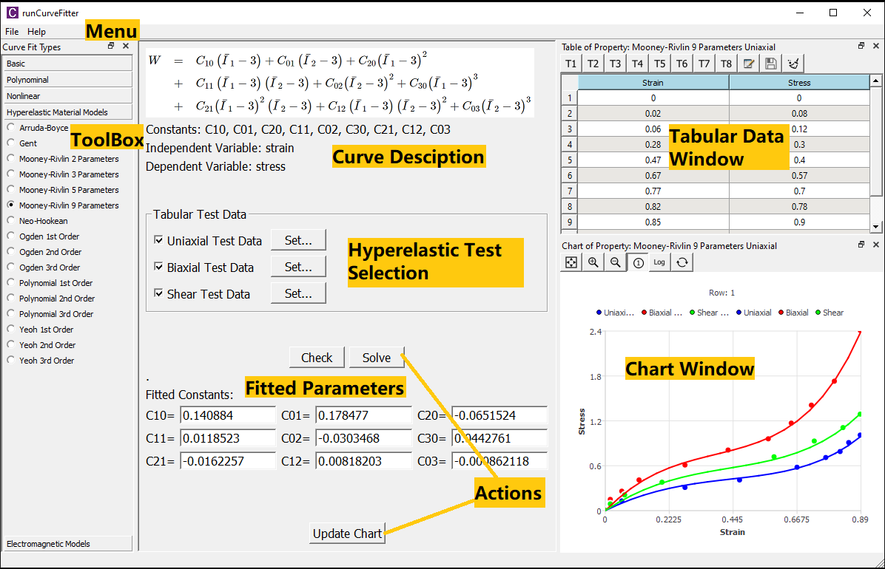
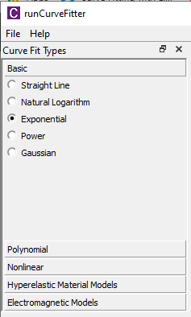
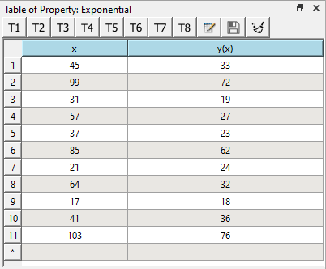
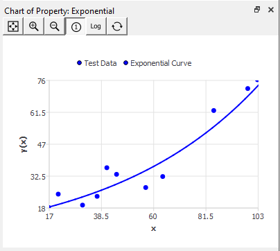
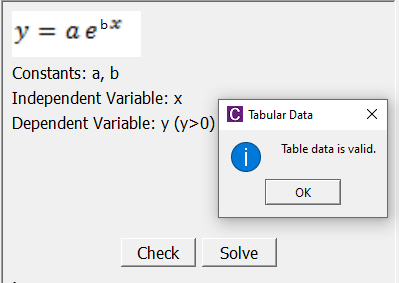
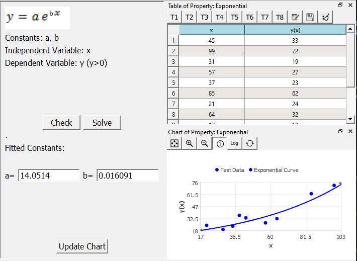

# Getting Started
Using BeamSection is straightforward, this section shows you how to calculate the beam properties step by step. 

## Graphical Interface
An overview of the Graphical User Interface (GUI) with notation is shown in the figure below.

### Menu
This section provides you basic actions in using CurveFitter. The actions include:

* **Exit**: Quits the program.
* **Help**: Runs your default web browser and visits official website [welsim.com/curvefit](https://welsim.com/curvefit).
* **About**: Displays About dialog and shows software and hardware information.

### Toolbox
This section lists all available curves for you to choose from. The default curve is the straight line (first-order polynomial). The curves are grouped by the characteristics as follows.  

#### Basic Curves
Straight line, Natural logarithm, Exponential, Power, Gaussian

#### Polynomial Curves
2nd Order Polynomial, 3rd Order Polynomial, 4th Order Polynomial, 5th Order Polynomial

#### Nonlinear Curves
Symmetrical Sigmoidal, Asymmetrical Sigmoidal, Rectangular Hyperbola, Basic Exponential, Half-Life Exponential, Proportional Rate Growth or Decrease

#### Hyperelastic Material Model Curves
Arruda-Boyce, Gent, Mooney-Rivlin 2, 3, 5, and 9 Parameters, Neo-Hookean, Ogden 1st-3rd Orders, Polynomial 1st-3rd Orders, Yeoh 1st-3rd Orders

#### Electromagnetic Model Curves
Electrical Steel, Power Ferrite

### Curve Description
This section contains details about the selected curve, such as the function or energy functional, parameters to fit, variable descriptions. 

For the hyperelastic model curves, additional Hyperelastic Test Data checkboxes shows in this seciton. It allows users to set/edit the test data at different deformations. 

### Fitted Parameters
This section outputs the fitted parameters for users. You also can edit the constants in the line edit widget and review the curves in the Chart window.

### Actions
There are three actions provided for users to analyze or fit the test data.

* **Check** button: examines the input data in the tabular data window. 
* **Solve** button: solves the curve fitting based on the input tabular data. The check process is implemented before the solution. If the curve fitting succeeded, the fitted constants will be set in the Fitted Parameters section, the curves will be plotted in the Chart window as well. 
* **Update Chart** button: allows you to update the curves in the Chart window with the current constants.

### Chart Windows
This section displays the test data dots and fitted curves in the same window, these dots and curves can be differentiated by legends and colors. Zoom in and out showing area are supported. You also can set the logarithmic axis for the curve display.

## Workflow

This section demonstrates the procedures in applying curve fitting. The steps are followed:

1. Select the designated curve type from the toolbox.  

2. Edit table data or import data from an external file. 

3. Review the test data in the Chart. 

4. **Check** the input data (Optional). A pop-up message box indicates the status of the input data. 

5. **Solve** the curves with the input tabular data. If it succeeded, the Constants line edits are filled with fitted parameters, and the Chart window displays the fitted curves along with the test data. These fitted parameters are the answers that we want. 

6. Adjust parameters to evaluate the similar curves (Optional). You can change the parameters and hit the **Update Chart** button to see the new curves with modified parameters. 

!!! note
    Your test data is critical for your fitted constants, please ensure that the test data cover the entire range of your curve expreience.

