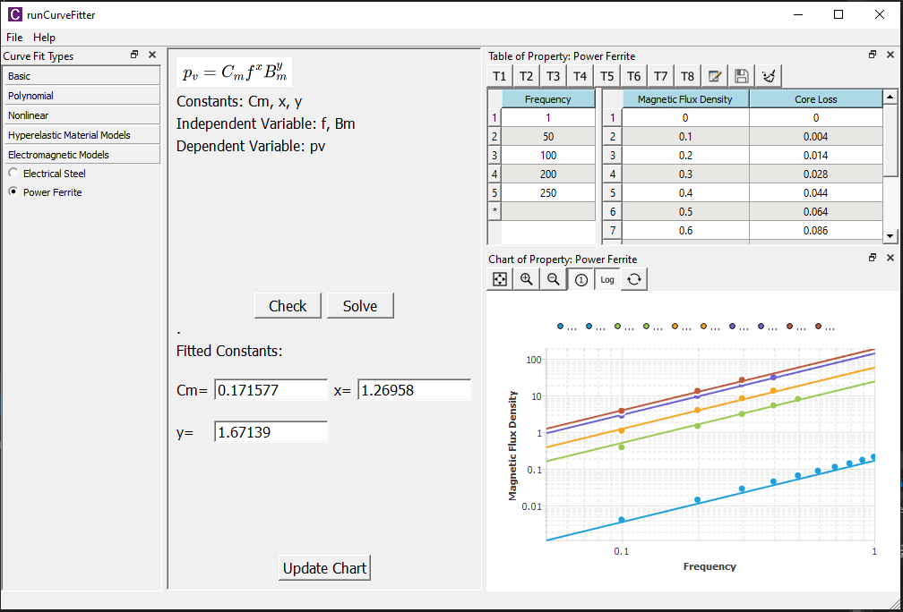

# Beam Cross-Section Overview
BeamSection is a free **beam cross-section** software program for engineers. This tool provides you comprehensive beam property calculations those are often used in engineering simulation and practice.

<!-- 
Curve fitting is one of the most widely used analysis methods in science and technology. Curve fitting examines the relationship between one or more predictors (independent variables) and a response variable (dependent variable), with the goal of defining a "best fit" model of the relationship. It is reportedly used in crystallography, chromatography, photoluminescence and photoelectron spectroscopy, infrared, Raman spectroscopy, and finite element analysis. 

## Specification
The system requirements for running CurveFitter are given in the table below.

| Specification | Description |
| ------------- | ----------- |
| Operation system | Microsoft Windows 7 to 10; 64-bit |
| Physical memory | At least 4 GB |
| Import/Export file format | Plain text, Excel |

The supported functions/curves are listed in the table below.

| Category | Materials |
| -------- | --------- |
| Basic | Straight line, Natural logarithm, Exponential, Power, Gaussian |
| Polynomial | 2nd-5th Order Polynomial |
| Nonlinear | Symmetrical Sigmoidal, Asymmetrical Sigmoidal, Rectangular Hyperbola, Basic Exponential, Half-Life Exponential, Proportional Rate Growth or Decrease |
| Hyperelastic material model | Arruda-Boyce, Gent, Mooney-Rivlin 2 3 5 and 9 Parameters, Neo-Hookean, 1st-3rd Order Ogden, 1st-3rd Order Polynomial, 1st-3rd Order Yeoh |
| Electromagnetic Core loss Model | Electrical Steel, Power Ferrite (Steinmetz) |

## Linear, Polynomial Regression
Linear and Polynomial regressions in CurveFitter make use of the least-square method to fit a linear model function or a polynomial model function to data, respectively.

## Magnetic Core Loss Model Fitting
Core Loss Model fitting tool enables you to fit the parameters in estimating energy loss analysis. The tabular data window contains both regular tables and sub-tables for you to input multiple frequency-based data. The chart supports the logarithmic axis to better review the frequency-based curves.

 -->

## Questions or Comments?

* Fill [Contact Form](https://us15.list-manage.com/contact-form?u=90ac76843a62679589273ff26&form_id=f0bf197ab18ebb8a81cfae29896b0ecb)
* or email us at [info@welsim.com](mailto:info@welsim.com)

Feel free to send questions, comments, requests, bug reports, and success stories. Asking for a new feature usually results in adding the request to the TODO list or, if it already is in the list, in assigning higher priority to it.

