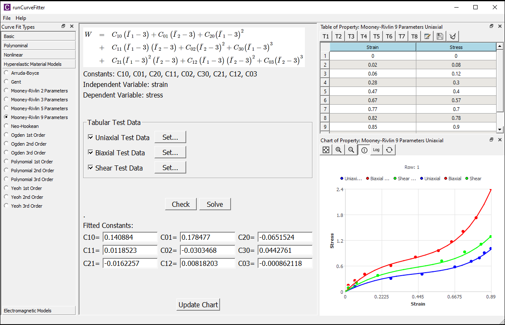
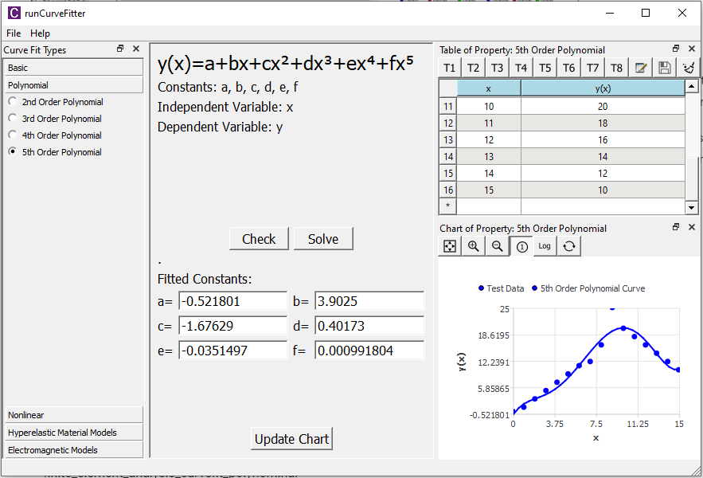
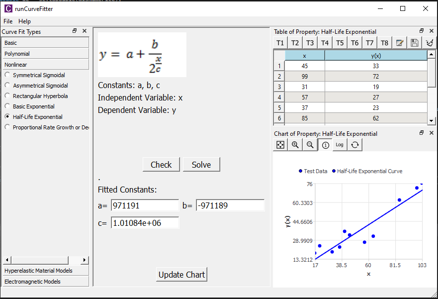
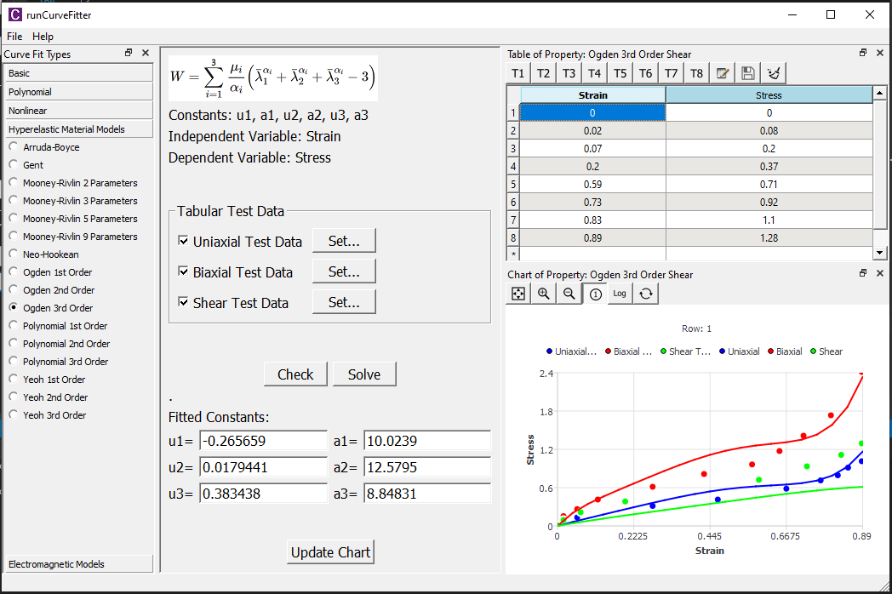
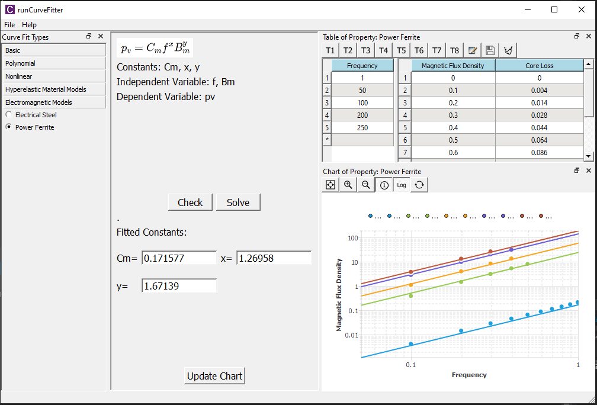

# Curve Fitter Overview
CurveFitter is a free software program for nonlinear **curve fitting** of analytical functions to experimental data. It provides tools for linear, polynomial, exponential, power, Schulz-Flory, nonlinear, hyperelastic materials, magnetic core loss curve fitting along with validation, and goodness-of-fit tests. The easy-to-use graphical user interface enables you to start fitting projects with no learning curves. You can summarize and present your results with customized fitting reports. There are many time-saving options such as an import-export feature which allows you to quickly input/output massive tabular data from/to external files.

Curve fitting is one of the most widely used analysis methods in science and technology. Curve fitting examines the relationship between one or more predictors (independent variables) and a response variable (dependent variable), with the goal of defining a "best fit" model of the relationship. It is reportedly used in crystallography, chromatography, photoluminescence and photoelectron spectroscopy, infrared, Raman spectroscopy, and finite element analysis. 

## Specification
The system requirements for running CurveFitter are given in the table below.

| Specification | Description |
| ------------- | ----------- |
| Operation system | Microsoft Windows 10 to 11; 64-bit |
| Physical memory | At least 4 GB |
| Import/Export file format | Plain text, Excel |

The supported functions/curves are listed in the table below.

| Category | Materials |
| -------- | --------- |
| Basic | Straight line, Natural logarithm, Exponential, Power, Gaussian |
| Polynomial | 2nd-5th Order Polynomial |
| Schulz-Flory | 1nd-6th Order Schulz-Flory |
| Nonlinear | Symmetrical Sigmoidal, Asymmetrical Sigmoidal, Rectangular Hyperbola, Basic Exponential, Half-Life Exponential, Proportional Rate Growth or Decrease |
| Hyperelastic material model | Arruda-Boyce, Gent, Mooney-Rivlin 2 3 5 and 9 Parameters, Neo-Hookean, 1st-3rd Order Ogden, 1st-3rd Order Polynomial, 1st-3rd Order Yeoh |
| Electromagnetic Core loss Model | Electrical Steel, Power Ferrite (Steinmetz) |

## Linear, Polynomial Regression
Linear and Polynomial regressions in CurveFitter make use of the least-square method to fit a linear model function or a polynomial model function to data, respectively.

## Nonlinear Curve Fitting
CurveFitter's nonlinear fit tool is powerful, flexible, and easy to use. This tool includes more than 10 built-in fitting functions, selected from a wide range of categories and disciplines. 

<!-- ## Surface Fitting
CurveFitter's NLFit tool provides an intuitive interface for fitting your XYZ or matrix data to a surface model. With this tool, you could locate one or multiple peaks in your surface data and fit them with the built-in or user-defined surface fitting functions.

 -->

## Hyperelastic Material Model Fitting
CurveFitter's hyperelastic model fitting tool allows you to obtain material constants from the uniaxial, biaxial, or shear test data. You can choose the available test data type by toggling the corresponding checkbox. The supported hyperelastic models are: Arruda-Boyce, Gent, Mooney-Rivlin, Neo-Hookean, Ogden, Polynomial, and Yeoh. The input test data is **engineering strain** and **engineering stress**.

## Magnetic Core Loss Model Fitting
Core Loss Model fitting tool enables you to fit the parameters in estimating energy loss analysis. The tabular data window contains both regular tables and sub-tables for you to input multiple frequency-based data. The chart supports the logarithmic axis to better review the frequency-based curves.

## Questions or Comments?

* Fill [Contact Form](https://us15.list-manage.com/contact-form?u=90ac76843a62679589273ff26&form_id=f0bf197ab18ebb8a81cfae29896b0ecb)
* or email us at [info@welsim.com](mailto:info@welsim.com)

Feel free to send questions, comments, requests, bug reports, and success stories. Asking for a new feature usually results in adding the request to the TODO list or, if it already is in the list, in assigning higher priority to it.

