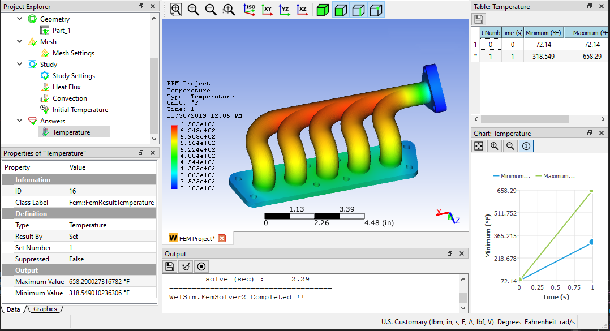

# Welcome
<!-- ## Welcome -->
WELSIM was born out of a vision to create a general-purpose simulation utility that could successfully enable a wide range of engineering and science communities to conduct simulation with more confidence. Customers use our software to help ensure the integrity of their innovations. WELSIM comes with an all-in-one user interface and self-integrated features. It is a long-term-support product that aims to accurately model engineering problems using the prestigious open source solvers. 

## Why WELSIM

* [x] Support 3D structural, thermal, fluid, and electromagnetic analyses that reveal physics-based results. Convenient data interface to export mesh or result files.
* [x] No wait. You can [download][1] and use WELSIM immediately.
* [x] The secure software program and no collection of your data. No need for an internet connection to run the program.
* [x] The ease-of-use graphical interface requires no learning curve.
* [x] Friendly [pricing][2] options. Free trial. No hidden fees. No commitments.

## Where to start
Engineers can do a thousand things with the WELSIM simulation solutions. We recommend starting with:

* [Quick start][3] to quickly review the steps of using WELSIM.
* [Windows][4] and [Linux][5] installation guides to install the software on your computer.

If you already use WELSIM:

* [User's manual][6] - learn about WELSIM user interfaces and how to use them for everything else.
* [Theory][7] - learn about math theory and numerical algorithms used in WELSIM.

If you are interested in our free engineering software:

* [CurveFitter][10] - learn about the curve fitting tool. 
* [MatEditor][9] - learn about the engineering material data tool. 
* [UnitConverter][8] - learn about the engineering unit convertion tool.
* [BeamSection][11] - learn about the beam cross-section tool. 

[1]: https://welsim.com/download
[2]: https://welsim.com/pricing
[3]: welsim/get_started/quick_start.md
[4]: install/windows.md
[5]: install/linux.md
[6]: welsim/users/overview.md
[7]: welsim/theory/introduction.md
[8]: unitconverter/unitconverter.md
[9]: mateditor/mateditor_overview.md
[10]: curvefitter/curvefit_overview.md
[11]: beamsection/beamsection_overview.md

<small>Last Updated: May 6th, 2025</small>
