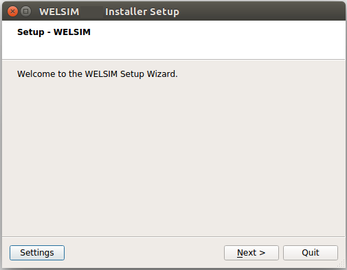
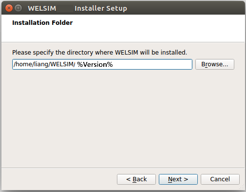
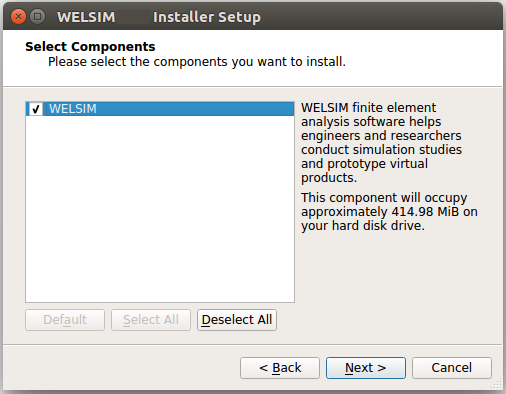
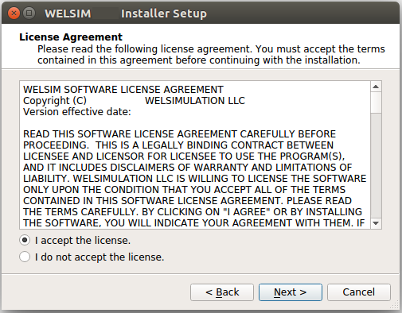
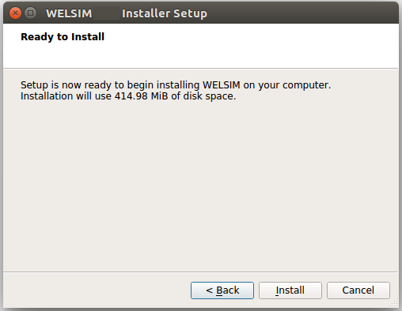
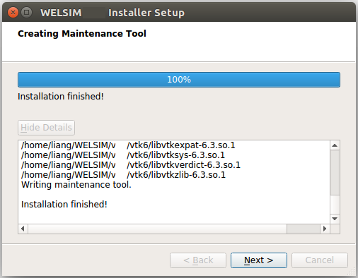
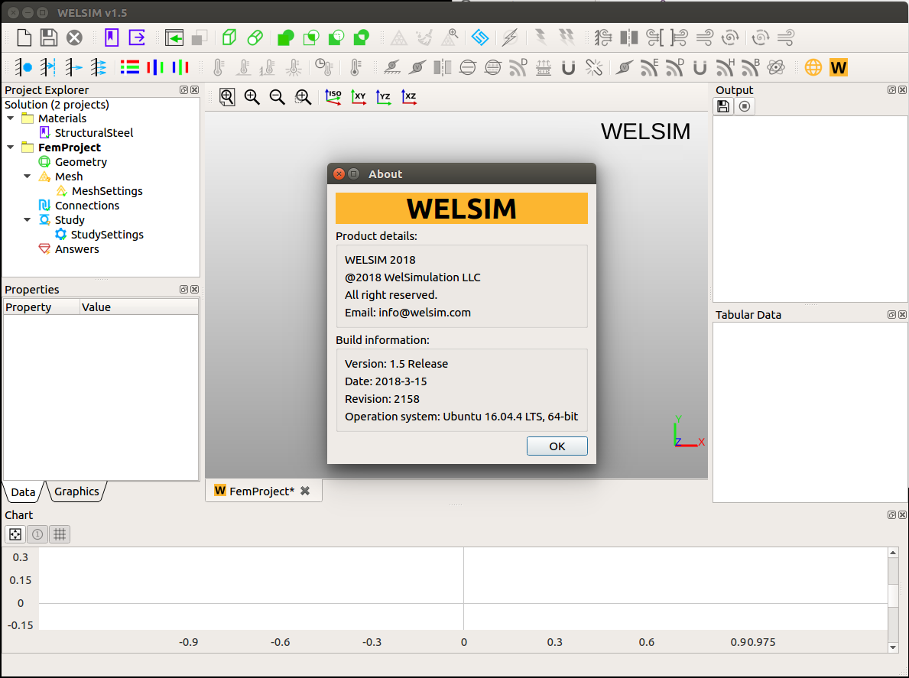

# Linux installation guide

## Installation prerequisites for Linux
This document describes the steps necessary to correctly install and configure WELSIM application on Linux platforms. These products include:

* WELSIM Application
* License manager

### System prerequisites
WELSIM application is supported on the Linux platforms and operating system levels listed in Table below.

| Platform | Operating system | Availability |
| -------- | ---------------- | ------------ |
| Linux x64 | Ubuntu 22.04 LTS or higher | [Download](https://welsim.com) |

!!! note
    1. If you run WELSIM on Ubuntu, we recommand Ubuntu 22.04 LTS or higher with the latest libstdc++ and libfortran libraries.


### Disk space and memory requirements
You will need the disk space shown in Table below for installation and proper functioning. 

| Product | Disk space | Memory |
| ------- | ---------- | ------ |
| WELSIM application | at least 1 GB | at least 4 GB |

## Platform details
For all 64-bit Linux platforms, the libraries listed below should be installed. 

* libxcb-xinerama0
* libstdc++
* gcc-c++
* glibc
* libfortran
* openmpi-bin
* libomp-dev

## Installing the WELSIM for a Linux system
This section explains how to download and install WELSIM. 

You can install WELSIM as root, or non-root; however, if you are root user, you can install the application in the system directory. The application can be used by different users.

### Product download instructions
To download the installation files from our website, you will need to agree the US Export Restrictions. You only need to download one installer file.

1. From the website[^1], select the Linux version of WELSIM and click the download button on the webpage.
2. The downloaded installer file has the name like: **WelSim%version%SetupUbuntu.run**. For example, the installer of 2024R1 is WelSim28SetupUbuntu.run.
3. Begin the product installation as described in the next section.

### Production installation

1.Navigate to the directory where you placed the installer file. Run the commands below in a terminal window. Note that we take the version of 2024R1 as an example, if you are installing a different version, replace the installer name in the command line below. 

```
$ chmod +x WelSim28SetupUbuntu.run
$ ./WelSim28SetupUbuntu.run
```

!!! note
    Running the installer requires the *libxcb-xinerama0* library installed in your system. 


2.The WELSIM installation Launcher appears as shown below.



3.Click the Next button to start the installation on your computer.

4.The installation folder setting appears as shown below. You can input your designated directory or keep the default one. After specifying the directory, Click Next.



5.The component selection interface appears as shown below. You can select the components that you want to install. The user can keep the default selection, and know the occupied disk space for this installation. **Click Next**.



6.The license agreement appears as shown below. Read the agreement, and if you agree to the terms and conditions, select **I Agree**. **Click Next**. 



7.The installation needs your conformation to start as shown below. **Click Install**. 



8.The installation completed as shown below. **Click Next**. 




## Starting the software on Linux
After installation, starting the WELSIM software application is straightforward. Here are steps:

1.Install the dependencies to your Ubuntu OS
```
sudo apt update
sudo apt upgrade
sudo apt install openmpi-bin libomp-dev
```


2.Allocate the installed WELSIM application folder, double click the executable file *runWelSim*. 
!!! note
    If the WELSIM does not start, the executable file may have no exectuable attribute on your machine. You could open a terminal window and type commends below.
    ```
    $ chmod +x runWelSim.sh
    $ ./runWelSim.sh 
    ```


3.WELSIM application starts, the GUI shows the system information in Figure below.




## Uninstalling the software
To uninstall WELSIM, you can browse file explorer into the installation folder, and double click on the Uninstaller. Following the instructions on the Uninstaller, you can remove the application from your computer. 

You also can simply delete the installation folder to uninstall the WELSIM.

[^1]: https://welsim.com/download