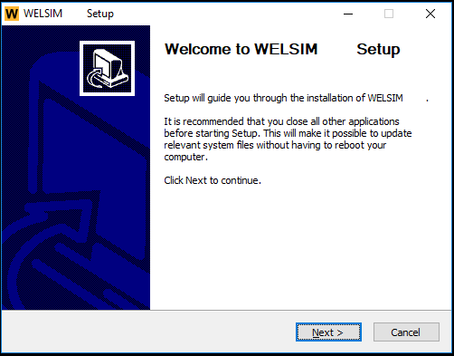
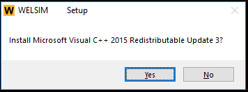
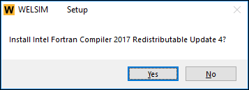
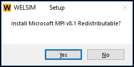
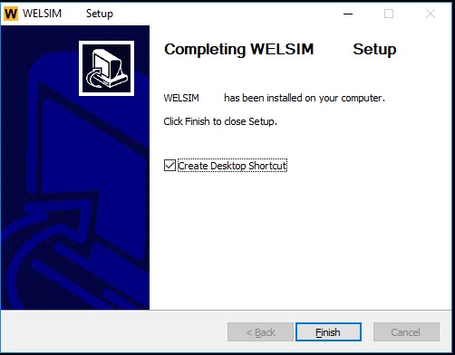

# Windows installation guide

## Installation prerequisites for Windows
This document describes the steps essential to correctly install and configure WELSIM on Windows platform. 

### System prerequisites 
WELSIM is supported on the following Windows platforms and operating system levels.

| Platform | Operating System | Platform Architecture | Availability |
| -------- | ---------------- | --------------------- | ------------ |
| x64 | Windows 11 | winx64 | [Download][1] |

### Disk space and memory requirements
You will need the disk space shown in Table [tab:ch11_win_disk_space] for installation and proper functioning. The numbers listed here are the maximum amount of disk space you will need. 

| Product | Disk Space | Memory |
| ------- | ---------- | ------ |
| WELSIM | 1 GB | at least 4GB |

### Software prerequisites
You need to have the following software installed on your system. These software prerequisites will be installed automatically when you launch the product installation. If you have finished an installation successfully, the prerequisites executable are located under the %Installed Folder%\Prerequisites directory.

* Microsoft Visual C++ 2015-2022 Redistributable(x64)
* Intel Visual Fortran Redistributables, 2022
* Microsoft MPI Redistributable, 10.0

### Digital signatures
WELSIM installer and executable files are signed with digital certificates. The signer name is: WelSimulation LLC.

## Platform details
### Compiler requirements for Windows systems
The compiler requirements for Windows systems are listed in Table [tab:ch12_win_compiler_req].

| No. | WELSIM Compilers |
| --- | ---------------- |
| 1 | Visual Studio 2022 (including the Microsoft C++ compiler) |
| 2 | Intel Visual Fortran 2022 compiler |

!!! note 
    Those compilers are not required if you only use WELSIM application.

## Installing the WELSIM for a Windows system
This section includes the steps required for installing WELSIM and licensing configuration on one Windows machine.

### Downloading the installation file
To download the installation files from our website, you will need to agree the US Export Restrictions.

You only need to download one installer file.

1. From the [website][1], select the Windows version of WELSIM and click the download button on the webpage.
2. The downloaded installer file has the name: WelSim28Setup.exe
3. Begin the product installation as described in the next section.

### Installing WELSIM

1. Navigate to the directory where you placed the installer file. Run the installer by double click.
2. The WELSIM installation Launcher appears as shown in Figure below.

3. Click the Next button to start the installation on your computer.
4. The license agreement appears as shown in Figure below. Read the agreement, and if you agree to the terms and conditions, select **I Agree**. **Click Next**. 

5. The installation folder setting appears as shown in the figure below. You can input your designated directory or keep the default one. After specifying the directory, Click Next.

6. The prerequesites libraries installation appears as shown in the figure below. Your system requires these libraries to run the WELSIM application. Click Yes.

7. The installation completed as shown in the figure below. Click Finish. 

!!! note
    WELSIM relies on the latest version of Microsoft MPI. If the Microsoft MPI redistributable installation conflicts with your pre-existing MS MPI libraries, please uninstall the pre-existing MPI from the Control Panel and reinstall the WELSIM.

## Activating the WELSIM
In this section, assuming you already received the license file wsimkey.dat. To activate WELSIM on your computer with client licensing, you can follow the steps below:

1. Start WELSIM application on your computer. 
2. Click the License Manager from the menu: **HELP -> License Manager**
3. WELSIM License Manager user interface appears. There are five buttons on the interface:
    1. Generate Computer ID: generate user's unique ID for license key generation. 
    2. Evaluate: click to continue using the trial version.
    3. Exit: quit the License Manager with no software activation.
    4. Buy Now: open your default internet browser and direct your visit to the [pricing page][2].
    5. Enter Code: If you have received the license key file, click this button to import the license file.
4. If the user are running software at the first time, generate the Computer ID by clicking the button of “Generate Computer ID”, and send this string (format of xxxx-xxxx-xxxx-xxxx) to info@welsim.com. The user will receive the license key within 24 hours.
5. After receiving the license file (wsimkey.dat), click “Enter Code” button to import the license. In the License Code interface, the user can paste the license content from clipboard, or directly import the license from file. 
6. Click OK button to activate the WELSIM. A successfully activated software is shown in figure below.

## Starting the software
After installation, starting the WELSIM software is straightforward. Here are three methods:

1. Double click the shortcut of WELSIM, if you toggle the option “Create Desktop Shortcut” during the last step of installation.
2. Click the shortcut of WELSIM from the Start menu. From Start -> WELSIM ->WELSIM v1.8.
3. Browse the directory of installation, double click the runWelSim.exe file.

As shown in the figure below, WESLIM application is started successfully on the Windows operation system.

## Uninstalling the software
Uninstalling the software is straightforward. The user can run the unint.exe from one of methods below:

1. Click the shortcut of WELSIM uninstaller from the Start menu. From **Start** -> **WELSIM** ->**Uninstall**.
2. Browse the directory of installation, double click the **uninst.exe** file.
3. Unstall the WELSIM application from the system **Control Panel**.

[1]: https://welsim.com/download
[2]: https://welsim.com/pricing