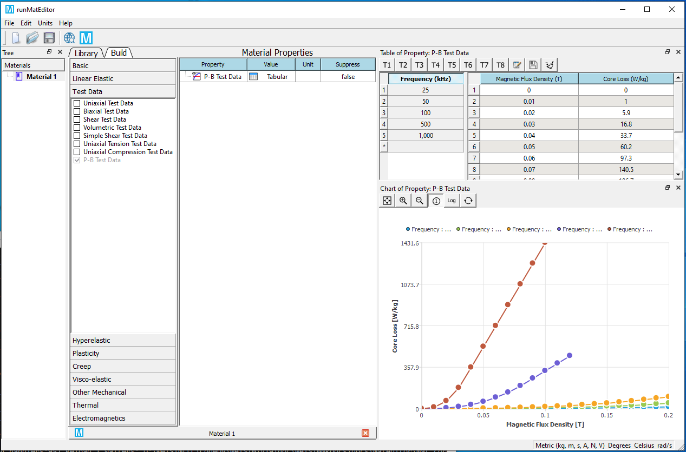
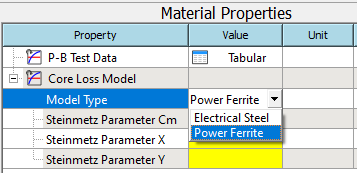
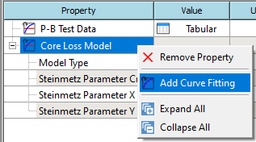
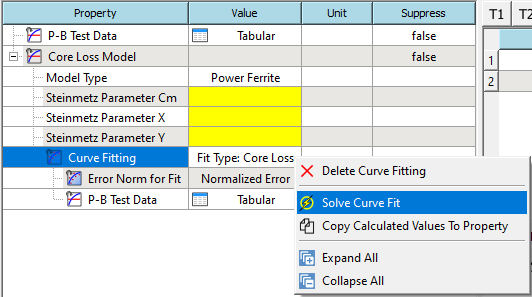
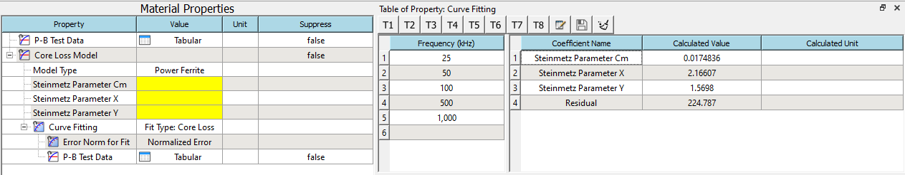
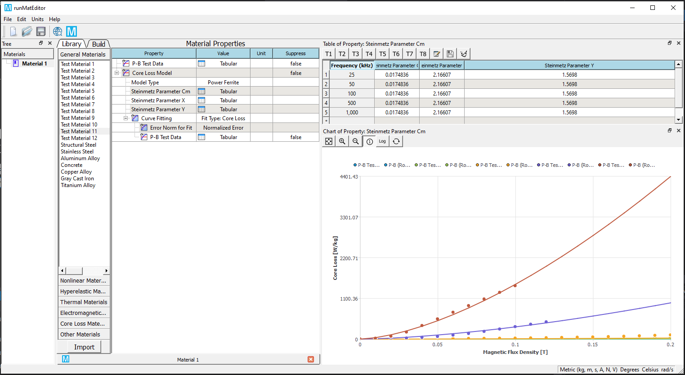
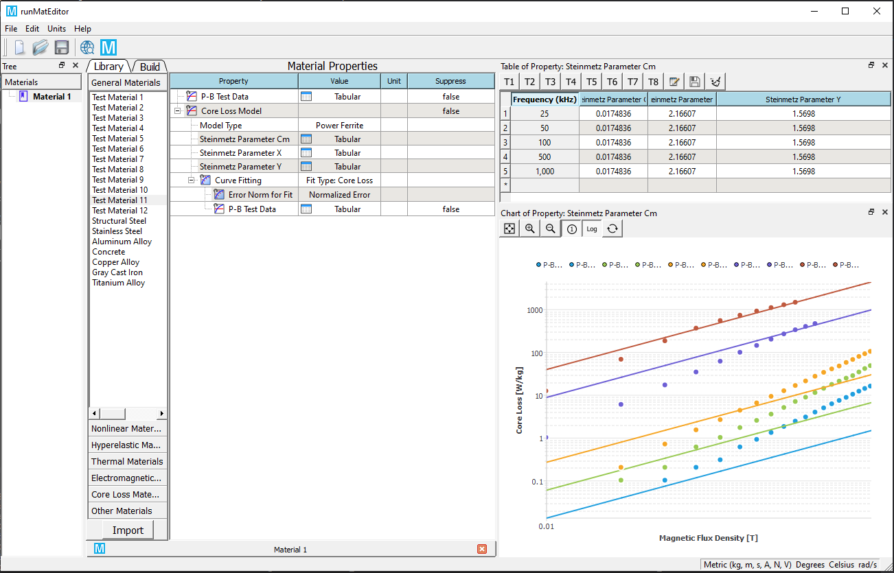

# Core loss model
The core loss combines eddy current losses and hysteresis losses for a transient solution type. It is a post-processing calculation, based on already calculated transient magnetic field quantities. It is applicable for the evaluation of core losses in steel laminations (frequently used in applications such as electric machines, transformers) or in power ferrites.

Hysteresis loss is associated with loss density fields in 2D and 3D eddy current solutions only. Hysteresis loss is short for magnetic hysteresis loss and represents power loss in some magnetic materials (electric steels or ferrites) in alternating (sinusoidal) magnetic fields. This loss is due to a phenomenon called "magnetic viscosity" which causes the B and H fields to have a phase shift between them. In the B-H plane, for linear materials, the relationship between these two fields describes an ellipse. The hysteresis loss is proportional to the area of the ellipse.

## Core loss models for an electromagnetic material

MatEditor provides two core loss models: electrical steel and power ferrite. The coefficients are given in the table below.

| Type | Associated properties |
| ---- | ----- |
| Electrical Steel | Hystersis coefficient $K_h$, Classcial eddy coefficient $K_c$, Excess coefficient $K_e$. |
| Power Ferrite | Steinmetz coefficients $C_m$, $X$, and $Y$. |

<!-- , Coefficient considering DC bias effects $K_{dc}$ (not used for eddy current solution type), and Equivalent cut depth.
, Coefficient considering DC bias effects $K_{dc}$ (not used for eddy current solution type), and Equivalent cut depth

| Hysteresis model | Instrinsic coercivity $H_{ci}$, Remanence $B_r$, $K_{c}$, and Equivalent cut depth. | -->

!!!note
    In Transient Solver, X must be less than Y.
    

<!-- ### DC-biased effects
The core loss computation is based on the traditional three core loss coefficients Kh, Kc, and Ke, plus the optional Kdc. In order to properly consider the impact of DC-biased hysteresis loss, a general rule to automatically compute $K_{dc}$ is applied to improve the core loss from the classic Steinmetz equation. If the user leaves the default value of $K_{dc}$ as zero, this indicates that $K_{dc}$ will be determined automatically by the software; otherwise, the software will use the user-input $K_{dc}$ value to consider the impact of DC-bias.

!!! note
    The use of $K_{dc}$ when computing DC-biased effects has no effect on the hysteresis model-based core loss computation approach since in such a case, the hysteresis model has inherently considered the impact of DC-biased effects on hysteresis loss.

#### Hysteresis model-based core loss computation approach
Using this approach, the computation of the hysteresis loss component is based on the input of a hysteresis loop, and the computation of the eddy current loss component based on the classic eddy current loss coefficient $K_c$. This means that the impact of classic excess loss must be included in the hysteresis loss (sometimes called: dynamic hysteresis loss). There are two ways to enable computation of core loss for the hysteresis model-based approach:

* Define the descending limiting branch of the hysteresis loop in the nonlinear BH curve input panel together with the input of $K_c$, which is defined by choosing Electrical Steel as the Core Loss Model on the Properties of the Material panel. Please note that any values entered for Kh and Ke will be ignored. 

!!! note
    This approach requires the use of a material that has a vector magnitude direction set to (0,0,0) to enable the hysteresis loss calculation; and must also have its Core Loss Setting checked in the Set Core Loss dialog to include the eddy current component of core loss.

* Define the hysteresis loop by the input of a normal nonlinear BH curve together with the selection of the Hysteresis Model as the Core Loss Model and the input of values for Intrinsic Coercivity $H_{ci}$, Remanence $B_r$ (optional) and $K_c$. 

!!! note
    The second approach is able to more accurately model minor loop loss behavior.

#### Additional core loss due to flux normal to laminations
When the lamination model is used in the WelSim 3D transient solver, an additional eddy current component of core loss will be automatically calculated due to the normal component of flux ($B_n$) on the lamination stack and will be added to the total core loss, if conductivity > 0 has been specified in the material manager. The basic idea of the algorithm for considering this additional eddy current component of core loss is to force-induced eddy current only occurring in the plane of lamination by introducing anisotropic conductivity.

To compute this additional core loss component:
* The material conductivity which is taken from the project material library (not from the core loss input panel) must be specified as non-zero.
* The object must be defined as a lamination.
* The eddy effect must always be turned off for laminated objects. 
* Core Loss Setting should be activated on the Set Core Loss panel, General tab under Excitations. -->

## Calculating properties for core loss (B-P curve) 
To be able to extract parameters from the loss characteristics (B-P Curve), you first set the Core Loss Model of the material to Electrical Steel or Power Ferrite as a material property in the Property View. 

<!-- (If the Core Loss Model is set to Hysteresis Loop, refer to Calculating Properties Using a Hysteresis Loop in WelSim.) 
To calculate core loss properties for an electrical steel material:
In the Core Loss Model property, select Electrical Steel or Power Ferrite from the Value pull-down list.  -->

Additional parameters appear in the following table Core Loss Model ($K_h$, $K_c$, and $K_e$ for electrical steel, and $C_{m}$, $X$, and $Y$ for power ferrite). If the P-B test data is already presented in the current material, you can add curve fitting property from the RMB context menu. This allows the electrical steel coefficients $K_h$, $K_c$, and $K_e$, or the power ferrite coefficients $C_m$, $X$, and $Y$ to be derived from a manufacturer-provided core loss curve. 

<!-- !!!note
    The $K_{dc}$ core loss quantity is not used for the Eddy Current solution type. -->

!!!node 
    The accuracy in inputting the data for B-P Curve for the electrical steel material has a significant effect on the correctness of the analyses to the electromagnetic devices. You should input the data for B-P Curve according to accurate data provided by material manufacturers. Typically core material suppliers provide the average loss over a cycle for a peak B, of sinusoidal nature. Therefore for BP curve input in WelSim, B (Tesla) should be peak and P should be average.

As the input data (value or unit) changes, the following parameters are not automatically updated unless you resolve the curve fitting:

* $K_h$ - Hysteresis Coefficient 
* $K_c$ - Classical Eddy Coefficient 
* $K_e$ - Excess Coefficient 
* $C_m$ - Steinmetz Coefficient 
* $X$ - Steinmetz Coefficient 
* $Y$ - Steinmetz Coefficient 

<!-- * $K_{dc}$ - Coefficient Considering DC Bias Effects (not used for Eddy Current solution type) -->

<!-- ## Electrical steel core loss from loss curves

!!!note 
    The accuracy in inputting the data for B-P Curve for the electrical steel material has a significant effect on the correctness of the analyses to the electromagnetic characteristics of the electric machine. You should input the data for B-P Curve according to the accurate data provided by the manufacturers of materials. 

The following parameters are dynamically updated with both the specified unit and the standard unit (w/m3) as the input data changes.

* Kh - Hysteresis 
* Kc - Classical Eddy 
* Ke - Excess  -->

## Calculate core loss coefficients from loss curves 
This section introduces how to calculate core loss coefficients for electrical steel and power ferrite materials according to the given P-B test data.

1. Add P-B Test Data material property, and edit the frequency-based data. You also can import the data from a plain text or Excel file. Check the data curves by clicking the row of frequency. Click the header of the frequency column displays all curves in the chart. 

2. Add Core Loss Model material property, and set the Core Loss Model Type of the property to Electrical Steel or Power Ferrite. 

3. Add Curve Fitting sub-property from the RMB context menu. 

4. Solve the curve fit from the RMB context menu. 

5. If the solve succeeds. The calculated parameters will be shown in the table. 

6. Copy the solved values to the properties from RMB context menu. You also can review the calculated curves in the chart. 

7. Display curves in the logarithmic axis (optional). 

## Computation of electrical steel core loss from loss curves
The iron-core loss without DC flux bias is expressed as the following:

$$
p_v=P_h+P_c+P_e=K_{f} f (B_m)^2 + K_c (fB_m)^2 + K_e(fB_m)^{1.5} = K_1B_m^2+K_2B_m^{1.5}
$$

where 

* $B_m$ is the amplitude of the AC flux component,
* $f$ is the frequency,
* $K_h$ is the hysteresis core loss coefficient,
* $K_c$ is the eddy-current core loss coefficient, and
* $K_e$ is the excess core loss coefficient,
* $K_1=K_ff+K_cf^2$,
* $K_2=K_ef^{1.5}$.

Minimize the quadratic form to obtain $K_h$ , $K_c$, and $K_e$ directly.

$$
err(K_h,K_c,K_e)=\sum_{i=1}^m \sum_{j=1}^{n_i} \left[p_{ij}-\left(K_{h}f_{i}B_{mij}^2 +K_{c}\left(fB_{mij}\right)^{2}+ K_{e}\left(f_iB_{mij}\right)^{1.5} \right) \right]^2=min 
$$

where $m$ is the number of loss curves, $n_i$ is the number of points of the $i$-th loss curve, and 
$p_{ij} = f(f_i , B_{mij})$ is two dimensional lookup table for loss curves.

!!!note
    Since the manufacturer-provided loss curve is obtained under sinusoidal flux conditions at a given frequency, these coefficients can be derived in the frequency domain.

## Computation of power ferrite core loss from loss curves 
The principles of the computation algorithm are summarized as follows.
The iron-core loss is expressed as the Steinmetz approximation

$$
p_v=C_m f^x B_m^y
$$

where $p_v$ is the average power density, $f$ is the excitation frequency, and $B_m$ is the peak flux density, is commonly used to characterize core loss data for sinusoidal excitation, but can also be applied to square-wave data. 

To linearize the equation for curve fitting, we used base-10 logarithms. The equation above can be rewritten to 

$$
log(p_v)=c + x\cdot log(f) + y \cdot(B_m)
$$

where $c=log(C_m)$.
 
Minimize the quadratic form to obtain $C$, $x$ and $y$.

$$
err(C_m,x,y)=\sum_{i=1}^{m}\sum_{j=1}^{n_i}\left[log(p_{vij})-\left(c+xlog(f_i)+ylog(B_{mij}) \right) \right]^2=min
$$

where $m$ is the number of loss curves, $n_i$ is the number of points of the $i$-th loss curve, and 
$P_{vij} = f(f_i , B_{mij})$ is two dimensional lookup table for multi-frequency loss curves. Then $C_m$ is calculated from the equation $c=log(C_m)$.

