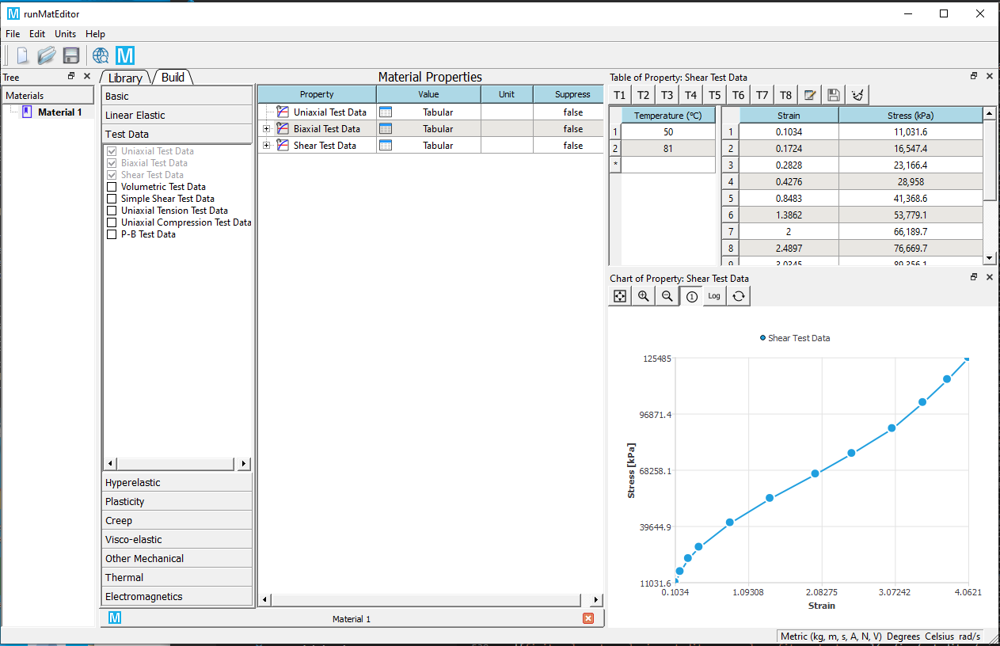
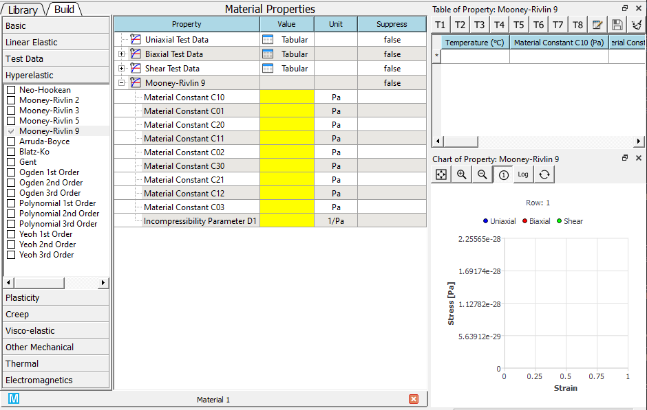
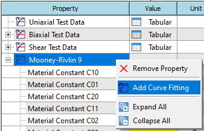
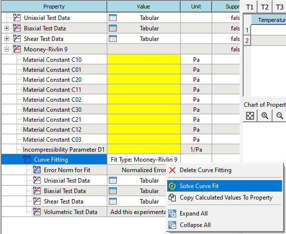
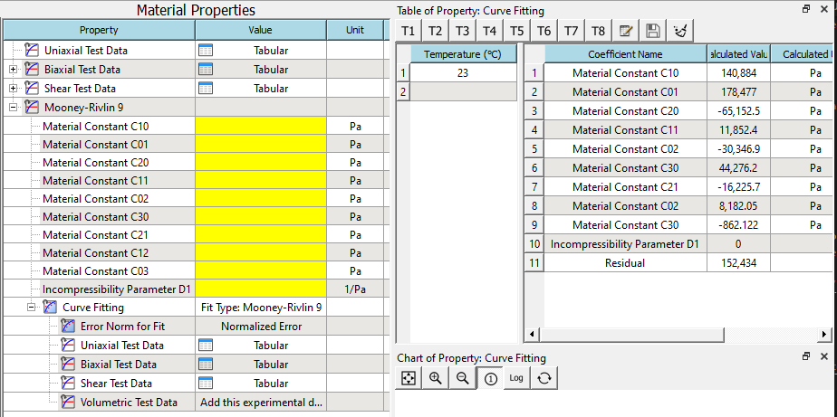
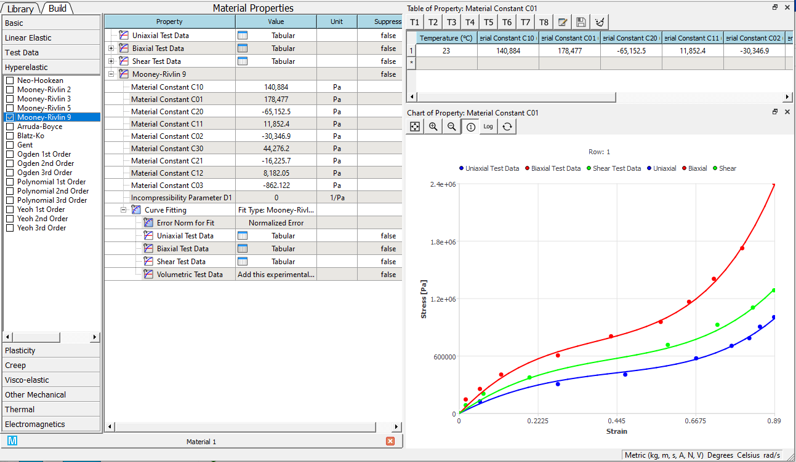

# Curve Fitting

## Calculate material constants from test data 
This section introduces how to calculate material coefficients for the selected hyperelastic models according to the given uniaxial, biaxial, shear, and volumetric test data. **Enginering** strain and stress pair is used for input data.

1. Add Uniaxial Test Data, Biaxial Test Data, or Shear Test Data material property, and edit the strain-stress data. You also can import the data from a plain text or Excel file. Set the temperature value if it is available. Check the data points by clicking the row of temperature. 

2. Add one of hyperelastic material properties from the toolbox, the supported hyperelastic models include Neo-Hookean, Mooney-Rivlin, Arruda-Boyce, Blatz-Ko, Gent, Ogden, Polynomial, and Yeoh. An example of Mooney-Rivlin 9 is given here. 

3. Add Curve Fitting sub-property from the RMB context menu. 

4. Solve the curve fit from the RMB context menu. 

5. If the solve succeeds. The calculated parameters will be shown in the table. 

6. Copy the solved values to the properties from RMB context menu. You also can review the calculated curves in the chart. 

!!!note
    1. The test data should cover the entire strain range in the following simulation. 
    2. It is recommended to input all uniaxial, biaxial, and shear test data if those data are available from the experiments.

