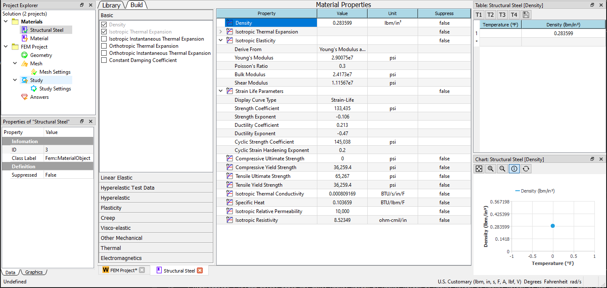

# Overview
Material Module serves as a database for material properties used in analysis projects. The module not only provides a material library but  allow you to create a material using the given properties. The properties view of a Material object is the primary user interface designed to let you create, save, and retrieve material models. The well-defined material object can be saved and used in the subsequent projects. 

!!!note
    The WELSIM Material module and **MatEditor** share the same features. For the completed and latest content, you can refer to [the manual of MatEditor](mateditor_overview.md).

## Graphical user interface
The ease-of-use Material Module contains the following graphical user interface components: 

* **Toolbox**: provdies two options (**Library** and **Build** tabs) for you to edit material data. 
* **Library outline pane**: lists predefined materials for you to quickly add material data.
* **Property outline pane**: shows an outline of the contents of the togglable material properties. You can add a property data entry to the material by toggling on the property entry or remove property by toggling off the property entry. 
* **Properties view pane**: displays all properties that are going to be added to the **Material Object**. You can tune the property values at this pane. 
* **Table pane**: allows you to define and review tabular data for material properies.
* **Chart pane**: displays the property tabular data in vivid. 

## Predefined materials
WELSIM also provide predefined materials, which covers most of commonly used materials. Users can choose these materials and apply to the successive finite element analysis.

| Category | Materials |
| -------- | --------- |
| General Materials | Structural Steel, Stainless Steel, Aluminum Alloy, Concrete, Copper Alloy, Gray Cast Iron, Titanium Alloy|
| Nonlinear Materials | Aluminum Alloy NL, Concrete NL, Copper Alloy NL, Stainless Steel NL, Structural Steel NL, Titanium Alloy NL |
| Hyperelastic Materials | Elastomer Mooney-Rivlin, Elastomer Neo-Hookean, Elastomer Ogden, Elastomer Yeoh, Neoprene Rubber |
| Thermal Materials | Brass, Bronze, Copper, Diamond, Ferrite, Nodular Cast Iron, Solder, Teflon, Tungsten, Wood |
| Electromagnetic Materials | SS416, Supermendure |
| Other Materials | Water Liquid, Argon, Ash |

## Material properties
The supported material properties are listed in the table below.

| Category | Materials |
| -------- | --------- |
| Basic | Density, Isotropic Thermal Expansion, Isotropic Instantaneous Thermal Expansion, Orthotropic Thermal Expansion, Orthotropic Instantaneous Thermal Expansion, Constant Damping Coefficient |
| Linear Elastic | Isotropic Elasticity, Orthotropic Elasticity, Viscoelastic |
| Hyperelastic Test Data | Uniaxial Test Data, Biaxial Test Data, Shear Test Data, Volumetric Test Data, SimpleShear Test Data, Uniaxial Tension Test Data, Uniaxial Compression Test Data |
| Hyperelastic | Arruda-Boyce, Blatz-Ko, Gent, Mooney-Rivlin 2, Mooney-Rivlin 3, Mooney-Rivlin 5, Mooney-Rivlin 9, Neo-Hookean, Ogden 1st Order, Ogden 2nd Order, Ogden 3rd Order, Polynomial 1st Order, Polynomial 2nd Order, Polynomial 3rd Order, Yeoh 1st Order, Yeoh 2nd Order, Yeoh 3rd Order |
| Plasticity | Bilinear Isotropic Hardening, Multilinear Isotropic Hardening, Bilinear Kinematic Hardening, Multilinear Kinematic Hardening, Anand Viscoplasticity |
| Creep | Strain Hardening, Time Hardening, Generalized Exponential, Generalized Graham, Generalized Blackburn, Modified Time Hardening, Modified Strain Hardening, Generalized Garofalo, Exponential Form, Norton, Combined Time Hardening, Rational Polynomial, Generalized Time Hardening |
| Visco-elastic | Prony Shear Relaxation, Prony Volumetric Relaxation |
| Other Mechanical | Strain Life Parameters, Compressive Ultimate Strength, Compressive Yield Strength, LaRc0304 Constants, Orthotropic Strain Limits, Orthotropic Stress Limits, Puck Constants, Tensile Ultimate Strength, Tensile Yield Strength, Tsai-Wu Constants, Shape Memory Effect, Drucker-Prager Strength Piecewise, Drucker-Prager Strength Linear, Ideal Gas EOS, Crushable Foam, Nonlinear Elastic Model Damage, Plakin Special Hardening, Tensile Pressure Failure, Crack Softening Failure |
| Thermal | Enthalpy, Isotropic Thermal Conductivity, Orthotropic Thermal Conductivity, Specific Heat |
| Electromagnetics | B-H Curve, Isotropic Relative Permeability, Orthotropic Relative Permeability, Isotropic Resistivity, Orthotropic Resistivity |

## Working with material data
### Exporting
You can export the complete material data to an external XML file. The following format is supported for export:

* XML in WELSIM Material (MatML 3.1) schema.
* JSON in WELSIM Material schema.
* OpenRadioss input script

<!-- To implement the exporting, you can use one of the following methods:

* Click the **Export Materials** button from the standard **Toolbar**.
* Click the **Export Materials** item from the **Material Menu**.
* Right-click the **Material Project** and select the **Export Materials** item from the context menu. -->
