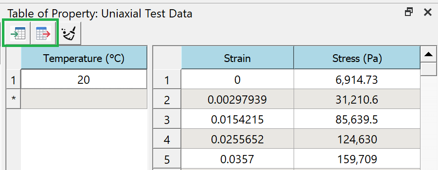
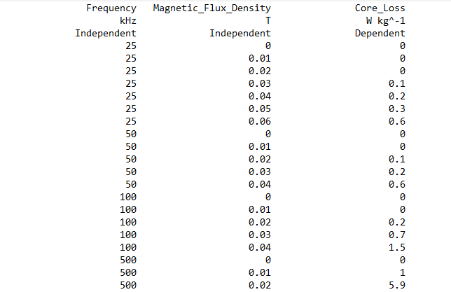
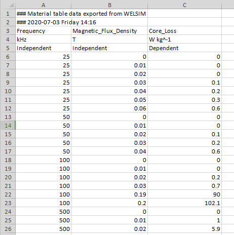
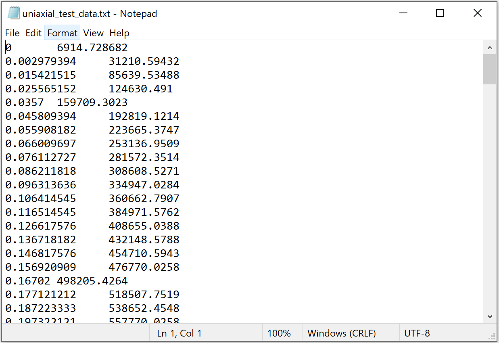

# Import/Export Tabular Data
Import and export tabular data is supported in MatEditor, CurveFitter and WELSIM, this feature facilitates you to input and output massive tabular data with no need to manually input and output data, specifically test data for the hyperelastic and magnetic core loss materials.

The import and export buttons are allocated on the top of the Tabular Data Window, as shown in the figure below: 

## Default file format
The default file format used in MatEditor/CurveFitter/WELSIM contains a header block that gives the quantity name, unit, and dependency. This header data allows you to define the units from the external file. The latest version supports both plain text and Excel formats. Both formats share a similar schema. The details of each format are discussed below. 

* The comment line starts with **###** symbol and will be ignored by the reader.
* The first row lists the **quantity names**. 
* The second row shows the **units**. For the dimensionless quantity, *dash symbol* **-** is used.
* The third row gives the **dependency** of the quantity, which could be **independent**, **dependent**, **subindependent**, or **subdependent**. 
* The kernel test data start from the fourth row.  

!!!note 
    The number of columns of import data must match the pre-defined headers.

The plain text data file looks like below: 

An example of Excel file is shown below: 

## Format with no header data
MatEditor/CurveFitter/WELSIM also supports the external data that contains no header information (pure value data). You need to ensure unit consistency when importing such data files. Both plain text and Excel file formats are supported.

The plain text file with no header dat looks like below: 

!!!note 
    Due to the lack of the header information, the units of the imported data is determined by the current units of the Table. In addition, the pivoting column may not be set if the file does not contain such data. The number of columns must be identicial to that of the pre-defined table quantities.

## Examples
The examples of the import/export tabular data are available at our [GitHub page](https://github.com/WelSimLLC/Examples/tree/main/TabularData).