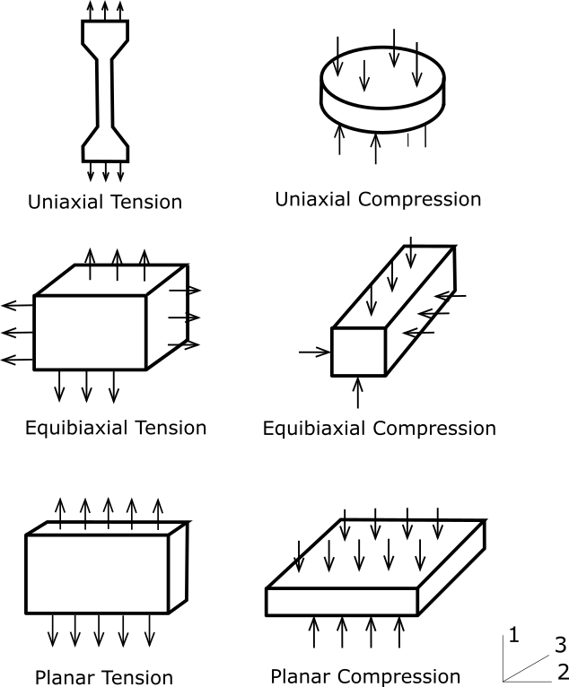

# Hyperelasticity and Curve Fitting

## Isotropic hyperelasticity
The elastic potential energy in hyperelastic material can be obtained from the initial state with no stress activation. Therefore, we have the main invariable terms of the right Cauchy-Green deformation tensor C($I_{1}$, $I_{2}$, $I_{3}$), or the main invariable of the deformation tensor excluding the volume changes ($\bar{I}_{1}$, $\bar{I}_{2}$, $\bar{I}_{3}$). The potential can be expressed as $\mathbf{W}=\mathbf{W}(I_{1},I_{2},I_{3})$, or $\mathbf{W}=\mathbf{W}(\bar{I}_{1},\bar{I}_{2},\bar{I}_{3})$.

The nonlinear constitutive relation of a hyperelastic material is defined by the relation between the second-order Piola-Kirchhoff stress and the Green-Lagrange strain, the total Lagrange method is more efficient in solving such models. 

When the elastic potential energy $W$ of the hyperelasticity is known, the second Piola-Kirchhoff stress and strain-stress relationship can be calculated as follows

$$
S=2\dfrac{\partial W}{\partial C}
$$

$$
C=4\dfrac{\partial^{2}W}{\partial C\partial C}
$$

The following are several forms of strain-energy potential (W) provided for the modeling of incompressible or nearly incompressible hyperelastic materials.

### Arruda-Boyce model
The form of the strain-energy potential for Arruda-Boyce model is 

$$
\begin{array}{ccl}
W & = & \mu[\dfrac{1}{2}(\bar{I}_{1}-3)+\dfrac{1}{20\lambda_{m}^{2}}(\bar{I_{1}^{2}}-9)+\dfrac{11}{1050\lambda_{m}^{4}}(\bar{I_{1}^{3}}-27)\\
 & + & \dfrac{19}{7000\lambda_{m}^{6}}(\bar{I_{1}^{4}}-81) + \dfrac{519}{673750\lambda_{m}^{8}}(\bar{I_{1}^{5}}-243)]\\
 & + & \dfrac{1}{D_1}(\dfrac{J^{2}-1}{2}-\mathrm{ln}J)
\end{array}
$$

where $\mu$ is the initial shear modulus of the material, $\lambda_{m}$ is limiting network stretch, and $D_1$ is the material incompressibility parameter.

The initial shear modulus is 

$$
\mu=\dfrac{\mu_{0}}{1+\dfrac{3}{5\lambda_{m}^{2}}+\dfrac{99}{175\lambda_{m}^{4}}+\dfrac{513}{875\lambda_{m}^{6}}+\dfrac{42039}{67375\lambda_{m}^{8}}}
$$

The initial bulk modulus is 

$$
K=\dfrac{2}{D_1}
$$

As the parameter $\lambda_L$ goes to infinity, the model is equivalent to neo-Hookean form.

<!-- #### Stress-stretch relation

The corresponding engineering stress can be expressed as follow:

Uniaxial tension:

$$
T_{uni}=2(\lambda_1-\lambda_1^{-2})\mu[\dfrac{1}{2} + \dfrac{2}{20}I_1 + \dfrac{11 \cdot 3}{1050\lambda_m^4}I_1^2 + \dfrac{19\cdot4}{7000 \lambda_m^6}I_1^3 + \dfrac{519\cdot5}{673750\lambda_m^8}I_1^4]
$$

Equibiaxial tension:

$$
T_{bi}=2(\lambda_1-\lambda_1^{-5})\mu[\dfrac{1}{2} + \dfrac{2}{20}I_1 + \dfrac{11 \cdot 3}{1050\lambda_m^4}I_1^2 + \dfrac{19\cdot4}{7000 \lambda_m^6}I_1^3 + \dfrac{519\cdot5}{673750\lambda_m^8}I_1^4]
$$

Pure shear:

$$
T_{sh}=2(\lambda_1-\lambda_1^{-3})\mu[\dfrac{1}{2} + \dfrac{2}{20}I_1 + \dfrac{11 \cdot 3}{1050\lambda_m^4}I_1^2 + \dfrac{19\cdot4}{7000 \lambda_m^6}I_1^3 + \dfrac{519\cdot5}{673750\lambda_m^8}I_1^4]
$$ -->

### Blatz-Ko foam model
The form of strain-energy potential for the Blatz-Ko model is:

$$
W=\frac{\mu}{2}\left(\frac{I_{2}}{I_{3}}+2\sqrt{I_{3}}-5\right)
$$

where $\mu$ is the initial shear modulus of material. The initial bulk modulus is defined as :

$$
K = \frac{5}{3}\mu
$$

<!-- ### Extended tube model
The elastic strain-energy potential for the extended tube model is:

$$
\begin{array}{ccc}
W & = & \frac{G_{c}}{2}\left[\frac{\left(1-\delta^{2}\right)\left(\bar{I}_{1}-3\right)}{1-\delta^{2}\left(\bar{I}_{1}-3\right)}+\mathrm{ln}\left(1-\delta^{2}\left(\bar{I}_{1}-3\right)\right)\right]\\
 & + & \frac{2G_{e}}{\beta^{2}}\sum_{i=1}^{3}\left(\bar{\lambda}_{i}^{-\beta}-1\right)+\frac{1}{D_1}\left(J-1\right)^{2}
\end{array}
$$

where the initial shear modulus is $G$=$G_c$ + $G_e$, and $G_e$ is constraint contribution to modulus, $G_c$ is crosslinked contribution to modulus, $\delta$ is extensibility parameter, $\beta$ is empirical parameter (0$\leq \beta \leq$1), and $D_1$ is material incompressibility parameter. 

Extended tube model is equivalent ot a two-term Ogden model with the following parameters:

$$
\begin{array}{cccc}
\alpha_1 = 2 &, & \alpha_2=-\beta\\
\mu_1=G_c &, & \mu_2=-\dfrac{2}{\beta}G_e, & \delta=0 
\end{array}
$$ -->

### Gent model
The form of the strain-energy potential for the Gent model is:

$$
W=-\frac{\mu J_{m}}{2}\mathrm{ln}\left(1-\frac{\bar{I}_{1}-3}{J_{m}}\right)+\frac{1}{D_1}\left(\frac{J^{2}-1}{2}-\mathrm{ln}J\right)
$$

where $\mu$ is the initial shear modulus of material, $J_m$ is limiting value of $\bar{I}_1-3$, $D_1$ is material incompressibility parameter. 

The initial bulk modulus is 

$$
K=\dfrac{2}{D_1}
$$

When the parameter $J_m$ goes to infinity, the Gent model is equivalent to neo-Hookean form.

<!-- #### Stress-stretch relation
The corresponding engineering stress can be expressed as follow:

Uniaxial tension:

$$
T_{uni}=2(\lambda_1-\lambda_1^{-2})\dfrac{\mu J_m}{2}\dfrac{1}{J_m-I_1+3}
$$

Equibiaxial tension:

$$
T_{bi}=2(\lambda_1-\lambda_1^{-5})\dfrac{\mu J_m}{2}\dfrac{1}{J_m-I_1+3}
$$

Pure shear:

$$
T_{sh}=2(\lambda_1-\lambda_1^{-3})\dfrac{\mu J_m}{2}\dfrac{1}{J_m-I_1+3}
$$ -->

### Mooney-Rivlin model
This model includes two-, three-, five-, and nine-terma Mooney-Rivlin models. The form of the strain-energy potential for a two-parameter Mooney-Rivlin model is 

$$
W=C_{10}\left(\bar{I}_{1}-3\right)+C_{01}\left(\bar{I}_{2}-3\right)+\frac{1}{D_1}\left(J-1\right)^{2}
$$

where $C_{10}$, $C_{01}$, and $D_{1}$ are the material constants.

The form of strain-energy potential for a three-parameter Mooney-Rivlin model is 

$$
W=C_{10}\left(\bar{I}_{1}-3\right)+C_{01}\left(\bar{I}_{2}-3\right)+C_{11}\left(\bar{I}_{1}-3\right)\left(\bar{I}_{2}-3\right)+\frac{1}{D_1}\left(J-1\right)^{2}
$$

where $C_{10}$, $C_{01}$, $C_{11}$, and $D_1$ are material constants.

The form of strain-energy potential for a five-parameter Mooney-Rivlin model is 

$$
\begin{array}{ccl}
W & = & C_{10}\left(\bar{I}_{1}-3\right)+C_{01}\left(\bar{I}_{2}-3\right)+C_{20}\left(\bar{I}_{1}-3\right)^{2}\\
 & + & C_{11}\left(\bar{I}_{1}-3\right)\left(\bar{I}_{2}-3\right)+C_{02}\left(\bar{I}_{2}-3\right)^{2}+\frac{1}{D_1}\left(J-1\right)^{2}
\end{array}
$$

where $C_{10}$, $C_{01}$, $C_{20}$, $C_{11}$, $C_{02}$, and $D_1$ are material constants.

The form of strain-energy potential for a nine-parameter Mooney-Rivlin model is 

$$
\begin{array}{ccl}
W & = & C_{10}\left(\bar{I}_{1}-3\right)+C_{01}\left(\bar{I}_{2}-3\right)+C_{20}\left(\bar{I}_{1}-3\right)^{2}\\
 & + & C_{11}\left(\bar{I}_{1}-3\right)\left(\bar{I}_{2}-3\right)+C_{02}\left(\bar{I}_{2}-3\right)^{2}+C_{30}\left(\bar{I}_{1}-3\right)^{3}\\
 & + & C_{21}\left(\bar{I}_{1}-3\right)^{2}\left(\bar{I}_{2}-3\right)+C_{12}\left(\bar{I}_{1}-3\right)\left(\bar{I}_{2}-3\right)^{2}+C_{03}\left(\bar{I}_{2}-3\right)^{3}\\
 & + & \frac{1}{D_1}\left(J-1\right)^{2}
\end{array}
$$

where $C_{10}$, $C_{01}$, $C_{20}$, $C_{11}$, $C_{02}$, $C_{30}$, $C_{21}$, $C_{12}$, $C_{03}$, and $D_1$ are material constants.

The initial shear modulus is given by:

$$
\mu=2(C_{10}+C_{01})
$$

The initial bulk modulus is 

$$
K=\dfrac{2}{D_1}
$$

<!-- #### Stress-stretch relation
The corresponding engineering stress can be expressed as a function of principal stretch:

Uniaxial tension:

$$
T_{uni}=2(\lambda_1-\lambda_1^{-2})C_{10}
$$

Equibiaxial tension:

$$
T_{bi}=2(\lambda_1-\lambda_1^{-5})C_{10}
$$

Pure shear:

$$
T_{sh}=2(\lambda_1-\lambda_1^{-3})C_{10}
$$ -->

### Neo-Hookean model
The Neo-Hookean model is a well-known hyperelastic model with an expanded linear rule (Hooke rule) having isotropy so that it can respond to finite deformation problems. The elastic potential is as follows.

$$
W=\frac{\mu}{2}(\bar{I}_{1}-3)+\dfrac{1}{D_{1}}(J-1)^{2}
$$

where $\mu$ is initial shear modulus of materials, $D_{1}$ is the material constant.

The initial bulk modulus is given by:

$$
K=\dfrac{2}{D_1}
$$

### Ogden compressible foam model
The strain-energy potential of the Ogden compressible foam model is based on the principal stretches of left Cauchy strain tensor, which has the form:

$$
W=\sum_{i=1}^{N}\frac{\mu_{i}}{\alpha_{i}}\left(J^{\alpha_{i}/3}\left(\bar{\lambda}_{1}^{\alpha_{i}}+\bar{\lambda}_{2}^{\alpha_{i}}+\bar{\lambda}_{3}^{\alpha_{i}}\right)-3\right)+\sum_{i=1}^{N}\frac{\mu_{i}}{\alpha_{i}\beta_{i}}\left(J^{-\alpha_{i}\beta_{i}}-1\right)
$$

where N determines the order of the polynomial, $\mu_i$, $\alpha_i$ are material constants, $D_k$ is incompressiblity parameter. The reduced principal strench is defined by:

$$
\bar{\lambda}_{p}=J^{-\frac{1}{3}}\lambda_p,\; J=(\lambda_{1}\lambda_{2}\lambda_{3})^{\frac{1}{2}}
$$

The initial shear modulus is given by:

$$
\mu=\dfrac{\sum_{i=1}^{N}\mu_{i}\alpha_{i}}{2}
$$

The initial bulk modulus K is defined by

$$
K = \sum_{i=1}^{N}\mu_{i}\alpha_{i}\left(\dfrac{1}{3}+\beta_{i}\right)
$$

When parameters N=1, $\alpha_1$=-2, $\mu_1$=-$\mu$, and $\beta$=0.5, the Ogden compressible model is converted to the Blatz-Ko model.

### Ogden model
The strain-energy potential of the Ogden compressible foam model is based on the principal stretches of left Cauchy strain tensor, which has the form:

$$
W=\sum_{i=1}^{N}\frac{\mu_{i}}{\alpha_{i}}\left(\bar{\lambda}_{1}^{\alpha_{i}}+\bar{\lambda}_{2}^{\alpha_{i}}+\bar{\lambda}_{3}^{\alpha_{i}}-3\right)+\sum_{k=1}^{N}\frac{1}{D_{k}}\left(J-1\right)^{2k}
$$

where N determines the order of the polynomial, $\mu_i$, $\alpha_i$ are material constants, $D_k$ is incompressiblity parameter. The reduced principal strench is defined by:

$$
\bar{\lambda}_{p}=J^{-\frac{1}{3}}\lambda_p,\; J=(\lambda_{1}\lambda_{2}\lambda_{3})^{\frac{1}{2}}
$$

The initial shear modulus is given by:

$$
\mu=\dfrac{\sum_{i=1}^{N}\mu_{i}\alpha_{i}}{2}
$$

The initial bulk modulus K is defined by

$$
K = \dfrac{2}{D_1}
$$

When parameters N=1, $\alpha_1$=2, the Ogden model is converted to the neo-Hookean model. When parameters N=2, $\alpha_1$=2 and $\alpha_2$=-2, the Ogden model is converted to the 2-parameter Mooney-Rivlin model.

### Polynomial form
The polynomial form of strain-energy potential is:

$$
W=\sum_{i+j=1}^{N}c_{ij}\left(\bar{I}_{1}-3\right)^{i}\left(\bar{I_{2}}-3\right)^{j}+\sum_{k=1}^{N}\frac{1}{D_{k}}\left(J-1\right)^{2k}
$$

where $N$ determines the order of polynomial, $c_{ij}$, $D_k$ are material constants.

The initial shear modulus is given by:

$$
\mu=2\left(C_{10}+C_{01}\right)
$$

The initial bulk modulus K is defined by

$$
K = \dfrac{2}{D_1}
$$

The Polynomial model is converted to following models with specific parameters:

| Parameters of Polynomial model | Equivalent model |
| ------------------------------ | ---------------- |
| N=1, $C_{01}$=0 | neo-Hookean |
| N=1 | 2-parameter Mooney-Rivlin |
| N=2 | 5-parameter Mooney-Rivlin |
| N=3 | 9-parameter Mooney-Rivlin |

### Yeoh model
The Yeoh model is also called the reduced polynomial form. The strain-energy potential is 

$$
W=\sum_{i=1}^{N}c_{i0}\left(\bar{I}_{1}-3\right)^{i}+\sum_{k=1}^{N}\frac{1}{D_{k}}\left(J-1\right)^{2k}
$$

where N denotes the order of the polynomial, $C_{i0}$ and $D_k$ are material constants. When N=1, Yeoh becomes neo-Hookean model. 

The initial shear modulus is defined:

$$
\mu=2c_{10}
$$

The initial bulk modulus is:

$$
K=\frac{2}{D_1}
$$

## Hyperelasticity Material Curve Fitting
The mechanical response of hyperelastic materials is determined by the hyperelastic constants in the strain energy density function of a model. To get correct results during a hyperelastic analysis, it is required to precisely assess the material constants of the materials being tested. These constants are usually derived for a material based on the experimental strain-stress data. The test data are generally taken from several modes of deformation over a wide range of strain values. The material constants could be fit using test data in at least as many deformation states as will be experienced in the finite element analysis.

For hyperelastic materials, simple deformation tests can be used to characterize the material constants. The six different deformation modes are graphically illustrated in the figure below. Combinations of data from multiple tests will enhance the characterization of the hyperelastic behavior of a material.

Although these six different deformation states are accepted, we find that upon the addition of hydrostatic stresses, the following modes of deformation are the same:

1. Uniaxial Tension and Equibiaxial Compression.
2. Uniaxial Compression and Equibiaxial Tension.
3. Planar Tension and Planar Compression.

With these equivalent modes of testing, we now have only three independent deformation modes for which one can get experimental data.

In the analysis, when the coordinate system is chosen to consistent with the principal directions of deformation, the right Cauchy-Green strain tensor can be written in matrix form by:

$$
[C] =
\begin{bmatrix}
\lambda_1^2 & 0 & 0\\
0 & \lambda_2^2 & 0\\
0 & 0 & \lambda_3^2
\end{bmatrix}
$$

where $\lambda_i$=1+$\epsilon_i$ is principal stretch ratio in the *i*-th direction, $epsilon_i$ is principal value of the engineering strain tensor in the *i*-th direction. The principal invariants of right Cauchy-Green strain tensor $C_{ij}$ are:

$$
I_1 = \lambda_1^2+\lambda_2^2+\lambda_3^2
$$

$$
I_2 = \lambda_1^2\lambda_2^2 + \lambda_1^2\lambda_3^2 + \lambda_2^2\lambda_3^2
$$

$$
I_3 = \lambda_1^2\lambda_2^2\lambda_3^2
$$

For the fully incompressible material, the principal invariant $I_3$ is one:

$$
\lambda_1^2\lambda_2^2\lambda_3^2=1
$$

### Uniaxial tension (Equibiaxial compression)
For the uniaxial tension deformation, the principal stretch ratios in the directions orthogonal to the 'pulling' axis is identical. Thus, the principal stretches during uniaxial tension $\lambda_i$ are given by:

* $\lambda_1=$stretch in direction being loaded
* $\lambda_2=\lambda_3=$stretch in directions not being loaded

Due to incompressibility:

$$
\lambda_2\lambda_3=\lambda^{-1}
$$

and with 

$$
\lambda_2=\lambda_3=\lambda_1^{-1/2}
$$

For uniaxial tension, the first and second strain invariants then become:

$$
I_1= \lambda_1^2+2\lambda_1^{-1}\\
I_2=2\lambda_1+\lambda_1^{-2}
$$

The corresponding engineering stress can be expressed using principal stretch ratio: 

$$
T_1=2(\lambda_1-\lambda_1^{-2})[\dfrac{\partial W}{\partial I_1}+\lambda_1^{-1}\dfrac{\partial W}{\partial I_2}]
$$

### Equibiaxial tension (Uniaxial compression)
During an equibiaxial tension test, the principal stretch ratios in the directions being loaded are identical. Therefore, for quibiaxial tension, the principal stretches, $\lambda_i$ are given by:

* $\lambda_1=\lambda_2=$stretch ratio in direction being loaded
* $\lambda_3=$stretch in directions not being loaded

According to incompressibility, we have 

$$
\lambda_3=\lambda_1^{-2}
$$

For equibiaxial tension, the first and second strain invariants then become:

$$
I_1=2\lambda_1^2+\lambda_1^{-4} \\
I_2=\lambda_1^4+2\lambda_1^{-2}
$$

The corresponding engineering stress can be expressed using principal stretch ratio: 

$$
T_1=2(\lambda_1-\lambda_1^{-5})[\dfrac{\partial W}{\partial I_1} + \lambda_1^2\dfrac{\partial W}{\partial I_2}]
$$

### Pure Shear (Uniaxial tension and uniaxial compression in orthogonal directions)
For pure shear deformation mode, plane strain is generally assumed so that there is no deformation in the 'wide' direction of the specimen. Including the incompressibility, we have 

$$ 
\lambda_2=1 \\
\lambda_3 = \lambda_1^{-1}
$$

For pure shear, the first and second strain invariants are:

$$
I_1=I_2=\lambda_1^2+\lambda_1^{-2}+1
$$

The corresponding engineering stress can be expressed using principal stretch ratio: 

$$
T_1=2(\lambda_1 - \lambda_1^{-3})[\dfrac{\partial W}{\partial I_1} + \dfrac{\partial W}{\partial I_2}]
$$

### Volumetric Deformation
The volumetric deformation is given as:

$$
\lambda_1=\lambda_2=\lambda_3=\lambda\\
J=\lambda^3
$$

As nearly incompressible is assumed, we have:

$$
\lambda \approx 1
$$

The pressure P is directly related to the volume ratio J:

$$
P=\dfrac{\partial W}{\partial J}
$$

### Deformations for principal stretches based models
For the models based on the principal stretches, such Ogden model, the strain-stress relation can be obtained by deriving the strain energy with respect to the stretch.

$$
\sigma(\lambda)=\dfrac{\partial W(\lambda)}{\partial \lambda}
$$

The corresponding engineering stress is:

$$
T_1 = \dfrac{\partial W(\lambda_1)}{\partial \lambda_1} \lambda_1^{-1}
$$

<!-- ### Last squares fit analysis -->

## Material stability check
Stability checks are critical for the following analysis. A nonlinear material is stable if the secondary work required for an arbitrary change in the deformation is always positive. We usually use the Drucker stability criterion to determine the stability of the hyperelastic materials. Mathematically, this is: 

$$
d\sigma_{ij}d\epsilon_{ij}>0
$$

where $d\sigma$ is the change in the Cauchy stress tensor corresponding to a change in the logarithmic strain.

The material stability checks can be done at the end of preprocessing but before an analysis actually begins. Checking for the stability of a material can be more conveniently accomplished by checking for the positive definiteness of the material stiffness. The program checks for the loss of stability of six typical stress paths including uniaxial tension and compression, equibiaxial tension and compression, and planar tension and compression. the range of the stretch ratio over which the stability is checked is chosen from 0.1 to 10.

