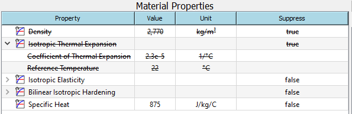

# Material workflow
This section discusses about the material data, and precedures for working with *MatEditor*.

## Material data
Material data is the source of the material information that is used for the analysis of the system it is contained in. The information in a material data component system is used if shared to an analysis system. MatEditor allows you to view, edit, and add data for use in your analysis system.

## Importing
You can import data into an system as a new material. The following types of files are supported for import:

* WELSIM material data format
* Material(s) file following the MatML 3.1 schema

!!! note
    When you import material data, the materials contained in that source will be added to the material outline.

## Editing
Property and Table panes provide constant and tabular data input. You can edit both constant and tabular data.

### Constant data
You edit constant data by changing the value and/or unit of that data in the Properties pane. The value is modified by clicking the cell in the Value column and typing in the new value. If available, changing the unit will convert the value to correspond to the new unit. If the value entered is invalid or not acceptable it will be indicated in yellow or red to gain users' attention.

### Tabular data
If Value cell shows a tabular format indication. This data is edited in the Table pane and each datum is a value and unit as one integral piece. If the value entered is invalid or not acceptable it will be indicated in yellow or red to gain users' attention. The unit is shown in the header, and you can change unit if necessary. The units between table header and Property pane column are connnected. Modifying either one of them changes units on both areas.

## Suppression
A material property may be defined but suppressed to prevent it from being sent to analysis process in the system. A data item may be suppressed by selecting the dropdown in the suppression column. Suppressed items and its children are shown by a strike through the name (for example,  ) and the dropdown being set to True in the suppression column.

## Perform material tasks in MatEditor
All material related tasks require that you perform the following basic tasks:

| Task | Procedure | 
| ---- | --------- |
| Create new material. | In the Menu or Toolbar, click New Material to add a new material. |
| Add material properties. | <ol type="1"><li>Activate the material in the Material Outline pane that is to receive the additional property.</li><li>Toggle the property in the Property Outline pane that you want to add.</li></ol> |
| Delete material properties. | <ol type="1"><li>Activate the material in the Material Outline pane whose property is to be deleted.</li><li>Select the material property in the Properties pane.</li><li>Right-click and choose Delete or on the menu bar, choose Delete.</li></ol> |
| Modify material properties. | <ol type="1"><li>Activate the material in the Material Outline pane that contains the property you want to modify.</li><li>In the Properties pane change the value or unit for constant data.</li><li>Perform one of the following: <ul><li>For constant data, change the value or unit in the Properties pane.</li><li>For tabular data, change the value or unit(s) in the Table pane.</li></ul></li></ol> |
| Suppress material properties. | <ol type="1"><li>Activate the material in the Material Outline pane that contains the property you want to suppress.</li><li>Select the dropdown in the suppression column for the property you want to suppress.</li></ol> |

