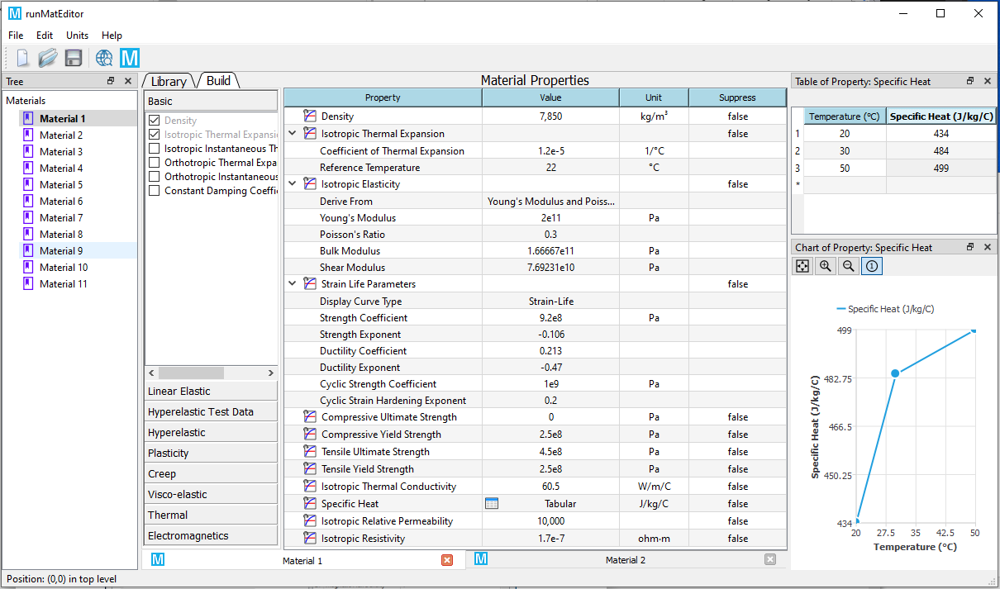

# Overview

**MatEditor** is a free material editor software program for engineers. This tool provides you comprehensive material properties those are often used in engineering simulation and finite element analysis.

## Specification

| Specification | Description |
| ------------- | ----------- |
| Operation system | Microsoft Windows 7 to 10; 64-bit |
| Physical memory | At least 4 GB |

Supported unit systems :

* [x] SI: (kg, m, s, K, A, N, V)
* [x] MKS Standard: (kg, m, s, °C, A, N, V)
* [x] NMMTON Standard: (tonne, mm, s, °C, A, N, mV)
* [x] BIN Standard: (lbm, in, s, °F, A, lbf, V)
* [ ] US Engineering: (lb, in, s, R, A, lbf, V)
* [x] CGS Standard: (g, cm, s, °C, A, dyne, V)
* [x] NMM Standard: (kg, mm, s, °C, mA, N, mV)
* [x] UMKS Standard: (kg, µm, s, °C, mA, µN, V)
* [x] NMMDAT Standard: (decatonne, mm, s, °C, mA, N, mV)
* [x] BFT Standard: (lbm, ft, s, °F, A, lbf, V)
* [ ] CGS Consistent: (g, m, s, °C, A, dyne, V)
* [ ] NMM Consistent: (tonne, m, s, °C, mA, t⋅mm/s2, mV)
* [ ] UMKS Consistent: (kg, m, s, °C, pA, µN, pV)
* [ ] BIN Consistent: (slinch, in, s, °C, A, slinch⋅in/s2, V)
* [ ] BFT Consistent: (slug, ft, s, °C, A, slug⋅ft/s2, V)
* [x] CGuS Standard: (g, cm, $\mu$s, °C, A, dyne, V)

## Material properties
The supported material properties are listed in the table below.

| Category | Materials |
| -------- | --------- |
| Basic | Density, Isotropic Thermal Expansion, Isotropic Instantaneous Thermal Expansion, Orthotropic Thermal Expansion, Orthotropic Instantaneous Thermal Expansion, Constant Damping Coefficient |
| Linear Elastic | Isotropic Elasticity, Orthotropic Elasticity, Viscoelastic |
| Hyperelastic Test Data | Uniaxial Test Data, Biaxial Test Data, Shear Test Data, Volumetric Test Data, SimpleShear Test Data, Uniaxial Tension Test Data, Uniaxial Compression Test Data |
| Hyperelastic | Arruda-Boyce, Blatz-Ko, Gent, Mooney-Rivlin 2, Mooney-Rivlin 3, Mooney-Rivlin 5, Mooney-Rivlin 9, Neo-Hookean, Ogden 1st Order, Ogden 2nd Order, Ogden 3rd Order, Polynomial 1st Order, Polynomial 2nd Order, Polynomial 3rd Order, Yeoh 1st Order, Yeoh 2nd Order, Yeoh 3rd Order |
| Plasticity | Bilinear Isotropic Hardening, Multilinear Isotropic Hardening, Bilinear Kinematic Hardening, Multilinear Kinematic Hardening, Anand Viscoplasticity, Johnson-Cook, Zerilli-Armstrong |
| Creep | Strain Hardening, Time Hardening, Generalized Exponential, Generalized Graham, Generalized Blackburn, Modified Time Hardening, Modified Strain Hardening, Generalized Garofalo, Exponential Form, Norton, Combined Time Hardening, Rational Polynomial, Generalized Time Hardening |
| Visco-elastic | Prony Shear Relaxation, Prony Volumetric Relaxation |
| Equations of State (EOS) | Compaction, Gruneisen, Ideal Gas, Linear, LSZK, Murnaghan, NASG, Noble-Abel, Osborne, Polynomial, Puff, Stiff Gas, Tillotson |
| Failure | Johnson |
| Other Mechanical | Strain Life Parameters, Compressive Ultimate Strength, Compressive Yield Strength, LaRc0304 Constants, Orthotropic Strain Limits, Orthotropic Stress Limits, Puck Constants, Tensile Ultimate Strength, Tensile Yield Strength, Tsai-Wu Constants, Shape Memory Effect, Drucker-Prager Strength Piecewise, Drucker-Prager Strength Linear, Ideal Gas EOS, Crushable Foam, Nonlinear Elastic Model Damage, Plakin Special Hardening, Tensile Pressure Failure, Crack Softening Failure |
| Thermal | Enthalpy, Isotropic Thermal Conductivity, Orthotropic Thermal Conductivity, Specific Heat |
| Electromagnetics | B-H Curve, Isotropic Relative Permeability, Orthotropic Relative Permeability, Isotropic Resistivity, Orthotropic Resistivity, Isotropic Relative Permittivity, Orthotropic Relative Permittivity, Isotropic Dielectric Loss Tangent, Isotropic Magnetic Loss Tangent, Isotropic Relative Imaginary Permeability, Orthotropic Dielectric Loss Tangent, Orthotropic Magnetic Loss Tangent |
| Fluid | Dynamic Viscosity, Kinematic Viscosity, Lemalar Prandtl Number, Turbulent Prandtl Number, ALE |

<!-- ## Base and comment material property

* [x] Density
* [x] Isotropic Thermal Expansion
* [x] Isotropic Instantaneous Thermal Expansion
* [x] Orthotropic Thermal Expansion
* [x] Orthotropic Instantaneous Thermal Expansion
* [x] Constant Damping Coefficient

## Linear elastic material property

* [x] Isotropic Elasticity
* [x] Orthotropic Elasticity
* [x] Viscoelastic

## Hyperelastic test data

* [x] Uniaxial Test Data
* [x] Biaxial Test Data
* [x] Shear Test Data
* [x] Volumetric Test Data
* [x] SimpleShear Test Data
* [x] Uniaxial Tension Test Data
* [x] Uniaxial Compression Test Data

## Hyperelastic material property

* [x] Arruda-Boyce
* [x] Blatz-Ko
* [x] Gent
* [x] Mooney-Rivlin 2
* [x] Mooney-Rivlin 3
* [x] Mooney-Rivlin 5
* [x] Mooney-Rivlin 9
* [x] Neo-Hookean
* [x] Ogden 1st Order
* [x] Ogden 2nd Order
* [x] Ogden 3rd Order
* [x] Polynomial 1st Order
* [x] Polynomial 2nd Order
* [x] Polynomial 3rd Order
* [x] Yeoh 1st Order
* [x] Yeoh 2nd Order
* [x] Yeoh 3rd Order

## Plasticity material property

* [x] Bilinear Isotropic Hardening 
* [x] Multilinear Isotropic Hardening
* [x] Bilinear Kinematic Hardening
* [x] Multilinear Kinematic Hardening
* [x] Anand Viscoplasticity

## Creep material property

* [x] Strain Hardening
* [x] Time Hardening
* [x] Generalized Exponential
* [x] Generalized Graham
* [x] Generalized Blackburn
* [x] Modified Time Hardening
* [x] Modified Strain Hardening
* [x] Generalized Garofalo
* [x] Exponential Form
* [x] Norton
* [x] Combined Time Hardening
* [x] Rational Polynomial
* [x] Generalized Time Hardening

## Visco-elastic material property

* [x] Prony Shear Relaxation
* [x] Prony Volumetric Relaxation

## Other mechanical material property

* [x] Strain Life Parameters
* [x] Compressive Ultimate Strength
* [x] Compressive Yield Strength
* [x] LaRc0304 Constants
* [x] Orthotropic Strain Limits
* [x] Orthotropic Stress Limits
* [x] Puck Constants
* [x] Tensile Ultimate Strength
* [x] Tensile Yield Strength
* [x] Tsai-Wu Constants
* [x] Shape Memory Effect
* [x] Drucker-Prager Strength Piecewise
* [x] Drucker-Prager Strength Linear
* [x] Ideal Gas EOS
* [x] Crushable Foam
* [x] Nonlinear Elastic Model Damage
* [x] Plakin Special Hardening
* [x] Tensile Pressure Failure
* [x] Crack Softening Failure

## Thermal material property

* [x] Enthalpy
* [x] Isotropic Thermal Conductivity
* [x] Orthotropic Thermal Conductivity
* [x] Specific Heat

## Electromagnetics material property

* [x] B-H Curve
* [x] Isotropic Relative Permeability
* [x] Orthotropic Relative Permeability
* [x] Isotropic Resistivity
* [x] Orthotropic Resistivity -->

## Predefined materials
WELSIM also provide predefined materials, which covers most of commonly used materials. Users can choose these materials and apply to the successive finite element analysis.

| Category | Materials |
| -------- | --------- |
| General Materials | Structural Steel, Stainless Steel, Aluminum Alloy, Concrete, Copper Alloy, Gray Cast Iron, Titanium Alloy|
| Nonlinear Materials | Aluminum Alloy NL, Concrete NL, Copper Alloy NL, Stainless Steel NL, Structural Steel NL, Titanium Alloy NL |
| Hyperelastic Materials | Elastomer Mooney-Rivlin, Elastomer Neo-Hookean, Elastomer Ogden, Elastomer Yeoh, Neoprene Rubber |
| Thermal Materials | Brass, Bronze, Copper, Diamond, Ferrite, Nodular Cast Iron, Solder, Teflon, Tungsten, Wood |
| Electromagnetic Materials | SS416, Supermendure, TDK-K1, TDK-M33, TDK-N30, TDK-N41, TDK-N45, TDK-N48, TDK-N49, TDK-N87, TDK-N97, TDK-T38, TDK-T66 |
| Other Materials | Water Liquid, Argon, Ash |

## Download
MatEditor software is available at our [official website](https://welsim.com/download).

