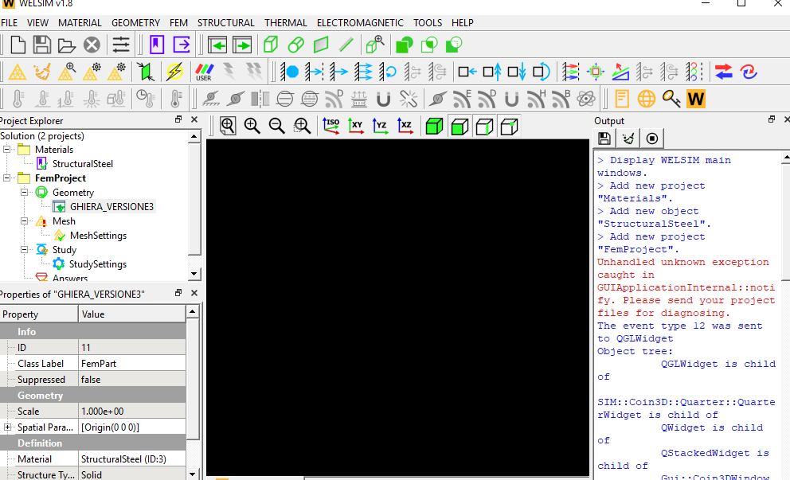
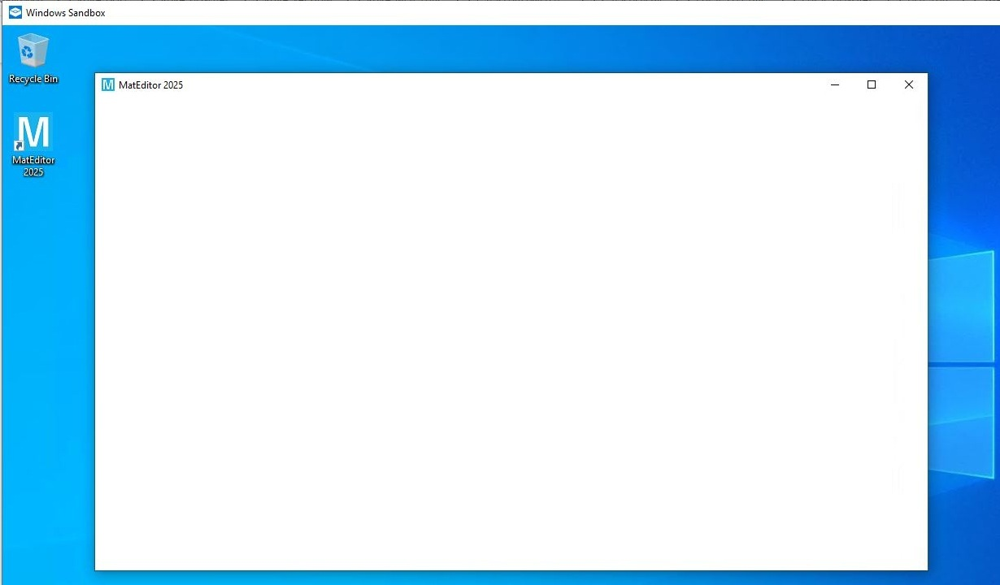
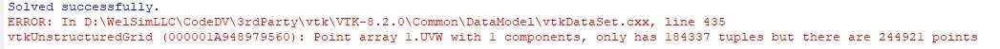

# Troubleshooting
If you encounter an issue that cannot be resolved here, please send the project file (*.wsdb and the associated folder) to <info@welsim.com> for investigation. 

## Issue 1: No graphical window (No OpenGL driver)
The graphics window fails to display items, or no any windows show up. 

* **Cause**: This issue is due to lack of OpenGL drivers, or the old version of OpenGL. It probably happens in the Windows OS that is hosted in a Sandbox environment.

* **Solution**: Install or update the OpenGL drivers to the latest. If it occurs in a sandboxed Windows, install the [Mesa for Windows distribution](https://github.com/pal1000/mesa-dist-win), and deploy the OpenGL software to the application using the included *perappdeploy.bat* batch file.

## Issue 2: Result mesh data dismatching
The result contour fails to display due to the dismatched mesh. The error message of this issue is shown in Figure below.

{#welsim_result_data_point_error1}

* **Cause**: This issue is due to dismatched data between result and mesh.

* **Solution**: This could be a software defect, send the model to the [info@welsim.com](mailto:info@welsim.com) for investigation.

