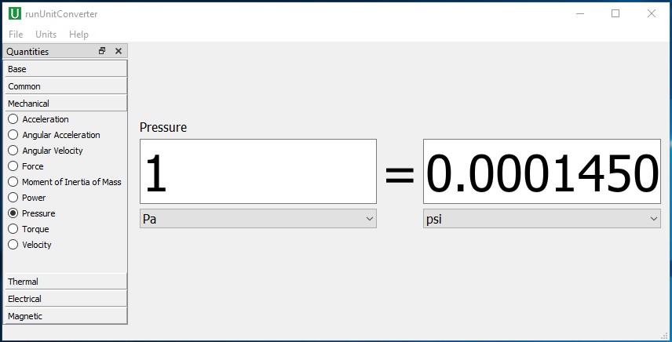

# UnitConverter
UnitConverter is a free unit conversion software program for engineers. This tool allows you to convert a large number of engineering units quickly and accurately.

## Specification

| Specification | Description |
| ------------- | ----------- |
| Operation system | Microsoft Windows 7 to 10; 64-bit |
| Physical memory | At least 4 GB |

Supported unit systems :

* [x] SI: (kg, m, s, K, A, N, V)
* [x] MKS Standard: (kg, m, s, °C, A, N, V)
* [x] NMMTON Standard: (tonne, mm, s, °C, A, N, mV)
* [x] BIN Standard: (lbm, in, s, °F, A, lbf, V)
* [x] US Engineering: (lb, in, s, R, A, lbf, V)
* [x] CGS Standard: (g, cm, s, °C, A, dyne, V)
* [x] NMM Standard: (kg, mm, s, °C, mA, N, mV)
* [x] UMKS Standard: (kg, µm, s, °C, mA, µN, V)
* [x] NMMDAT Standard: (decatonne, mm, s, °C, mA, N, mV)
* [x] BFT Standard: (lbm, ft, s, °F, A, lbf, V)
* [x] CGS Consistent: (g, m, s, °C, A, dyne, V)
* [x] NMM Consistent: (tonne, m, s, °C, mA, t⋅mm/s2, mV)
* [x] UMKS Consistent: (kg, m, s, °C, pA, µN, pV)
* [x] BIN Consistent: (slinch, in, s, °C, A, slinch⋅in/s2, V)
* [x] BFT Consistent: (slug, ft, s, °C, A, slug⋅ft/s2, V)
* [x] CGuS Standard: (g, cm, $\mu$s, °C, A, dyne, V)

## Supported units
The supported units are listed in the table below.

| Category | Materials |
| -------- | --------- |
| Base | Angle, Current, Length, Mass, Temperature, Time |
| Common | Area, Density, Density By Area, Specific Volume, Energy, Energy Density By Area, Energy Density By Volume, Frequency, Volume |
| Mechanical | Acceleration, Angular Acceleration, Angular Velocity, Force, Moment of Inertia, Power, Pressure, Torque, Velocity, Mass Flow, Momentum, Stiffness, Fracture Toughness, Gravitational Constant |
| Thermal | Heat Flux Density, Heat Transfer Coefficient, Thermal Conductivity, Thermal Expansivity, Heat Flow, Heat Generation, Heat Capacity, Thermal Radiation Coefficient, Specific Heat Cp, Specific Heat Cv, Specific Heat Rho0Cp, Enthalpy |
| Electrical | Capacitance, Charge Density, Electric Charge, Electrical Conductance, Electrical Conductivity, Inductance, Surface Charge Density, Surface Current Density, Voltage, Volume Charge Density, Electrical Permittivity, Electric Field, Electric Flux Density |
| Magnetic | Magnetic Field Strength, Magnetic Flux Density, Magnetic Permeability, Magnetic Potential |
| Fluid | Dynamic Viscosity, Kinematic Viscosity |

## Download
UnitConverter software is available at our [official website](https://welsim.com/download).

