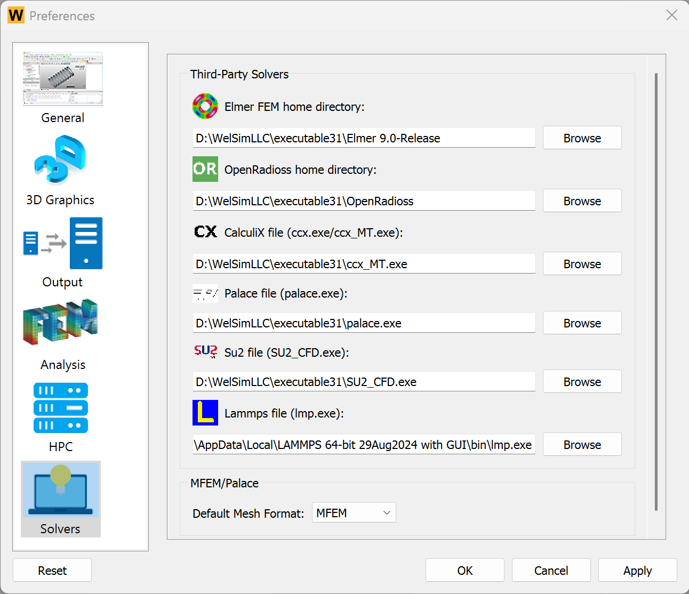

# External solvers

WELSIM is a simulation software that supports multiple solvers and is one of the most comprehensive and widely compatible pre- and post-processing tools for open-source solvers in the world. Currently supported open-source solvers include FrontISTR, Elmer FEM, OpenRadioss, CalculiX, SU2, and LAMMPS. Each of these solvers offers distinct features and advantages, allowing users to choose the one that best suits their needs. Thanks to WELSIM’s powerful pre- and post-processing capabilities, the time required for modeling when using these solvers is significantly reduced.

This section primarily introduces the details and usage methods of external solvers.

## Configuration
When invoking external solvers, a simple configuration of the solver paths is required. Users only need to go to the *Preferences* interface, select *Solvers*, and configure the solvers accordingly. The configuration interface is shown below.

The details of each supported solver are summarized below. This table also provides information on the integration method and the level of support for each solver.

| Solver | Download Site | Connection Type | Pre-processing | Post-processing |  
| --- | --- | --- | --- | --- | 
| Elmer FEM | https://elmerfem.org | Path | Yes | No |
| OpenRadioss | https://openradioss.org | Path | Yes | Yes |
| FrontISTR | https://elmerfem.org | File | Yes | Yes |
| CalculiX | https://calculix.de | File | Yes | No |
| Palace | https://awslabs.github.io/palace | File | Yes | Yes |
| SU2 | https://su2code.github.io | File | Yes | Yes |
| LAMMPS | https://lammps.org | File | Yes | No |

## Default solver
For different types of simulation analyses, WELSIM automatically sets a default solver. However, users can also manually specify the solver to be used. As shown in the figure below,

When the user selects *Program Controlled*, the system automatically assigns a solver based on the following logic:

1. If the analysis type is structural and explicit transient is not enabled, the system automatically uses the **FrontISTR** solver.
2. If the analysis type is explicit structural dynamics, the system automatically uses the **OpenRadioss** solver.
3. If the analysis type is thermal, the system automatically uses the **FrontISTR** solver.
4. For fluid analysis types, the system automatically uses the **SU2** solver.
5. For electromagnetic analysis types, the system automatically uses the **Palace** solver.
6. When the project type is molecular dynamics, the system automatically uses the **LAMMPS** solver.

---
<small>
WelSim is not directly affiliated with Elmer FEM, FrontISTR, OpenRadioss, CalculiX, Palace，SU2, and LAMMPS. References to these open source solvers are solely for technical blog purposes and software usage guidance.
</small>