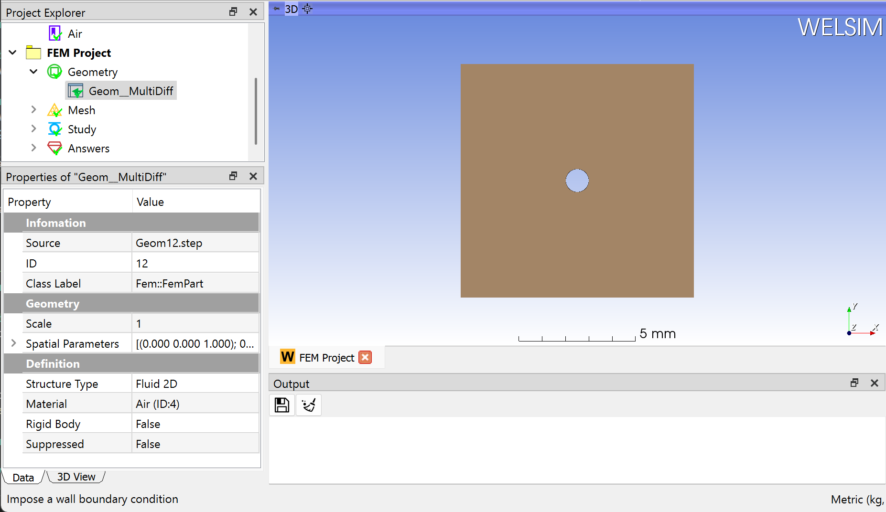

# 2D CFD analysis
This example shows you how to conduct a 2D fluid dynamics analysis. CFD module use *Su2* as the default solver. 

### Selecting units
In the beginning, we select the MMKS unit system for the subsequential simulation. Clicking **Preferences** from the **Toolbar** or **Menu**, and setting the **Metric (kg, mm, s, mA, N, mV)**.

## Specifying analysis 
In the Properties View of the FEM Project object, you set the Dimension to Cartesian 2D, Physics Type property to Fluids, and Analysis Type to Steady. A 2D CFD analysis is defined as shown in Figure below.

## Preparing geometry
Next, you can import the geometry file “*hole_plate_2d.step*” by clicking the Import... command from the **Toolbar** or **Geometry** Menu. The imported geometry and material property are shown in Figure below.

## Setting mesh
To obtain a fine mesh for the analysis, you set the **Mesh Settings** properties **Maximum Size** to **0.3 mm**.

Clicking the **Mesh** command from the **Toolbar** or **FEM Menu**, you can mesh the geometries. There are 1369 nodes, and 2588 Tri3 elements generated as shown in Figure below.

## Setting anlaysis
Clicking the Study Setting object and setting the CFD analysis conditions. In this example, **Incompressible Euler** governing equation is applied. Since SU2 is the default CFD solver, these settings are consistent with the SU2 input script settings. For more details, please refer to the [manual of SU2](https://su2code.github.io/docs_v7/home).

## Imposing conditions
Next, you impose two boundary conditions, a **Euler Wall**, and **Farfield** by clicking the corresponding commands from the **Toolbar** and **Fluids Menu**. The inner circular edge is selected for the Wall boundary condition, and outer edges are selected for the farfield, you can hold the **Ctrl** or **Shift** key to select multiple edges. The wall boundary condition is configured as shown in the figure below.

Then, you impose an **initial velocity** condition, scope the entire domain for it, and set the velocity on the X direction is -1.55 m/s.

## Solving the model
To solve the model, you can click the **Compute** command from the **Toolbar**, **FEM Menu**, or right-click on the **Answers** object and select **Compute** command from context menu. Depending on the complexity of the model, the solving process can be completed in seconds to hours. The **Output** window displays the solver messages and indicates the status of the solving process. 

## Evaluating results
To evaluate the pressure of the domain, you can add a **Pressure** result object to the tree by clicking the **Pressure** item from the **Toolbar**, **Fluids** Menu. Next, double-clicking the result object or clicking the **Evaluate** item from the **Toolbar** or **FEM Menu**, you display the contour in the **Graphics** window as shown in Figure below.

Adding a velocity result object is similar. Clicking the **Velocity** result from **Toolbar** or **Fluids Menu**, you insert a **Velocity** result object to the tree. Evaluating the **Velocity Y** Type, you obtain the velocity contour on Y direction in the **Graphics** window. The **Maximum** and **Minimum** values of field data are displayed in the Properties View window as shown in Figure below.

