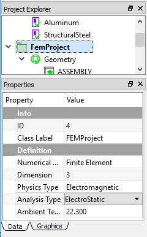
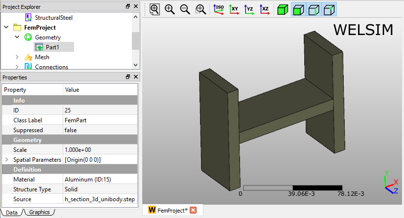
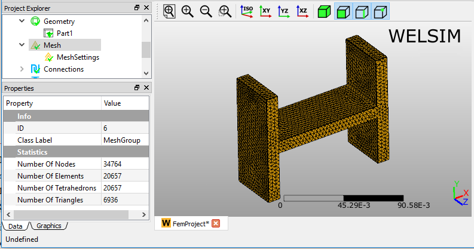
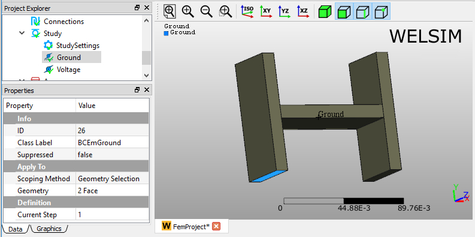
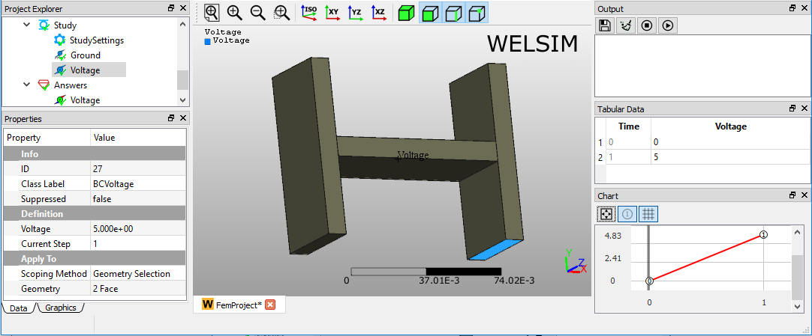
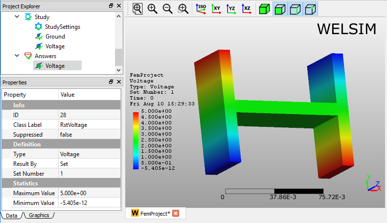

# Electrostatic analysis
This example shows you how to conduct a 3D electrostatic analysis for a unibody part. 

## Specifying analysis 
In the Properties View of the FEM Project object, you set the Physics Type property to Electromagnetic and Analysis Type to Electrostatic. An Electro-Static analysis is defined as shown in Figure below.

## Preparing geometry
Next, you can import the geometry file “**h_section_unibody.step**” by clicking the Import... command from the **Toolbar** or **Geometry** Menu. The imported geometry and material property are shown in Figure below.

## Setting mesh
To obtain a fine mesh for the analysis, you set the **Mesh Settings** properties **Quadratic** to **True**, and **Maximum Size** to **3e-3**.

Clicking the **Mesh** command from the **Toolbar** or **FEM Menu**, you can mesh the geometries. There are 34,764 nodes, and 20,657 Tet10 elements generated as shown in Figure below.

## Imposing conditions
Next, you impose two boundary conditions, a **Ground**, and **Voltage** by clicking the corresponding commands from the **Toolbar** and **Electromagnetic Menu**. In the Properties View of the Ground object, holding the **Ctrl** or **Shift** key and select left bottom and right top surfaces for the **Geometry** property, as shown in Figure below.

In the **Properties View** of **Voltage** object, set the **Voltage** value to 5, and scope surfaces for the **Geometry** property, as shown in Figure below.

## Solving the model
To solve the model, you can click the **Compute** command from the **Toolbar**, **FEM Menu**, or right-click on the **Answers** object and select **Compute** command from context menu. Depending on the complexity of the model, the solving process can be completed in seconds to hours. The **Output** window displays the solver messages and indicates the status of the solving process. As shown in Figure [fig:ch2_start_ex1_output_solver], this model is solved successfully.

## Evaluating results
To evaluate the deformation of the structure, you can add a **Voltage** object to the tree by clicking the **Voltage** item from the **Toolbar**, **Electromagnetic** Menu. Next, double-clicking the result object or clicking the **Evaluate** item from the **Toolbar** or **FEM Menu**, you display the contour in the **Graphics** window as shown in Figure below.

Adding an electric field result object is similar. Clicking the **Electric Field** result from **Toolbar** or **Electromagnetic Menu**, you insert a **Electric Field** result object to the tree. Evaluating the default **Total Electric Field** Type, you obtain the magnitude of the electric field vector contour on the body in the **Graphics** window. The **Maximum** and **Minimum** values of field data are displayed in the Properties View window as shown in Figure below.

!!! info
    This project file is located at examples/quick_electrostatic_01.wsdb.

