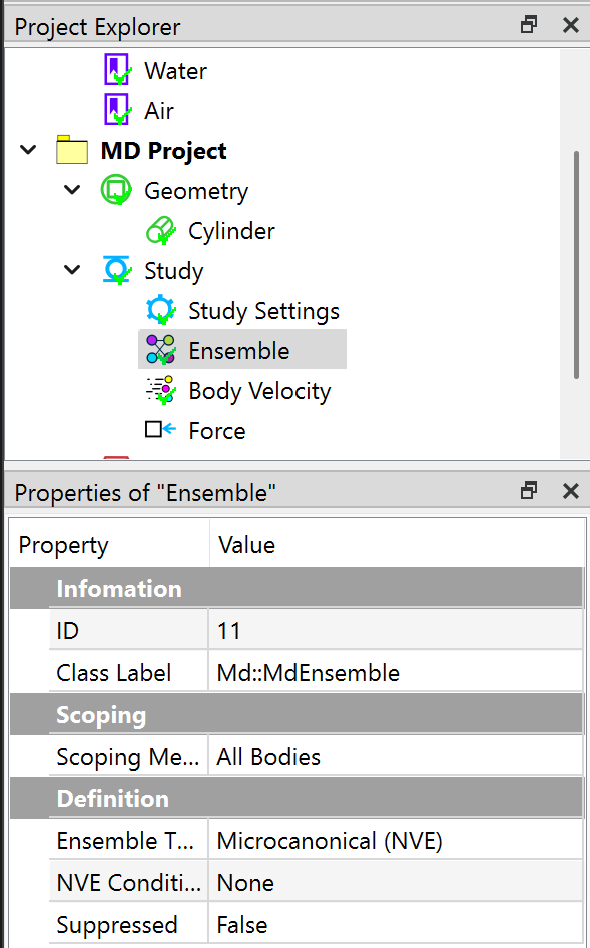

# Molecular dynamics analysis
This example shows you how to conduct a 3D molecular dynamics (MD) analysis. MD analysis uses *LAMMPS* as the default solver. The content will be added in the future. 

## Creating a MD project
Clicking the MD project from the Toolbar or the Menu, A new MD project tree will be presented in the Project Explorer window. Note that MD project is different to the FEM project, and the properties are different as well.

## Specifying analysis

In this analysis, we set MD Project properties **Units** to SI, **Atom Style** to Peridynamics. All the property settings are shown in figure below.

## Preparing geometry
Next, you can create a cylinder geometry, and define the molecular details in the Property window. As shown in the Figure below, the **Lattice Style** is set to SC, **Lattice Scale** is set to 0.0005, **Units Value** is set to Box. The dimensions for the cylinder is given as well in the Figure below.

## Setting analysis 
Next, you need to define step time and other properties in the Study Settings object, as shown in the Figure below.

## Imposing conditions
Next, you impose three conditions, an Ensemble, a Body Velocity, and a Force by clicking the corresponding commands from the Toolbar and MD Menu. In the Properties View of the Ensemble object, choose Microcanonical (NVE) type. 

In the Properties View of Body Velocity object, set the **Defined By** to **Create**, and **Loop Type** to **All**.

In the Properties View of Force object, set the **Defined By** to **Indent**, and **Indent Style** to **Sphere**. The other parameters are given in the Figure below.

## Solving the model
To solve the model, you can click the **Compute** command from the **Toolbar**, **FEM Menu**, or right-click on the **Answers** object and select **Compute** command from context menu. Depending on the complexity of the model, the solving process can be completed in seconds to hours. The **Output** window displays the solver messages and indicates the status of the solving process.
