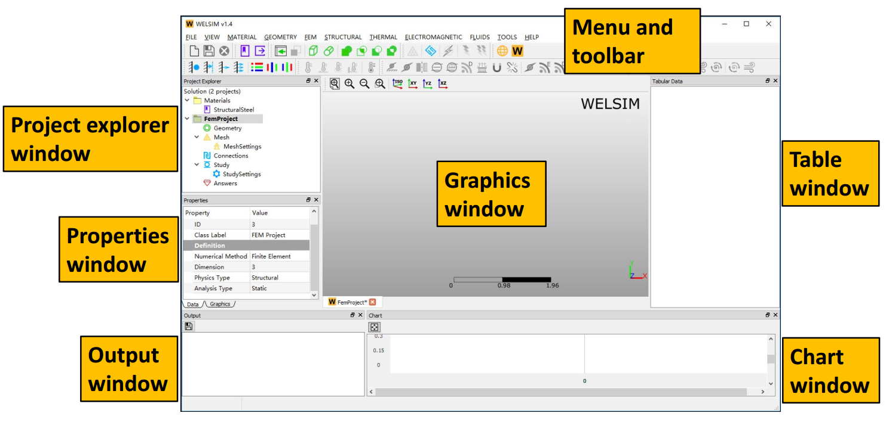
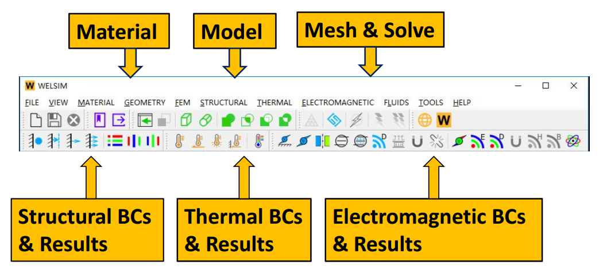
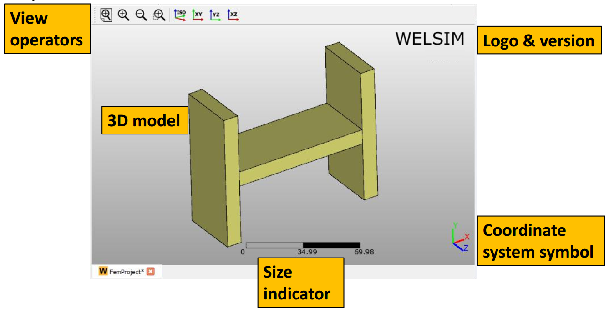
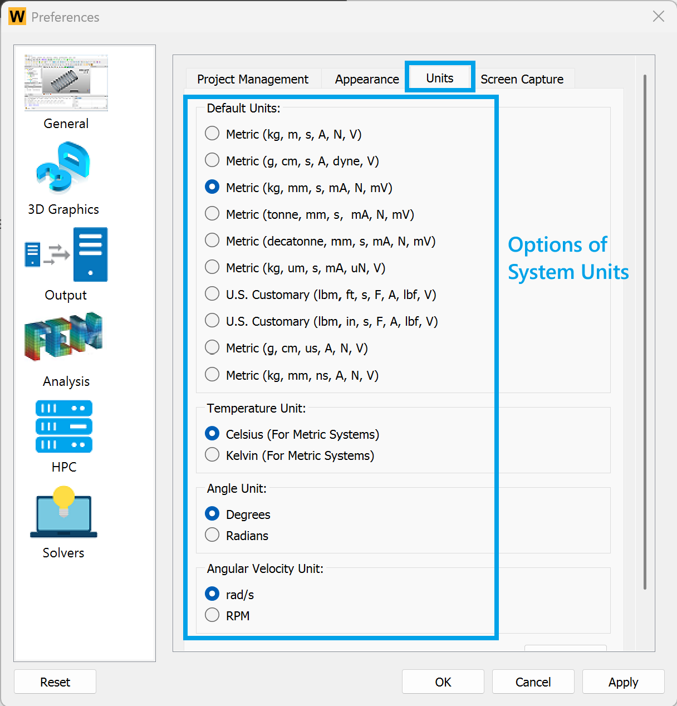
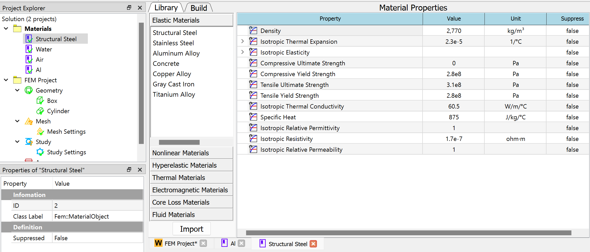
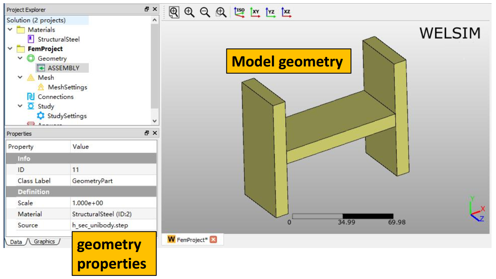
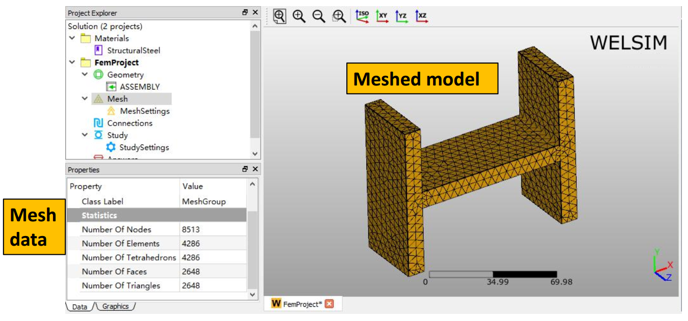
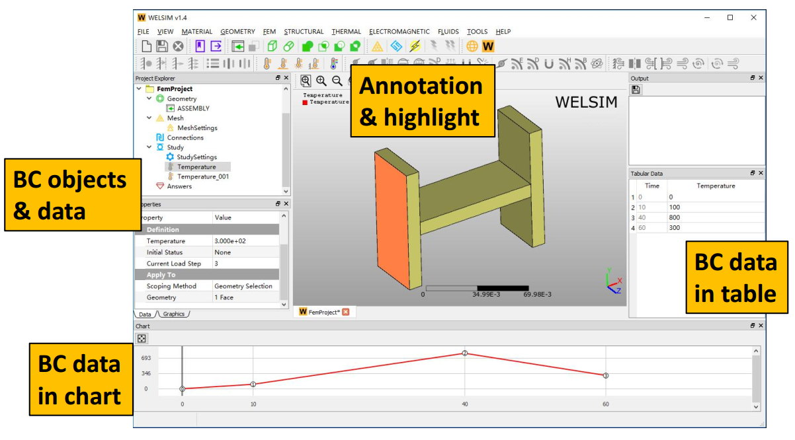
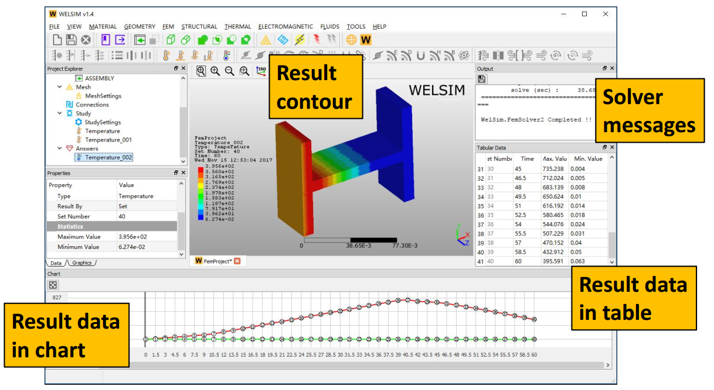
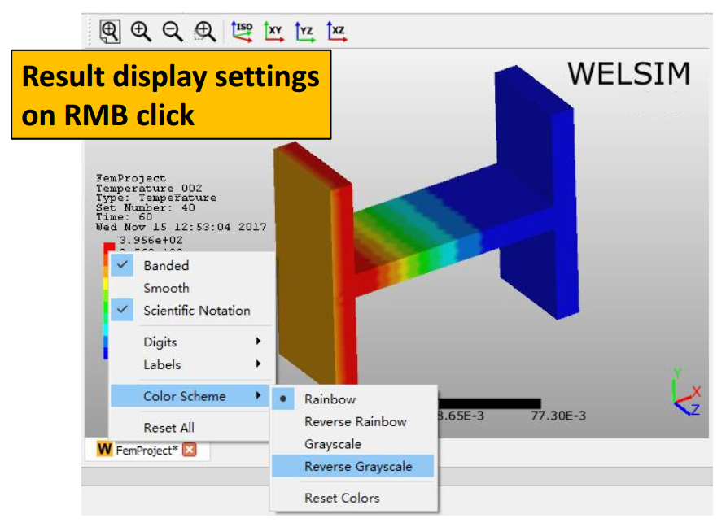

# Quick start
This section demonstrates you the primary GUI features and workflow of WELSIM application.
 
## Graphical user interface

### Overview
The WELSIM application provides you an ease-of-use graphical interface to customize the finite element analysis settings. The primary components of graphical user interface include:

* Menus
* Toolbar
* Project Explorer (Tree) Window 
* Properties View Window
* Graphics Window
* Tabular Data Window
* Chart Window
* Output Window

An overview of graphical user interface is shown in [Figure](../../img/3_guide/ch2_start_gui_overall.png) below.

### Menu and toolbar
Menus and toolbar contain primary commands of the application as shown in Figure below. Sections [Main Menus](../users/gui.md#main-menus) and [Toolbars](../users/gui.md#toolbars) of have more details. 

### Graphics window
The Graphics window displays the geometries and associated symbols, text, and annotations. In this window, you can pan, rotate, and zoom the 3D geometries using mouse and key. In addition to the geometries, this window may contain annotation,  [Graphics Toolbar](../users/gui.md#graphics-toolbar), coordinate system symbol, ruler, logo, etc. A schematic view of the Graphics window is shown in Figure below.

### Unit definition
The Perferences window lists the available units for users to choose. It is usually the first step to start the simulation.

The bottom right of the main window shows the current units in use.

### Material definition spreadsheet
The material module provides a spreadsheet panel for you to define and review material properties. An overview of the material property spreadsheet is shown in Figure below.

### Geometry display
The Graphics window displays the 3D geometries, meshed elements, result contours, etc. A 3D geometry and object properties are shown in Figure below.

### Mesh display
Graphics window displays the mesh as you select the mesh related objects in the tree. The Properties View shows the statistical data of the mesh as shown in Figure below.

### Boundary condition display
For the boundary conditions, the Graphics window displays the highlighted entities (faces, edges, vertices), the Property View, Tabular Data, and Chart windows show the boundary values over time. The Properties View window also allows you to scope the geometry entities and set values, as shown in Figure below.

### Solution display
After solving, the user interface displays the solution and results. The Graphics window displays the result contour and legend. The Properties View shows the Maximum and Minimum values of the result at the given Set Number. The Tabular Data and Chart Windows illustrate the maximum and minimum values over the time as shown in Figure  below.

### Result legend
You can adjust the result contour and legend by right clicking on the legend field and set the parameters in the context menu, as shown in Figure below.

## Workflow
Using WELSIM is straightforward. The following gives you the primary workflow steps in starting a finite element analysis project from scratch:

### Choosing unit
In the preferences, select an appropriate unit system for the entire simulation. The currently selected unit will be displayed in the lower right corner of the main window.

### Creating a new project
Clicking **New** command from **Toolbar** or **File Menu** creates a new simulation project. Several default objects are automatically generated in the tree, and the Graphics window is filled with the 3D modeling interface. The following shows the behaviors of creating a new project:

* A **Material Project** and a **FEM Project** are created simultaneously. The **Material Project** object holds only **Material objects**, and the **FEM Project** object contains all modeling objects that allow users to customize a finite element analysis. Only one **Material Project** is allowed in the tree, while you can add multiple **FEM Projects** to conduct multiple simulation studies at one interface. 

* An activated project displays the object name in **Bold**. You can double click the project object to activate a **FEM Project**. 

* Many commands on **Toolbar** and **Menu** become available as a **FEM project** is created. 

* Each object provides a unique context menu, and you can right-click to display the context menu. For example, you can rename an object via the context menu.

* Each object provides unique options in **Properties View** window, which is automatically updated as you select objects.

### Defining materials
In addition to the default **Structural Steel** material, you can add new materials and define the properties. A **Material** object represents a material database. The following gives the behaviors of material definition.

* You can create a new material object by clicking **Add Material** command from **Toolbar** or **Material Menu**. The **Material Project** many holds multiple **Material** objects.

* A newly created **Material** object requires you to specify the properties. Double-clicking or right-clicking on the material object, you open the **Edit** spreadsheet.

* Two methods are available for you to add material properties in the **Edit** spreadsheet. The **Library** tab provides you pre-defined material data to directly import. The **Build** tab lists all available properties for you to add properties one by one. 

### Importing or creating geometries
You can add geometry data by importing a CAD file or creating primitive shapes using the commands from **Toolbar** or **Geometry Menu**. 

* The built-in modeler allows you to create primitive shapes such as **Box**, **Cylinder**, **Plate**, and **Line**.
* The supported CAD geometry file formats are: STEP, IGES.
* The ruler in the **Graphics** window provides you a reference to estimate the size of geometries. 
* The size of the imported geometry can be adjusted by the tuning the **Scale** property value. 

### Meshing
You can skip meshing at this moment because the system automatically meshes the domain at solving step if no mesh is generated. However, meshing at this step provides you an insight of the mesh quality and a chance to optimize the mesh. You can click the Mesh commands from the **Toolbar** or **FEM Menu** to perform the meshing operations.

* The mesh module supports **Tet10**, **Tet4**, **Tri6**, and **Tri3** elements. The default type is the linear element, and you can change the element order by modifying the **Quadratic** property in **Mesh Settings** object.
* For multiple body geometries, you can add a **Mesh Method** object to make some bodies have different mesh density to the global mesh density, which is defined by the **Mesh Settings** object. 
* The **Toolbar** and **FEM Menu** provide you mesh tools, such as **Clear Generated Mesh**, **Examine Mesh**. 
* The mesh density can be adjusted by tuning the properties of **Mesh Settings**, such as **Maximum Size**, **Mesh Density**.

### Analysis settings
You can define the analysis settings in the following order:

* Set the **Physics Type** and **Analysis Type** in the **FEM Project** object. 
* Determine the **Number of Steps**, **Current Step**, and **Current End Time** properties in **Study** object.
* Determine the analysis settings properties in **Study Settings** object.
* * Choose the solver, such as CalculiX, Elmer FEM, FrontISTR, LAMMPS, MFEM, OpenRadioss, Palace, SU2[^1]. Keep the Program Controlled allows the program chooses the default solver. 
* Determine the solver settings properties in the **Answers** object.

### Imposing initial conditions
For the transient analysis, you can define initial conditions. The available initial conditions are

* Initial Temperature

### Imposing boundary conditions
The boundary and body conditions are essential for the conducted analysis. Depending on the **Physics Type** and **Analysis Type**, you can insert various condition objects into the tree via the **Toolbar** or **Menu**. The following gives the behaviors of the body and boundary conditions.

* The body and boundary condition value is **Step**-based. 
* Multiple boundary and body conditions can be jointly imposed on the geometry.
* In the condition scoping, you can select multiple entities by pressing **Ctrl** or **Shift** key. However, the multiple entities for one property field must be the same type of geometry. 
* **Graphics** window displays the annotation and highlighted geometry entities if a condition object is valid. 
* **Tabular Data** and **Chart** windows can show the condition values over time.

### Solve
To solve the customized model, you can click the Compute command from the Toolbar or FEM Menu. The behaviors of solving are 

* You may be required to Save the project before performing a solving process. The system needs to save the input scripts and mesh data for solvers.
* The Output window displays the solver messages. The promoted message indicates the success or failure of the solving process.
* You can discontinue the solving process by clicking the Stop Interprocess button in the Output pane.

### Displaying results 
Depending on the **Physics Type** and **Analysis Type**, you can insert various result objects into the tree via the **Toolbar** or **Menu**. The following gives the behaviors of the solution and results.

* To display the resulting contour, you can select the target result object, and click the **Evaluate** from the **Toolbar** or **FEM Menu**, or double click the object.
* You can adjust the contour format by right clicking on the resulting legend.
* You can clear result contour by clicking **Clear Result**, or **Clear Calculated Solution** commands from the **Toolbar** or **FEM Menu**.

### Completed
The analysis is completed. You can **Save** the projects to an external “wsdb” file and close the application. 

!!! note
    The **\*.wsdb**  file and associated folder are the WELSIM database for project data persistence, you can open this project file later, on another computer, and on different operation systems.

[^1]: WELSIM is not affilicated with these open source solvers including CalculiX, Elmer FEM, FrontISTR, LAMMPS, MFEM, OpenRadioss, Palace, and SU2. 

