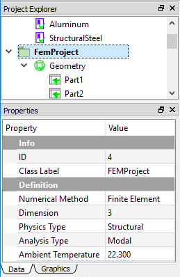
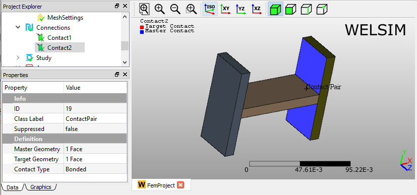

# Structural modal analysis
This example shows you how to conduct a 3D transient structural analysis for an assembly. Modal structural analyses use *FrontISTR* as the default solver. It also supports using *CalculiX* or *Elmer FEM* as a solver.

### Selecting units
In the beginning, we select the MKS unit system for the subsequential simulation. Clicking **Preferences** from the **Toolbar** or **Menu**, and setting the **Metric (kg, m, s, A, N, V)**.

## Defining materials
In this multi-body analysis, we assign **Structural Steel** and **Aluminum** materials to different parts. Since a **Structural Steel** object is already added as you initialize a **FEM Project**, you only need to insert an aluminum material object by clicking **Add Material** from **Toolbar** or **FEM Menu**. 

To edit the material properties, you can double-click the **Material** object, or right-click on the Material object and select the **Edit** command from the context menu. In the material editor, you select the **Library** tab > **General Materials** > **Aluminum Alloy**, then click **Import** button or double-click the **Aluminum Alloy** entry. Click the **OK** to save and exit the material editing. 

You can rename this new material object to **Aluminum** by press **F2** key or right-clicking.

## Specifying analysis
In the Properties View of the FEM Project object, you set the Analysis Type property to Modal. A Modal Structural analysis is defined as shown in Figure below.

## Preparing geometry
Next, you can import the geometry file “**h_section_multibody.step**” and assign the materials to the corresponding parts. Three **Part** objects in the **Geometry** group represent three bodies in the **Graphics** window, respectively. You assign the **Aluminum** material to the **Part2**, which is the connection body in the middle, the rest bodies are assigned with **Structural Steel** material.

## Setting mesh
To obtain a fine mesh for the analysis, you set the **Mesh Settings** properties **Quadratic** to **True**, and **Maximum Size** to **3e-3**, as shown in Figure below.

Clicking the **Mesh** command from the **Toolbar** or **FEM Menu**, you can mesh the geometries. There are 42,329 nodes, and 25,920 Tet10 elements generated as shown in Figure below.

## Specifying contacts 
Next, you need to define two Contact Pairs to bond the three parts into one uni-body for the analysis. Clicking the Add Contact command from the Toolbar or FEM Menu, you add two Contact Pair objects into the tree. You can rename these two objects to Contact1 and Contact2, respectively. Then you select the surfaces for Master and Target Geometry properties. 

## Defining analysis settings
In the Properties View of **Study Settings** object, you can define the analysis details such as **Number of Modes**. Here, you can use the default settings as shown in Figure below.

## Imposing boundary conditions
In this modal analysis, you impose a **Constraint** (Fixed Support) boundary condition, which can be processed by clicking the corresponding commands from the **Toolbar** and **Structural Menu**. In the Properties View of the **Constraint** object, select the left bottom surface for the **Geometry** property.

## Solving the model
To solve the model, you can click the **Compute** command from the **Toolbar**, **FEM Menu**, or right-click on the **Answers** object and select **Compute** command from context menu. Depending on the complexity of the model, the solving process can be completed in seconds to hours. The **Output** window displays the solver messages and indicates the status of the solving process. 

## Evaluating results
To evaluate the deformation of the structure, you can add a **Deformation** object to the tree by clicking the **Deformation** item from the **Toolbar**, **Structural Menu**. A result object may provide multiple sub-result types. For example, a Deformation result object allows you to specify one deformation type from the candidates **Deformation X**, **Y**, **Z**, and **Total**. 

After setting the **Type** property to **Deformation Z**, double-clicking on the result object displays the resulting contour in the **Graphics** window as shown in Figure below. You also can click the **Evaluate** item from the **Toolbar** or **FEM Menu** to evaluate the result. 

