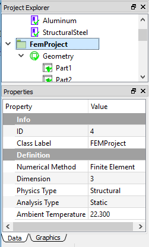
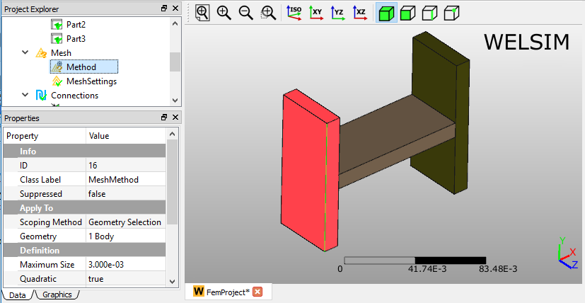
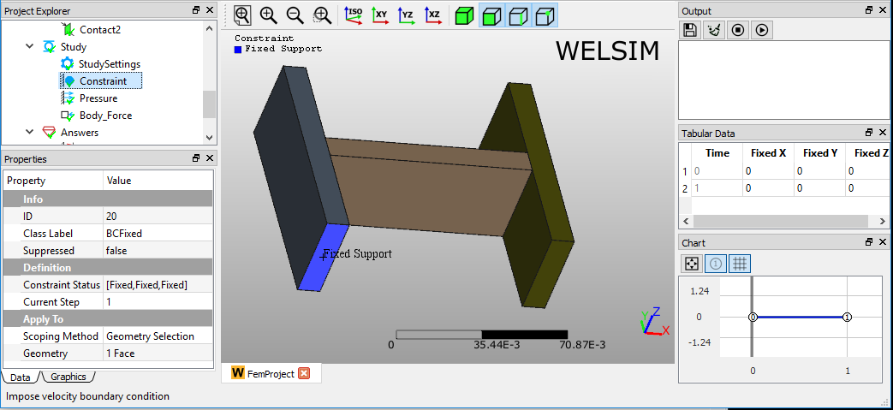
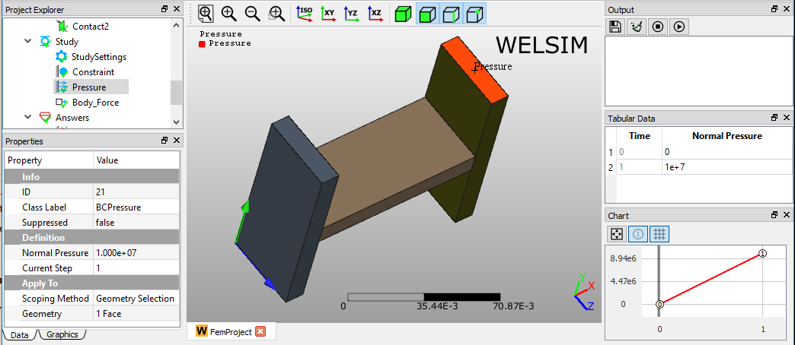
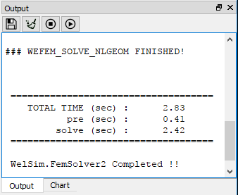
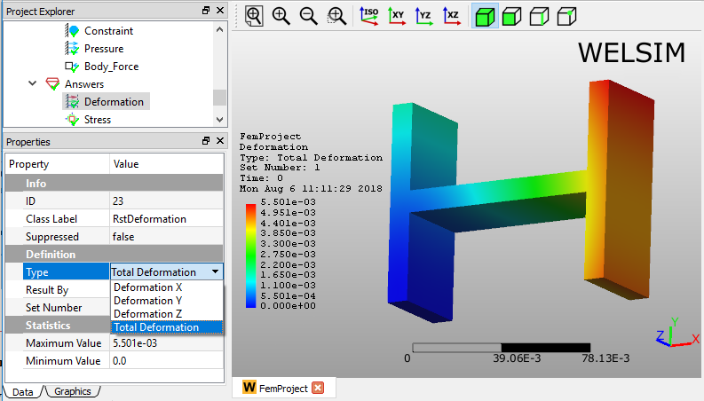
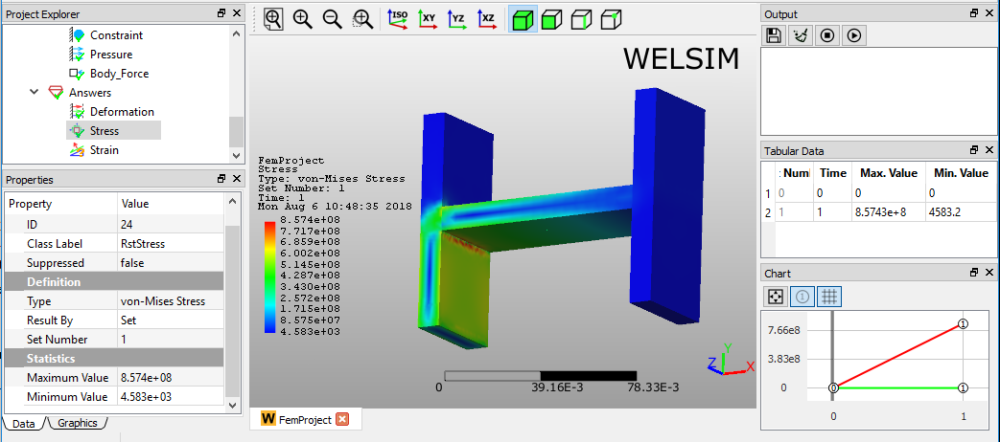

# Static structural analysis
This example shows you how to conduct a 3D static structural analysis for an assembly. 

### Defining materials
In this multi-body analysis, we assign **Structural Steel** and **Aluminum** materials to different parts. Since a **Structural Steel** object is already added as you initialize a **FEM Project**, you only need to insert an aluminum material object by clicking **Add Material** from **Toolbar** or **FEM Menu**. 

To edit the material properties, you can double-click the **Material** object, or right-click on the Material object and select the **Edit** command from the context menu. In the material editor, you select the **Library** tab > **General Materials** > **Aluminum Alloy**, then click **Import** button or double-click the **Aluminum Alloy** entry. The material properties are set as shown in Figure below. Click the **OK** to save and exit the material editing. 

You can rename this new material object to **Aluminum** by press **F2** key or right-clicking.

.

## Specifying analysis
Since the **Static Structural** analysis is the default settings at WELSIM application, you can keep the default settings as shown in Figure below.

## Preparing geometry
Next, you can import the geometry file “h_section_multibody.step” and assign the materials to the corresponding parts. As shown in Figure below, three **Part** objects in the **Geometry** group represent three bodies in the **Graphics** window, respectively. You assign the **Aluminum** material to the **Part2**, which is the connection body in the middle, the rest bodies are assigned with **Structural Steel** material.

## Setting mesh
To obtain a fine mesh for the analysis, you set the Mesh Settings properties Quadratic to True, and Maximum Size to 5e-3, as shown in Figure below.

Next, you add a **Mesh Method** object from the **Toolbar** or **FEM Menu**. In the property of this object, you select the left body for the **Geometry** property, and set **Maximum Size** value to 3e-3, , as shown in Figure below.

Clicking the **Mesh** command from the **Toolbar** or **FEM Menu**, you can mesh the geometries. There are 21,117 nodes, and 12,427 Tet10 elements generated as shown in Figure below.

## Specifying contacts 
Next, you need to define two **Contact Pairs** to bond the three parts into one uni-body for the analysis. Clicking the **Add Contact** command from the **Toolbar** or **FEM Menu**, you add two **Contact Pair** objects into the tree. You can rename these two objects to Contact1 and Contact2, respectively. Then you select the surfaces for **Master** and **Target Geometry** properties as shown in Figures below. 

## Imposing conditions
Next, you impose two boundary conditions, a Constraint (Fixed Support) and a Pressure by clicking the corresponding commands from the Toolbar and Structural Menu. In the Properties View of the Constraint object, select the left bottom surface for the Geometry property, as shown in Figure below.

In the **Properties View** of **Pressure** object, set the **Normal Pressure** value to **1e7**, and scope the right top surface for the **Geometry** property, as shown in Figure below.

## Solving the model
To solve the model, you can click the **Compute** command from the **Toolbar**, **FEM Menu**, or right-click on the **Answers** object and select **Compute** command from context menu. Depending on the complexity of the model, the solving process can be completed in seconds to hours. The **Output** window displays the solver messages and indicates the status of the solving process. As shown in Figure [fig:ch2_start_ex1_output_solver], this model is solved successfully.

## Evaluating results
To evaluate the deformation of the structure, you can add a **Deformation** object to the tree by clicking the **Deformation** item from the **Toolbar**, **Structural Menu**. A result object may provide multiple sub-result types. For example, a Deformation result object allows you to specify one deformation type from the candidates **Deformation X**, **Y**, **Z**, and **Total**, as shown in Figure below. 

After setting the property **Type** to **Total Deformation**, double-clicking on the result object displays the resulting contour in the **Graphics** window. You can click the **Evaluate** item from the **Toolbar** or **FEM Menu** to evaluate the result. 

Adding a stress result object is similar. Clicking the **Stress** result from **Toolbar** or **Structural Menu**, you insert a stress object to the tree. Evaluating the default **von-Mises Stress** Type, you obtain the von-Mises stress contour on bodies in the **Graphics** window. The **Maximum** and **Minimum** values of stress data are displayed in the **Properties View**, **Tabular Data**, and **Chart** windows.

!!!info 
    This project file is located at examples/quick_structural_static_solid_01.wsdb.

    

