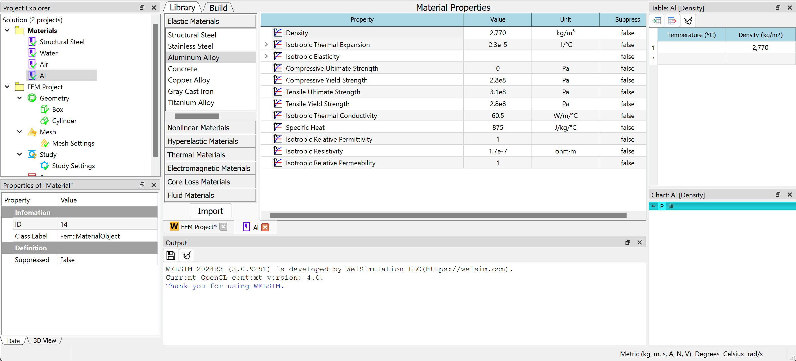
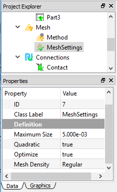
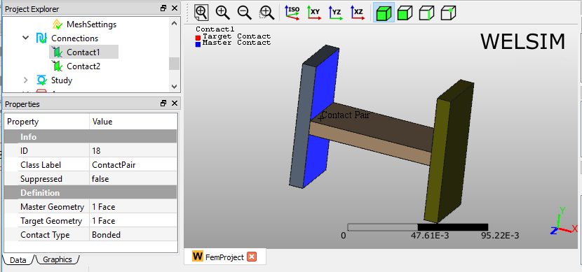

# Static structural analysis
This example will show you how to conduct a 3D static structural analysis for an assembly. Static structural analysis uses *FrontISTR* as the default solver. It also supports *CalculiX* or *Elmer FEM* as a solver.

### Selecting units
To start, we will select the MKS unit system for the subsequential simulation. Click **Preferences** from the **Toolbar** or **Menu**, and set it to **Metric (kg, m, s, A, N, V)**.

### Defining materials
In this multi-body analysis, we assign **Structural Steel** and **Aluminum** materials to different parts. Since a **Structural Steel** object is already created when you initialize a **FEM Project**, you only need to add an aluminum material object. Click **Add Material** from the **Toolbar** or **FEM Menu**. 

To edit the material properties, double-click the **Material** object, or right-click on the Material object and select **Edit** on the context menu. Now, in the material editor, select the **Library** tab > **General Materials** > **Aluminum Alloy**, then click the **Import** button, or double-click the **Aluminum Alloy** entry. The material properties are defined in the Figure below. Click **OK** to save and exit the material editing. 

You can rename this new material object to **Aluminum** by pressing **F2** or right-clicking.

## Specifying analysis
Since **Static Structural** analysis is the default setting in WELSIM, you can keep the settings the same as below.

## Preparing geometry
Next, import the geometry file “h_section_multibody.step” and assign materials to the corresponding parts. As shown in the Figure below, the three **Part** objects in the **Geometry** group represent the three bodies in the **Graphics** window, respectively. Assign **Aluminum** material to **Part2**, which is the connection body in the middle. Assign **Structural Steel** material to the other bodies.

## Setting mesh
To obtain a fine mesh for the analysis, set the following Mesh Settings properties: Quadratic to True and Maximum Size to 5e-3. This is shown below.

Next, add a **Mesh Method** object from the **Toolbar** or **FEM Menu**. Go into its Properties View, and set the **Geometry** property by selecting the left body. Then, set **Maximum Size** value to 3e-3, as shown below.

By clicking the **Mesh** command from the **Toolbar** or **FEM Menu**, you can mesh the geometries. 21,117 nodes and 12,427 Tet10 elements are generated as shown in the Figure below.

## Specifying contacts 
Now, you need to define two **Contact Pairs** to bond the three parts into one uni-body for the analysis. Click the **Add Contact** command from the **Toolbar** or **FEM Menu**, and add two **Contact Pair** objects into the tree. You can rename these two objects to Contact1 and Contact2, respectively. Then, select the surfaces for the **Master** and **Target Geometry** properties as shown below. 

## Imposing conditions
Next, impose two boundary conditions, a Constraint (Fixed Support) and a Pressure by clicking the corresponding commands from the **Toolbar** and **Structural Menu**. In the **Properties View** of the **Constraint** object, select the left bottom surface for the Geometry property, as shown in the Figure below.

In the **Properties View** of the **Pressure** object, set the **Normal Pressure** value to **1e7**, and select the right top surface for the **Geometry** property, as shown below.

## Solving the model
To solve the model, click the **Compute** command from the **Toolbar**, **FEM Menu**, or right-click on the **Answers** object and select the **Compute** command from the context menu. Depending on the complexity of the model, the solving process may take anywhere from seconds to hours. The **Output** window displays solver messages, and it indicates the status of the solving process. As shown in the Figure below, this model is solved successfully.

## Evaluating results
To evaluate the deformation of the structure, add a **Deformation** object to the tree by clicking the **Deformation** command from the **Toolbar** or **Structural Menu**. A result object may provide multiple sub-result types. For example, a Deformation result object allows you to choose between the deformation types, **Deformation X**, **Y**, **Z**, and **Total**, as shown below. 

After setting the **Type** property to **Total Deformation**, double-click on the result object to display the resulting contour in the **Graphics** window. You can click the **Evaluate** command from the **Toolbar** or **FEM Menu** to evaluate the result. 

Adding a stress result object is similar. Click the **Stress** result from the **Toolbar** or **Structural Menu**, and insert a stress object to the tree. Using the default **von-Mises Stress** Type, you can obtain the von-Mises stress contour on the body in the **Graphics** window. The **Maximum** and **Minimum** values of stress data are displayed in the **Properties View**, **Tabular Data**, and **Chart** windows.

    

