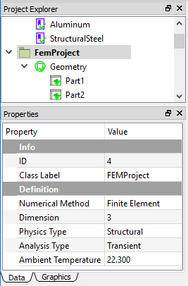
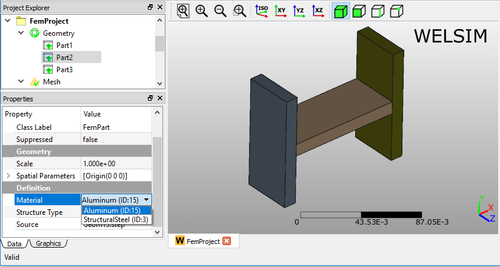
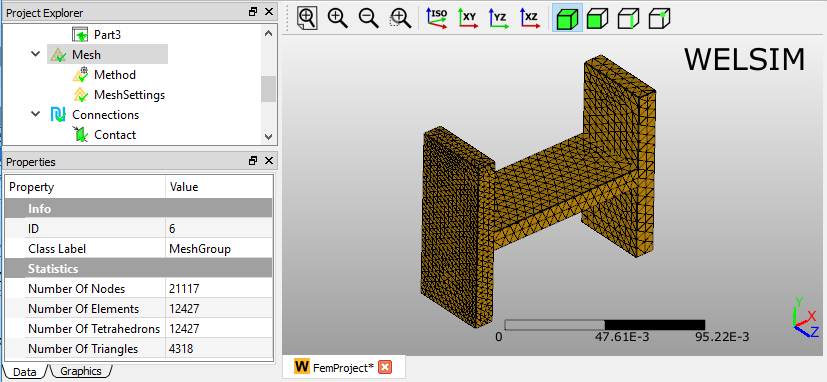
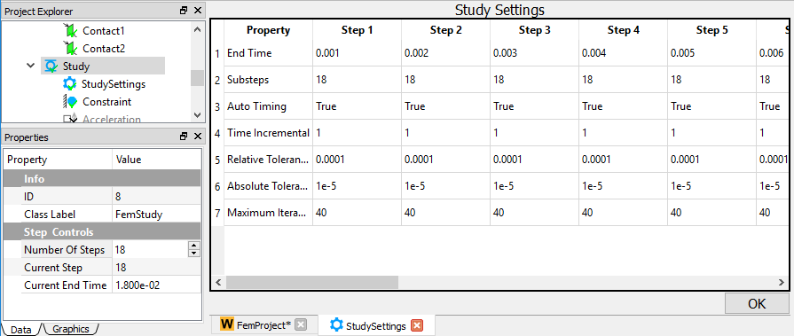
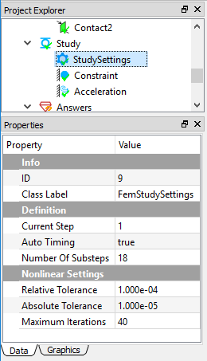
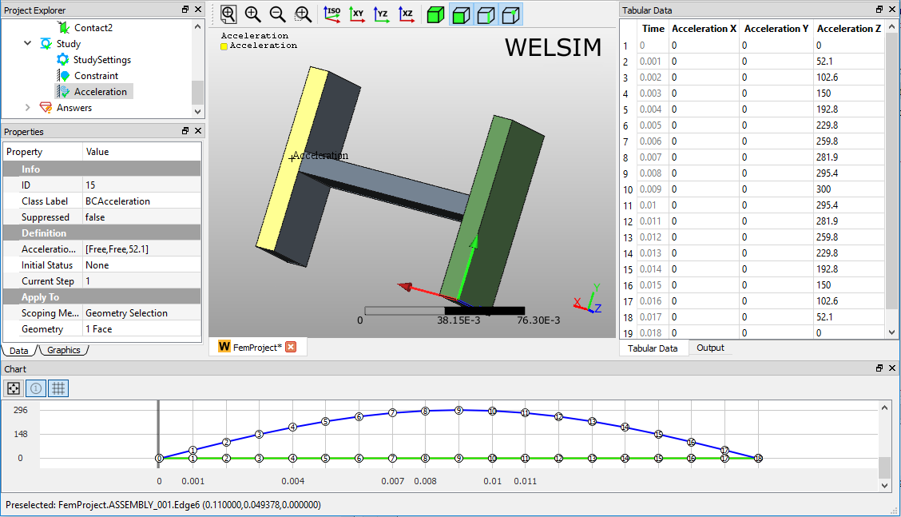
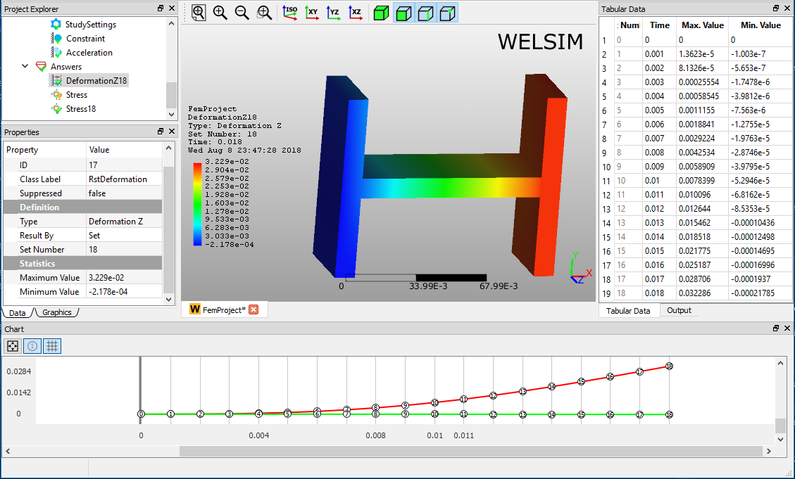
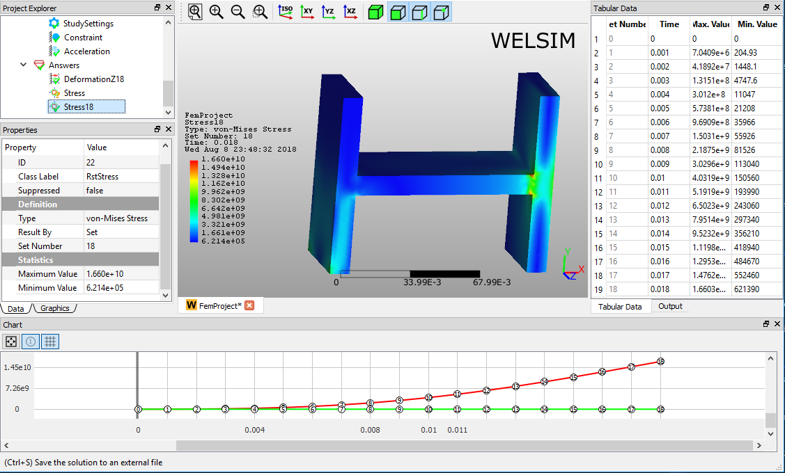

# Transient structural analysis
This example shows you how to conduct a 3D transient structural analysis for an assembly. Transient and explicit transient structural analyses use *FrontISTR* and *OpenRadioss* as the default solver, respectively. Thanks to *OpenRadioss*'s powerful solving capabilities and stable numerical results, we strongly recommend using the explicit solver for transient structural problems[^1].

### Selecting units
In the beginning, we select the MKS unit system for the subsequential simulation. Clicking **Preferences** from the **Toolbar** or **Menu**, and setting the **Metric (kg, m, s, A, N, V)**.

## Defining materials

In this multi-body analysis, we assign **Structural Steel** and **Aluminum** materials to different parts. Since a **Structural Steel** object is already added as you initialize a **FEM Project**, you only need to insert an aluminum material object by clicking **Add Material** from **Toolbar** or **FEM Menu**. 

To edit the material properties, you can double-click the **Material** object, or right-click on the Material object and select the **Edit** command from the context menu. In the material editor, you select the **Library** tab > **General Materials** > **Aluminum Alloy**, then click **Import** button or double-click the **Aluminum Alloy** entry. The material properties are set as shown in Figure below. Click the **OK** to save and exit the material editing. 

You can rename this new material object to **Aluminum** by press **F2** key or right-clicking.

## Specifying analysis 
In the **Properties View** of the **FEM Project** object, you set the **Analysis Type** property to **Transient**. A **Transient Structural** analysis is defined as shown in Figure below.

## Preparing geometry
Next, you can import the geometry file “h_section_multibody.step” and assign the materials to the corresponding parts. As shown in Figure below, three Part objects in the Geometry group represent three bodies in the Graphics window, respectively. You assign the Aluminum material to the Part2, which is the connection body in the middle, the rest bodies are assigned with Structural Steel material.

## Setting mesh
To obtain a fine mesh for the analysis, you set the Mesh Settings properties Quadratic to True, and Maximum Size to 5e-3, as shown in Figure below.

Next, you add a Mesh Method object from the Toolbar or FEM Menu. In the property of this object, you select the left body for the Geometry property, and set Maximum Size value to 3e-3, as shown in Figure below. 

Clicking the Mesh command from the Toolbar or FEM Menu, you can mesh the geometries. There are 21,117 nodes, and 12,427 Tet10 elements generated as shown in Figure below.

## Specifying contacts 
Next, you need to define two Contact Pairs to bond the three parts into one uni-body for the analysis. Clicking the Add Contact command from the Toolbar or FEM Menu, you add two Contact Pair objects into the tree. You can rename these two objects to Contact1 and Contact2, respectively. Then you select the surfaces for Master and Target Geometry properties as shown in Figures below. 

!!! Note 
    Defining contact pairs is optional, adding a contact pair or not depends on your specific models. 

## Defining analysis settings
In this transient analysis, you define 18 steps and set the *End Time* for each step, as shown in Figure below.

Next, you select the Study Settings object in the tree and set the Substeps property to 18, which determines the total number of substeps of the transient analysis. A screen capture of the defined properties is shown in Figure below.

## Imposing conditions
Next, you impose two boundary conditions, a **Constraint** (Fixed Support) and an **Acceleration** by clicking the corresponding commands from the **Toolbar** or **Structural Menu**. In the **Properties View** of the **Constraint** object, select the left bottom surface for the **Geometry** property, as shown in Figure below.

In the **Properties View** of **Acceleration** object, set the **Acceleration** value for the current step, and repeat this value definition for each Step. After defining the acceleration values for all steps, you scope a surface on Part2 for the **Geometry** property, as shown in Figure below.

## Solving the model
To solve the model, you can click the **Compute** command from the **Toolbar**, **FEM Menu**, or right-click on the **Answers** object and select **Compute** command from context menu. Depending on the complexity of the model, the solving process can be completed in seconds to hours. The **Output** window displays the solver messages and indicates the status of the solving process. 

### Evaluating results
To evaluate the deformation of the structure, you can add a **Deformation** object to the tree by clicking the **Deformation** item from the **Toolbar**, **Structural Menu**. A result object may provide multiple sub-result types. For example, a Deformation result object allows you to specify one deformation type from the candidates **Deformation X**, **Y**, **Z**, and **Total**. 

After setting the result **Type** to **Deformation Z**, double-clicking on the result object displays the resulting contour in the **Graphics** window as shown in Figure below. You can click the **Evaluate** item from the **Toolbar** or **FEM Menu** to evaluate the result. 

Adding a stress result object is similar. Clicking the Stress result from **Toolbar** or **Structural Menu**, you insert a stress object to the tree. Evaluating the default **von-Mises Stress** Type, you obtain the von-Mises stress contour on bodies in the **Graphics** window as shown in Figure below. The **Maximum** and **Minimum** values of stress data are displayed in the **Properties View**, **Tabular Data**, and **Chart** windows.

[^1]: To use OpenRadioss solver together with WELSIM, users need to download the OpenRadioss and configure the solver path in the Preferences of WELSIM.
