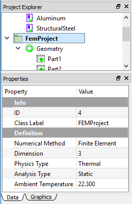
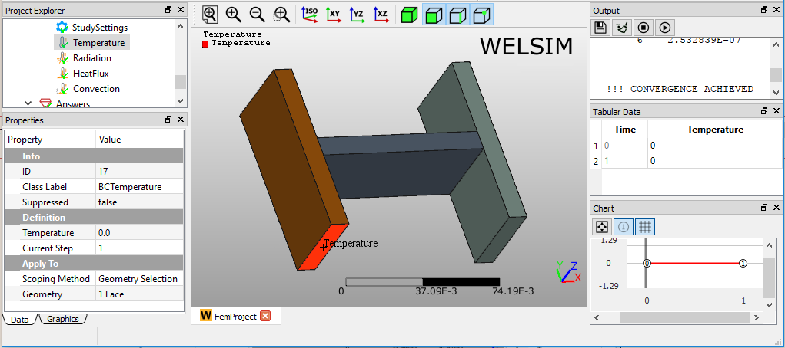
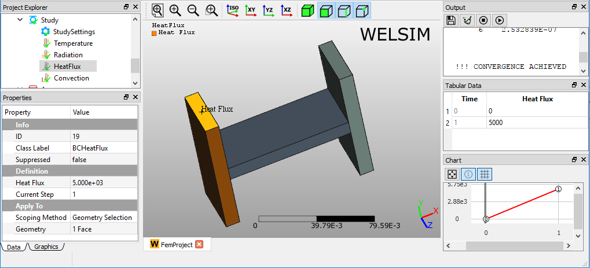
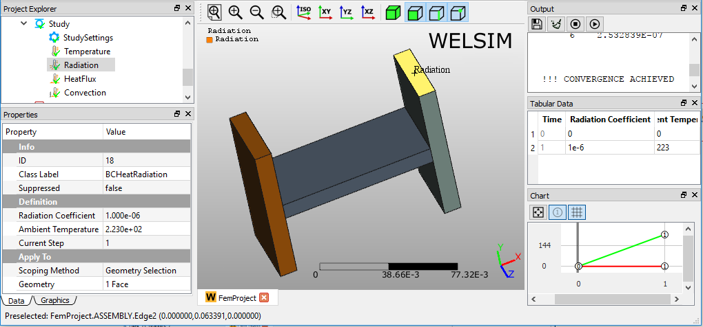
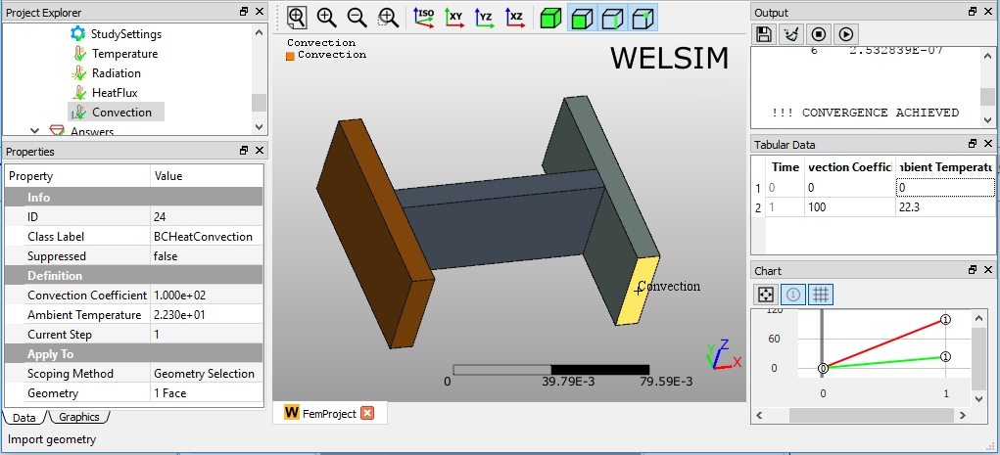
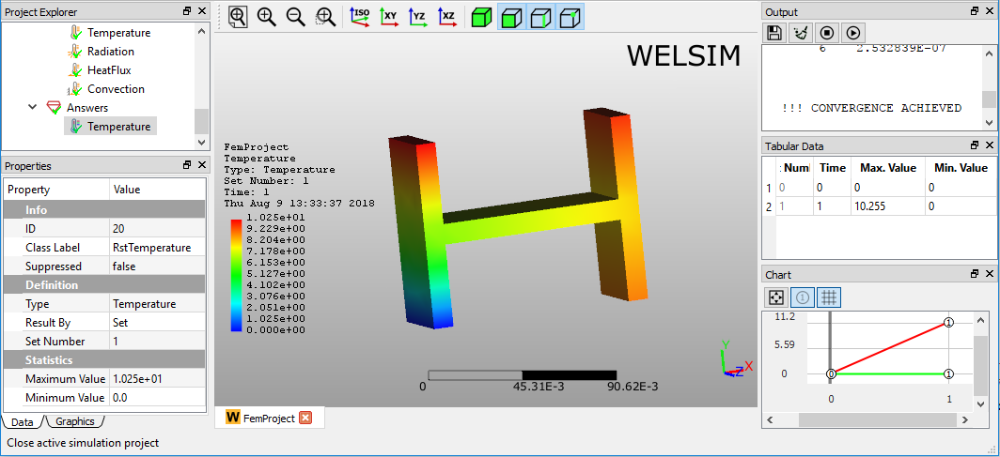

# Steady-state thermal analysis
This example shows you how to conduct a 3D static thermal analysis for an assembly. 

## Defining materials
In this multi-body analysis, we assign **Structural Steel** and **Aluminum** materials to different parts. Since a **Structural Steel** object is already added as you initialize a **FEM Project**, you only need to insert an aluminum material object by clicking **Add Material** from **Toolbar** or **FEM Menu**. 

To edit the material properties, you can double-click the **Material** object, or right-click on the Material object and select the **Edit** command from the context menu. In the material editor, you select the **Library** tab > **General Materials** > **Aluminum Alloy**, then click **Import** button or double-click the **Aluminum Alloy** entry. The material properties are set as shown in Figure below. Click the **OK** to save and exit the material editing. 

You can rename this new material object to **Aluminum** by press **F2** key or right-clicking.

## Specifying analysis 
In the **Properties View** of the **FEM Project** object, you set the **Physics Type** property to **Thermal**. A **Steady-State Thermal** analysis is defined as shown in Figure below.

## Preparing geometry
Next, you can import the geometry file “h_section_multibody.step” and assign the materials to the corresponding parts. As shown in Figure, three **Part** objects in the **Geometry** group represent three bodies in the Graphics window, respectively. You assign the **Aluminum** material to the **Part2**, which is the connection body in the middle, the rest bodies are assigned with **Structural Steel** material.

## Setting mesh
To obtain a fine mesh for the analysis, you set the **Mesh Settings** properties **Quadratic** to **True**, and **Maximum Size** to **3e-3**.

Clicking the **Mesh** command from the **Toolbar** or **FEM Menu**, you can mesh the geometries. There are 42,329 nodes, and 25,920 Tet10 elements generated.

## Specifying contacts 
Next, you need to define two **Contact Pairs** to bond the three parts into one uni-body for the analysis. Clicking the **Add Contact** command from the **Toolbar** or **FEM Menu**, you add two **Contact Pair** objects into the tree. You can rename these two objects to Contact1 and Contact2, respectively. Then you select the surfaces for **Master** and **Target Geometry** properties. 

## Imposing boundary conditions
Next, you impose four boundary conditions, a **Temperature**, **Heat Flux**, **Convection**, and **Radiation** by clicking the corresponding commands from the **Toolbar** or **Thermal Menu**. In the Properties View of the **Temperature** object, select a left bottom surface for the **Geometry** property and set the **Temperature** value to 0, as shown in Figure below.

In the Properties View of **Heat Flux** object, set the **Heat Flux** value to **5e3**, and scope a surface for the **Geometry** property, as shown in Figure below.

In the Properties View of **Heat Radiation** object, set the **Radiation Coefficient** value to **1e-6**, **Ambient Temperature** value to **22.3**, and scope a surface for the **Geometry** property, as shown in Figure below.

In the Properties View of Heat **Convection** object, set the **Convection Coefficient** value to **1e3** and **Ambient Temperature** value to **22.3**, and scope a surface for the **Geometry** property, as shown in Figure below.

## Solving the model
To solve the model, you can click the **Compute** command from the **Toolbar**, **FEM Menu**, or right-click on the **Answers** object and select **Compute** command from context menu. Depending on the complexity of the model, the solving process can be completed in seconds to hours. The **Output** window displays the solver messages and indicates the status of the solving process. As shown in Figure below, this model is solved successfully.

## Evaluating results
To evaluate the deformation of the structure, you can add a **Temperature** object to the tree by clicking the **Temperature** item from the **Toolbar** or **Thermal Menu**. Next, double-clicking the result object or clicking the **Evaluate** item from the **Toolbar** or **FEM Menu**, you display the result contour in the **Graphics** window as shown in Figure below. 

!!! info
    This project file is located at examples/quick_thermal_static_solid_01.wsdb.

