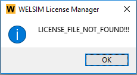

# WELSIM licensing guide
## Preface
This document contains information for running the WELSIM License Manager with all WelSimulation LLC products. 

### Supported hardware platforms
This document details information about licensing WelSimulation LLC products on the hardware platforms listed below. 

* Linux x64 (linx64)
* Windows x64 (winx64)

For specific operating system requirements, contact the customer support for the product and platform you are running.

### Conventions used in this document
Computer prompts and responses and user input are printed using this font:

```
/welsim_com/shared_files/licensing/welslic_admin
```

Wild card arguments and variables are *italicized*.
<br/>
Commands appear in **bold** face.


## Introduction
WelSimulation LLC uses the internal license manager for all of its licensed products. The communication between the WELSIM applications and license manager occurs through an internal process. The communication is nearly transparent; you should not see any noticeable difference in your day-to-day operation of WELSIM products.

You do not need to run the license manager installation. The license manager is installed together with the WELSIM application package.

### The licensing process
The licensing process for WELSIM is as follows:

1. Install the software. 
2. Start the software and generate your unique Computer ID, send the Computer ID to <info@welsim.com>.
3. After you receive your license file, run the License Manager Wizard from Toolbar of WELSIM application.
4. Set up the licensing environment and input license. See [Activating the WELSIM](windows.md#activating-the-welsim).

### Explanation of licensing terms
The main components of the licensing are:

* License file
* Application program (WELSIM)

These components are explained in more detail in the following sections.

#### The license file
Licensing data is stored in a text file called the license file. The license file is created by WelSimulation LLC and is installed by the end user. It contains information about the version, signature, and date.

The default and recommended location for the WELSIM license file (wsimkey.dat) is in the `%APPDATA%/WELSIM` directory. The application can automatically place the license file at this location after activation. End users can manually copy the license file to that directory, although are not suggested. 

#### License file format
License files usually contain eight lines. You cannot modify any these data items in the license files.

!!! note
    Everything in the license key should be entered exactly as supplied. All data in the license file is case sensitive, unless otherwise indicated.

#### Application line
The application line specifies the application name. Normally a license file for WELSIM application uses the “[WELSIM]”. The example of the application line is:
```
[WELSIM]
```

#### License version line
The license version line specifies the version of current license file. The example of the this line is shown below:
```
license_verion = 100
```

#### License signature line
A license signature line describes the password key to use a product. The example of the signature line is:
```
license_signature = Tvp919deAq5od+nCUjRF15mgeBIKCLgscLgvR8eFYAlBrqqcjETIyuY0Lu/brYbOKYrIPOXqFzWn8asLqieImA== 
```
#### Computer ID line
The computer ID line is the string generated from client's computer. The example of the Computer ID line is:
```
client_signature = KXfe-uAAA-KXfe-uQAA
```

#### Application version lines
The application version lines include two parts, one is the start version number and another is the end version. The example of the application version lines are:
```
from_sw_version = 100
to_sw_version = 100
```

#### Effective date lines
The effective date lines include both start and end date. The example of the effective date lines are:
```
from_date = 2017-07-02
to_date = 2018-08-02
```

#### Sample license files
A sample license file is shown here. This file is for WELSIM v1.8 and later tasks.
```
[WELSIM]
license_version = 100
license_signature = Tvp919deAq5od+nCUjRF15mgeBIKCLgscLgvR8eFYAlBrqqcjETIyuY0Lu/brYbOKYrIPOXqFzWn8asLqieImA==
client_signature = KXfe-uAAA-KXfe-uQAA
from_sw_version = 100
to_sw_version = 100
from_date = 2023-07-02
to_date = 2024-07-02
```

#### Recognizing a WELSIM license file
If you receive a license file and are not sure if it is a WELSIM license file, you can determine if it is by looking at the contents of the license file. If it is a WELSIM license file, then

* In the first line of the license file, the string field is WELSIM.


## Installing the WELSIM license manager
The WelSim License Manager is included in the WELSIM application installation. As the user installs the application, the license manager is already installed.

## Troubleshooting
This section lists problems and error messages that you may encounter while setting up licensing. The possible error messages are:

* LICENSE_FILE_NOT_FOUND
* LICENSE_SERVER_NOT_FOUND 
* ENVIRONMENT_VARIABLE_NOT_DEFINED 
* FILE_FORMAT_NOT_RECOGNIZED 
* LICENSE_MALFORMED 
* PRODUCT_NOT_LICENSED
* PRODUCT_EXPIRED 
* LICENSE_CORRUPTED 
* IDENTIFIERS_MISMATCH

An example of the license message error message is shown in Figure [fig:ch10_license_not_found].




