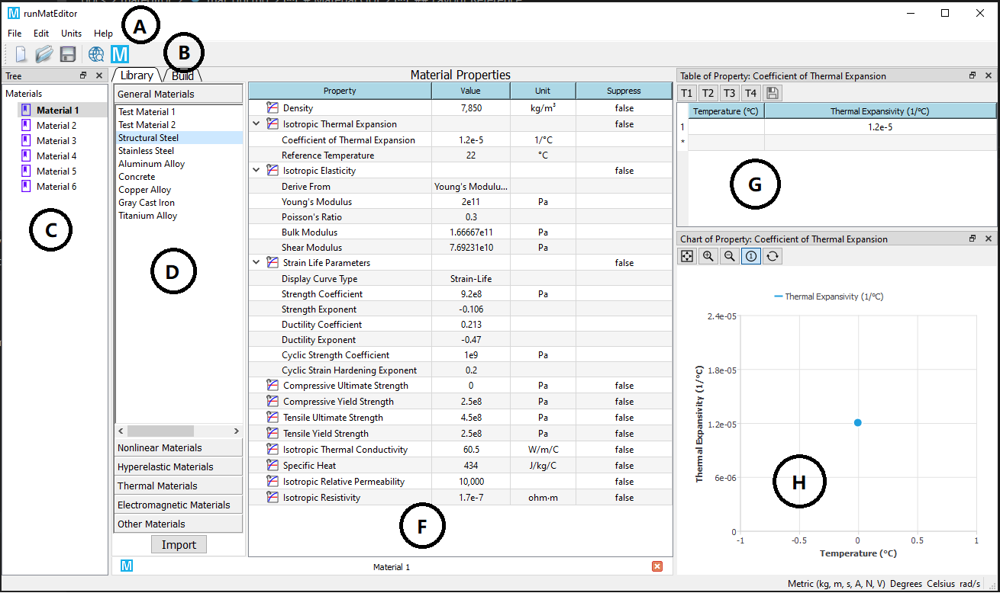
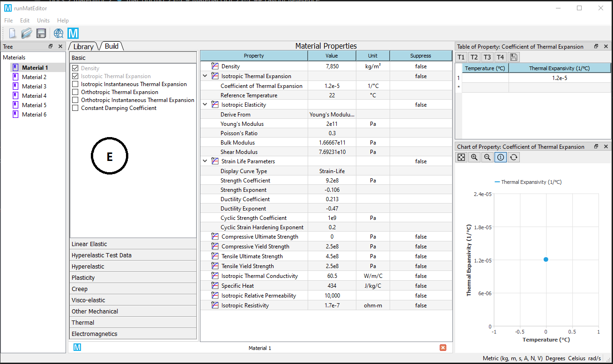
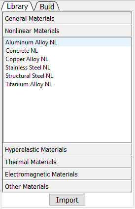
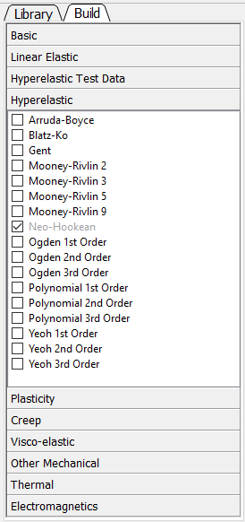
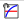
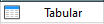
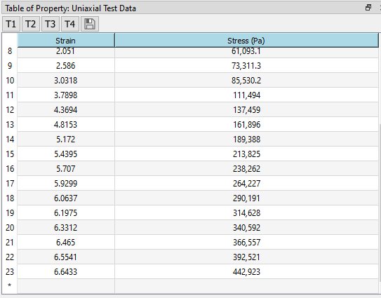

# Graphical user interface
The Material Module workspace is an independent interface and display relavant items as you configured.

## Layout reference
Presented below are two layout configurations for the Material Module view. The first configuration is displayed by clicking on "Library" tab in toolbox. The second configure is shown by clicking on "Build" tab in toolbox. You can switch this two layout mode by clicking the tabs.

| Legend | Name | Description |
| ------ | ---- | ----------- |
| A | [Menu Bar](#menu-bar) | Operations for Material Module. |
| B | [Toolbar](#toolbar) | Selected operations that often used for Material Module. |
| C | [Material Outline Pane](#material-outline-pane) | Material items that are created in Material Module. |
| D | [Library Outline Pane](#library-outline-pane) | Displays the available prebuild material sources. |
| E | [Property Outline Pane](#property-outline-pane) | Displays the available material property sources that can be included into a material. |
| F | [Properties Pane](#properties-pane) | Displays the properties of the current material. |
| G | [Table Pane](#table-pane) | Shows the tabular data for the selected item in the Properties pane. |
| H | [Chart Pane](#chart-pane) | Shows the chart of the item selected in the Properties pane. |

## Toolbox
Material Module Toolbox contains two tabs: Library and Build. These two tabs function as:

* **Library**: contains default material data that allows user to directly use. Clicking this tab displays the [Library Outline Pane](#library-outline-pane).
* **Build**: contains all supported material properties that enable user to compose material data. Clicking this tab displays the [Property Outline Pane](#property-outline-pane).

## Material outline pane
The Outline pane shows an outline of the contents of the created material data source. You can perform the following actions in this pane:

* Create a new material
* Delete a material
* Rename a material
* Edit a material
* Duplicate a material

### Items status
The itmes column shows the name of the items contained in the data source. When the name of material object is in bold, the material is activated for editing. 

## Library outline pane
The Library Outline pane shows an outline of availble predefined materials. These materials are grouped into several categories. 

## Property outline pane
The Property Outline pane shows an outline of availble material properties. These material properties are grouped into several categories. 

## Properties pane
The Properties pane shows the properties for the item selected in the [Property Outline](#property-outline-pane) pane. You can perform the following actions in this pane:

* Add additional properties, tabular data (from the Property Outline and Table panes)
* Delete a property
* Modify constant data
* [Suppress](mat_workflow/#suppression) a property

### Property column
The property column lists the properties for the item selected in the Property Outline pane. Clicking a property will change the contents of the Table pane and Chart pane. 

#### Material property
The status of the material property is indicated as follows:

* : The material property is described in a single property data (see the Material Definitions topic).
 	<!-- Some data contained in this material property requires attention (see the Validation and Filtering topics).
 	The material property is described in a collection of property data (see the Material Definitions topic).
 	Indicates that the collection of property data requires attention (see the Validation and Filtering topics). -->

### Value column
The value column is used to change data for a property or indicates that the data for the property is tabular (). 

### Unit column
The unit column displays the unit of the data shown in the value column . If the column is editable (see [Units Menu](#unit-menu)), changing the unit will convert the value into the selected unit (there is no net change in the data, so the solution is still valid).

### Suppression column
The suppression column shows the suppression status of the item and may also be used to switch the status (see [Suppression](#suppression)).

## Table pane
The Table pane shows the tabular data for the item selected in the Properties pane. If there are independent variables (for instance, Temperature) for the selected item and the item is constant, you may change it to a table by entering a value into the independent variables data cell. If a row is shown with an index of *, you may add additional rows of data. 

!!!note
    You also can change the unit by clicking the header of table

## Chart pane

The Chart pane shows the chart of the selected item in the Properties pane. The chart data is idenital to the table data.

