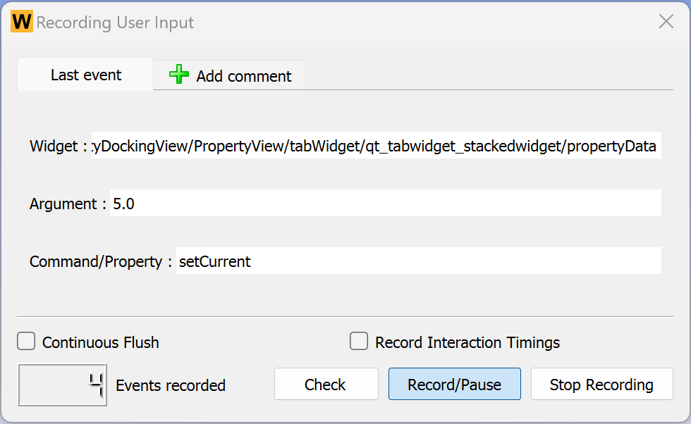
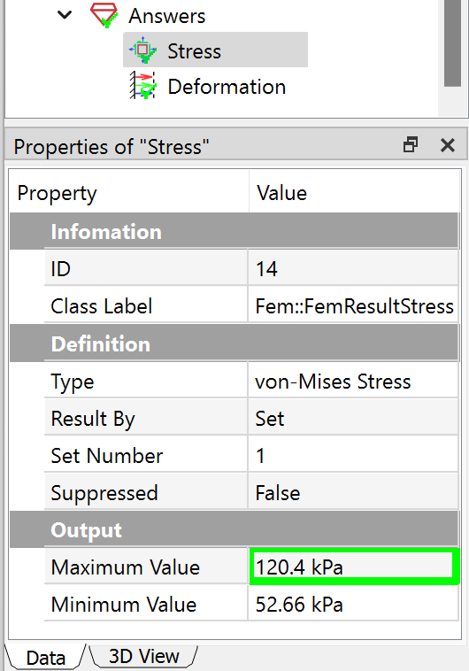
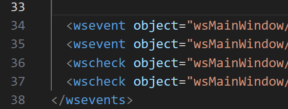
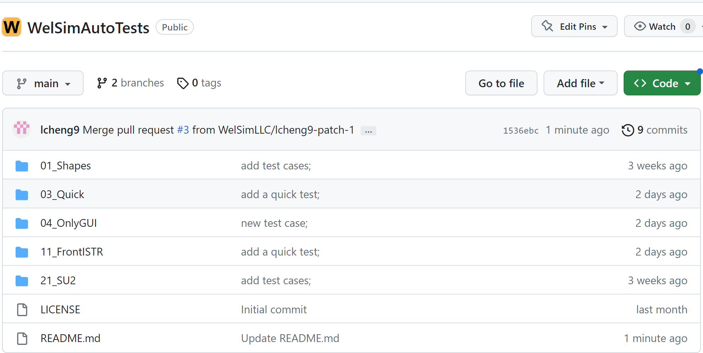

# Create regression test cases

WELSIM is currently the only engineering simulation CAE software in the world that offers an automated regression testing system to end users. It has also open-sourced all the test case files, allowing users to download and run all the test cases on their local machines. Additionally, users can rapidly create their own test cases to verify the accuracy and stability of the current software version.

Regarding the necessity and technical approach of CAE software testing system, you can refer to the article “Automated Regression Testing for General-Purpose Engineering Simulation CAE Software”. This article provides practical insights into how to quickly create test cases in WELSIM.

## Creating test cases

(1) Set up the environment variable WELSIM_DATA_ROOT and assign a path to it. This path typically stores files required for testing, such as CAD geometry model files. If no external files are imported in the test, you can temporarily skip setting up this environment variable.

On Linux, you can define environment variables through the export command or by modifying the *.bashrc* file.

!!!code
    export WELSIM_DATA_ROOT=/usr/simlet/WelSimLLC-github/WelSimAutoTests

(2) Run the WELSIM program and click Tools->Record Test… from the menu or toolbar to create a test file.

A file saving dialog will appear, prompting the user to specify the path and name of the test file. The file is in XML format. After entering the name, the Test Recorder dialog pops up.

You can see that the Record/Pause button is activated, indicating that the recording of test macro commands is in progress. When you want to stop recording, you can click the Stop Recording button in the bottom-right corner to complete the recording. The number in the bottom-left corner is the event recording counter. Every action the user performs on the window is recorded and increases the counter. The details of the macro commands are displayed in the center of the dialog. The macro commands displayed here will all be recorded in the test file.

(3) Test cases for CAE often require the verification of computational accuracy. Click the “Check” button to activate the verification function. When hovering the mouse over an area, a green bounding box will highlight it. Click on the desired attribute to be tested. As shown in the figure below, when a user clicks on the maximum value property of a result object, the system will automatically record its value for comparison during testing.

Unlike the “wsevent” identifier for the operation command, we can see that the commands for result comparison are identified as “wscheck” in the XML file.

(4) When the recording is complete, you can click the “Stop Recording” button to finish the recording. Save the test file.

Once the test project is created, you can locally save the test cases for future runs. You can also submit the created test cases to the official test repository, allowing WELSIM users worldwide to execute the test cases you’ve created.

## Conclusion
WELSIM provides a user-friendly system for recording test cases without the need for coding. Users can generate test files by following their regular operations. This entire testing system ensures the quality of the WELSIM software and provides an effective way for users to participate in the simulation community’s development. Thanks to the open-source license of test cases, the entire simulation community will benefit as these cases increase.

