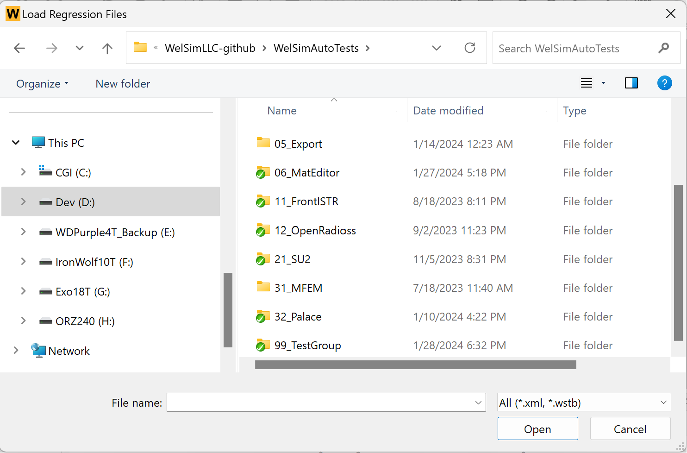
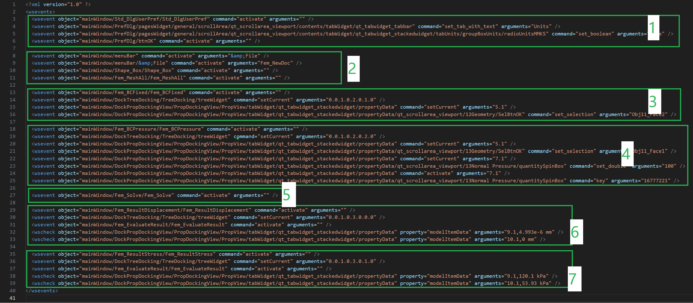

# Introduction to the Regression Testing System

This section describes the regression system in details. To run the regression tests, click the **Play test** commands from the Menu or Toolbar. The Toolbar and Menu of regression test are shown below.

Click the “Play Test” button and select the tests from the dialog.

Currently, the reading of the test files supports two formats: **xml** and **wstb**. Xml represents specific individual tests, while wstb can contain multiple files for testing. 

After reading the test file, the main testing user interface will be displayed. If a valid test file was selected in the previous step, then the main window will list it. The testing main interface has numerous functions that will be explained in four separate areas.

**Area 1** occupies the majority of the interface, facilitating the display of a large number of test cases. Users can toggle cases on or off, depending on what they want to run. Each case has a progress bar to display the current testing progress. Additionally, each case has a test result, with a green background indicating “Success” for passing tests, and a red background indicating “Failed” for failed tests.

**Area 2** features the right-click context menu, offering common functions such as select all, deselect all, remove all, save test files, and more. The position of the context menu is flexible and depends on the location of the mouse-click, typically in a blank area.

**Area 3** displays essential buttons, like the buttons to add cases, remove cases, and save test files. The button selected in the picture above is the trashcan button. When selected, the system will automatically clean up and delete the project after the test is finished. When the project is not closed after a test, users can manually save the project as a wsdb file. This feature is useful for users to investigate the cause of a failed cause. The “Save Test” button can save the currently failed cases, allowing users to rerun them after fixing the issues.

**Area 4**, at the bottom of the main interface, provides vital functions for running, pausing, and stopping tests. The default time for each step of the test is 100 milliseconds, but users can modify it. WELISM also supports displaying logs.

The testing time depends on the number and size of cases. A quick test set usually completes within 10 minutes, while long-term tests typically finish within 15 hours. When all tests pass, the product’s current state is considered relatively stable. If failed cases are identified, they can be run individually to investigate the causes. Then, appropriate updates to the software or test scripts can be made.

## Test File Format
XML files are simple, intuitive, and have great machine readability and writing performance, making them suitable as an automated test file format. The image below provides an example of a simple structural analysis test file.

In respect with the numbering, the file is divided into 7 sections:

1. Selecting the unit system.
2. Creating a new project; adding a cube and meshing.
3. Adding a fixed boundary condition, selecting a face.
4. Adding a pressure boundary condition, selecting a face, and setting the pressure value.
5. Solving.
6. Adding a displacement result, evaluating and validating the results.
7. Adding a stress result, evaluating and validating the results.

Each element in the test script has three attributes: object, command, and arguments. Object is used to locate the QT widget related to the GUI, corresponding one-to-one with the object names in the software product. Command has options like *activate* and *setCurrent*. Arguments define additional parameters, such as table index, boundary selection, numerical values, key values, etc.

There are two types of elements: *wsevent* for event-driven actions, executing each step operation, and *wscheck* for validating a specific value. Engineering simulation software need to ensure the accuracy of calculation results, so wscheck units are used for this task. During the execution of wsevent operations, extensive checks on software controls are performed to detect software defects like crashes, memory leaks, etc.

## Behavior
Running the WelSim automated test requires adding the environment variable **WELSIM_DATA_ROOT** to the test case folder. Instructions are provided in the test case package.

Automated testing can only detect the functions covered by the test cases, so it will need continuous maintenance and an addition of test cases, as the CAE software evolves. 

