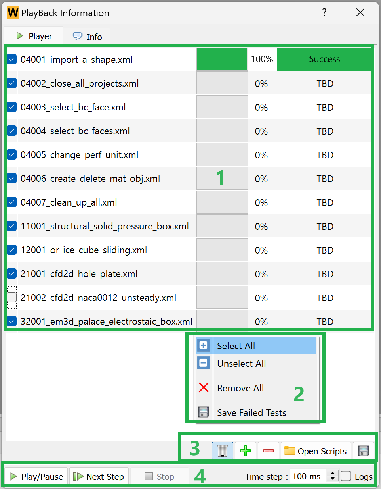

# Overview

The general-purpose engineering simulation CAE software, WELSIM, has undergone several years of development and its product has reached a stable state. Recently, the automated testing system has been made accessible to end-users, along with open-sourcing all of its test cases. Users not only have the ability to run validated test cases on their local machines, but to also quickly create their own test cases. Currently, WELSIM primarily uses XML as its test file format. The automated testing feature supports both Windows and Linux versions.

## Running tests
1. Download the zip file or clone the repository.
2. Set environment variables **WELSIM_DATA_ROOT** to the **WelSimAutoTests** folder.
3. Start the WELSIM application, select the **Play test...** action from the menu **Tools**.
4. Load the test cases and run.

!!!important
    All test cases are synchronized with the latest development version, please run the test cases using the latest development version of WELSIM. You need a license to run the tests, request a free trial license? Refer to [Activation](https://welsim.com/activation).

!!!important
    The user needs to configure the OpenRadioss, CalculiX, Elmer, and LAMMPS solvers by first before running the specific test cases.

## Creating tests
1. Set environment variables WELSIM_DATA_ROOT to the external file folder.
2. Start the WELSIM application, and select the **Record test...** action from the menu **Tools**.
3. Record operation flow.
4. Manually revise the test case if necessary.

## Statistics
This section shows the statistic data of the current testing cases.

| **Folder** | **Number of Tests** | **External Solver** |
|------------|---------------------|-----------|
| 04_GUI | 28 |  |
| 06_MatEditor | 158 |  |
| 07_Mesh | 12 | |
| 08_Result | 8 | |
| 09_BeamSection | 8 | |
| 11_FrontISTR | 46 | |
| 12_OpenRadioss | 18 | [x] |
| 13_CalculiX | 8 | [x] |
| 14_Elmer | 12 | [x] |
| 21_SU2 | 9 |  |
| 32_Palace | 2 |  |
| 41_Lammps | 1 | [x] |
| **Total** | **310** |

