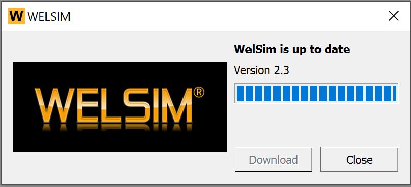
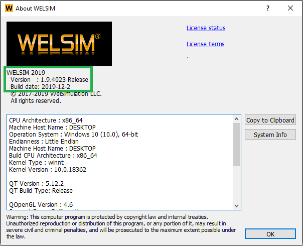

# WELSIM release notes
This release notes are specific to WELSIM and arranged by the version and features.

## Upgrading
To upgrade WELSIM to the latest version, download the installer from our [official website <i class="fa fa-external-link"></i>](https://welsim.com/download).
 
 
​

Since 2022R2(version 2.1), WelSim provides a version checker in the application, users can click **Help** -> **Check for Updates** on the menu and know if a new version is available. 

 

To inspect the currently installed version, open the **About** dialog in WELSIM application.

## Changelog

### 2025R2 (3.1) <small>May at 2025</small>
* Enhance support for *OpenRadioss* solver
    - Support Remote Displacement BC, create a Rigid Body node for the associated boundary.
    - Expose Solution object property Handle Negative Element to generate /NEGVOL command.
    - Support thermal stress analysis, ie. /IMPTEMP boundary condition command.
    - Support Contact Force results.
* Support multi-layer shell structure GUI, particularly in the tabular data input.
* Show Log file data as user clicks on the Solution object.
* Show Set Number and Time columns in the table and chart for the *OpenRadioss* and *SU2* results those are not evaluated yet.
* Add current project file location on the GUI window title, in addition to the product and version.
* Drag the files to import STEP files.
* Open source of the documentation.
* New features added to MatEditor.
    - Add Specific Heat Cv and Specific Heat Rho0Cp material properties.
    - Support LAW23 (PLAS_DAMA), LAW27 (PLAS_BRIT), and LAW28 (HONEYCOMB) material properties for *OpenRadioss*.
    - Support /THERM_STRESS/MAT and /HEAT/MAT commands for *OpenRadioss*
    - Add Swift and Ramberg-Osgood plastic material properties.
* Upgrade CFD solver SU2 to the latest version 8.2.
* Upgrade MUMPS to 5.7.3.
* Use Intel MPI for FrontISTR Windows version, instead of MSMPI.

### 2025R1 (3.0) <small>Jan. at 2025</small>
* Support molecular dynamics pre-processor for LAMMPS.
    - Supported commands: *atom_style*, *boundary*, *newton*, *comm_modify*, *region*, *create_box*, *neighbor*, *neigh_modify*, *pair_style*, *pair_coeff*, *timestep*, *fix*, *region*, *compute*, *thermo_style*, *thermo*, *thermo_modify*, *compute_modify*, *dump*, *run*, *unit*, *lattice*, *create_atoms*, *mass*, *velocity*, *displace_atoms*, etc.
    - Call the LAMMPS executable program seamlessly.
    - Reading LAMMPS' log and result files.
    - Display certain types of LAMMPS results. 
* Enable the particle and molecule display in the GUI.
* Add **Output Visual Data** and **Visual File Type** solution object properties for the FrontISTR solver.
* Enable **Beta features** option in the Preferences. 
* Support the 3DConnexion device, particularly SpaceMouse Wireless.
* Export results in Tecplot format.
* Upgrade **jsoncpp** to 1.9.3
* Add Atoms materials to the MatEditor.
    - H, He, Li, Be, B, C, N, O, F, Ne, Na
* Add atomic mass unit (AMU) mass unit.

### 2024R2 (2.9) <small>May at 2024</small>
* Support **CalculiX** preprocessing
    - Commands include AMPLITUDE, BEAM SECTION, CFD, COMPLEX FREQUENCY, DYNAMIC, ELECTROMAGNETICS, EL FILE, EL PRINT, END STEP, FREQUENCY, FRICTION, HEADING, HEAT TRANSFER, INCLUDE, NODE FILE, NODE PRINT, FLUID CONSTANTS, PHYSICAL CONSTANTS, REFINE MESH, RIGID BODY, STATIC, STEADY STATE DYNAMICS, STEP,  BOUNDARY, CFLUX, CLOAD, CONSTRAINT, CONTACT PAIR, DFLUX, DLOAD, DSLOAD, FILM, INITIAL CONDITIONS, MASS FLOW, RADIATE, ELEMENT, ELSET, EQUATION, FLUID SECTION, MASS, NODE, NSET, SHELL SECTION, SOLID SECTION, SURFACE,  CONDUCTIVITY, CREEP, CYCLIC HARDENING, DAMPING, DEFORMATION PLASTICITY, DENSITY, ELASTIC, ELECTRICAL CONDUCTIVITY, EXPANSION, HYPERELASTIC, MAGNETIC PERMEABILITY, MATERIAL, PLASTIC, RATE DEPENDENT, SPECIFIC GAS CONSTANT, SPECIFIC HEAT
* Support **Elmer FEM** preprocessing
    - Solvers include "Coil Solver", "Fluidic Force", "Free Surface Reduced", "Heat Equation", "MagnetoDynamics", "Mesh Update", "Navier-Stokes", "Poisson BEM", "Save Line", "Save Scalars", "Static Electrical Solver", "Static Current Solver", "Stress Analysis", "Stream Solver", etc.
* Support keyword search function in the solver output window, activated using **Ctrl+F** keys
* Support the test group file ***.wstb** for the automatic regression module.
* Support **CSV** format for the tabular data import and export.
* Support the new operations of the regression system such as deleting files, checking the existing files, exporting step files, mesh files, etc.
* Add **Mesh & Solve All** command.
* Add **Physics Constants** module to support Stefan Boltzmann, Newton Gravitation, Permittivity of Vaccum, Permeability of Vacuum, Gravity, Unit Charge, Gas Constant, Faraday Constant.
* New features added to **MatEditor**
    - Export material data in **Abaqus/CalculiX** format. The properties include Density, Isotropic Electrical Conductivity, Specific Gas Constant, Arruda Boyce, Mooney Rivlin 2, Neo-Hookean, Ogden 1st/2nd/3rd orders, Polynomial 1st/2nd/3rd orders, Yeoh 1st/2nd/3rd orders, Isotropic Elasticity, Isotropic Thermal Conductivity, Orthotropic Thermal Conductivity, Specific Heat, etc.
    - Export material data in **Elmer FEM** format. The properties include Density, Constant Damping Coefficient, IsotropicInstantaneous Thermal Expansion, Isotropic Thermal Expansion, Local Coordinates, Isotropic Electrical Conductivity, Isotropic Relative Permeability, Isotropic Relative Permittivity, Dynamic Viscosity, IsotropicElasticity, Enthalpy, Isotropic Thermal Conductivity, Specific Heat, etc.
    - Add new material properties: Specific Gas Constant. 
    - Add new units: Gravitational Constant, Gas Constant.
* Add 200+ automatic test cases.
* Many enhancements and optimizations.

### 2024R1 (2.8) <small>Jan. at 2024</small>
* Import GDSII files and display in the project tree and 3D graphics window.
* Allow users to choose the layer of selection in 3D geometry picking. 
* Enable ruler to show the micro and nano meter markers to better support micro shapes.
* Add new 3D EM features: Eigenmode, Transient, and Driven analyses.
* Include EM solver Palace, and all dependencies, MFEM, GSLib, libCEED, libXSMM, ARPACK-NG, etc. Built Palace on Windows operation system. Set the Palace as the default EM solver.  Remove FemSolver1.
* MatEditor
    - Add a new unit system: Metric (kg, mm, ns, A, N, V).
    - Add new material properties: Material Axes.
    - Add new materials: Sapphire.
* Upgrade Linux version version to Ubuntu 22.04 LTS, upgrade compiler to GCC11.
* Upgrade HYPRE from 2.25 to 2.30.
* Enhancement and improvement.

### 2023R3 (2.7) <small>Sept. at 2023</small>
* Support open-source CFD package Su2 pre-processing:
    - Configure file and Su2 format mesh file.
    - Solver options: EULER, NAVIER_STOKES, RANS, INC_EULER, INC_NAVIER_STOKES, INC_RANS.
    - Time-dependent and steady-state analyses.
    - Free-stream field.
    - Fluid Model: STANDARD_AIR, IDEAL_GAS, VW_GAS, PR_GAS, CONSTANT_DENSITY, INC_IDEAL_GAS, INC_IDEAL_GAS_POLY, FLUID_MIXTURE, SU2_NONEQ, MUTATIONPP.
    - Turbulence models: Spalart-Allmaras (SA), Shear Stress Transport (SST). 
    - Markers and Boundary Conditions: Euler (Slip) Wall, Symmetry, Heatflux, Isothermal Wall, Far field, Inlet, Supersonic Inlet, Outlet, etc.
    - Convective Schemes: JST, ROE, AUSM, HLLC, CUSP, MSW, FDS.
    - Limiter Options: SLOPE_LIMITER_FLOW, SLOPE_LIMITER_TURB, BARTH_JESPERSEN, VENKATAKRISHNAN, VENKATAKRISHNAN_WANG, SHARP_EDGES, WALL_DISTANCE, VAN_ALBADA_EDGE.
    - Restart and Visualization Files: RESTART, MESH, CSV, PARAVIEW_MULTIBLOCK, PARAVIEW, SURFACE_CSV, SURFACE_PARAVIEW.
    - Customizing the Screen and History Output: TIME_ITER, OUTER_ITER, INNER_ITER, CUR_TIME, TIME_STEP, WALL_TIME.
* Pre- and post-processing for OpenRadioss
    * Support **multi-step analysis**
    * Support **output frequency** for the engine file.
    * Expose the **thickness results** option in the animation files.
    * Expose the **FLD results** option in the animation files.
* Add the **Adaptive Mesh Region** condition.
* Support pressure boundary condition for shell structure.
* Support RMB **context menu** for the **result color legend bar**. The context menu allows user to:
    * Select the type of bar.
    * Toggle the display of date and time, logarithmic scale, deformation scale factor, scientific notation, and semi-transparency.
    * Set the number of digits, number of labels, and color spectrum. 
* Support RMB **context menu** for the **3D graphics** window.
* Support **Isometric view** for the dropdown AxisWidget.
* Expose Ffmpeg executable file path in the Preferences.
* Expose regression recorder and tester to the end users. 
* Open source all regression test cases.
* MatEditor:
    * Add JWL material property and Test143.
    * Add Shear Test Data - Viscoelastic, Bulk Test Data - Viscoelastic, and Uniaxial Plastic Strain Test Data material properties.
* CurveFitter:
    * Add an Output window to display more information to users.
    * Add the **Johnson-Cook**, **Swift**, **Voce**, and **Swift-Voce** functions in the Nonlinear section.
* Introduce glog 0.6. Upgrade MFEM from 4.5 to 4.5.2.
* Enhancement and optimization

### 2023R2 (2.6) <small>April at 2023</small>
* Generate solver scripts and associated mesh files for **Palace**. Support boundary conditions: PEC, PMC, Absorbing, Conductivity, Impedance, LumpedPort, WavePort, SurfaceCurrent, Ground, ZeroCharge. Support material properties: Permeability, Permittivity, LossTan, Conductivity. Support solver settings: Electrostatic, Magnetostatic, Eigenmode, Driven, Transient, Linear. Support mesh formats: Gmsh, MFEM, VTK, Vtu, Nastran.
* Export mesh files in Gmsh and Nastran formats.
* Support **rigid body** condition for the OpenRadioss solver.
* Support **spring** boundary condition for the structural analysis.
* Check geometries before meshing implementation.
* Add the ”Open Recent“ feature to the File menu. 
* Directory persistence for tabular data import and export.
* Introduce nlohmann/json third-party library.
* Upgrade MFEM to 4.5 from 4.4, Hypre to 2.25 from 2.12, and FrontISTR to 5.5 from 5.3.
* Enhancement and optimization.

### 2023R1 (2.5) <small>Jan. at 2023</small>
* Support OpenRadioss pre-processing.
    - Export OpenRadioss solver scripts including starter and engine files.
    - Supported blocks with keywords: MAT, NODE, GRNOD/NODE, BCS, PART, SHELL, BRICK, PROP/SOLID, PROP/SHELL, FUNCT, GRAV, INTER/TYPE7, SURF/SEG, RBODY, TH/PART, TH/INTER, INIVEL.
* Support OpenRadioss post-processing.
    - Load T01 file.
    - Load A001 files.
    - Display result contours: displacement, velocity, acceleration, stresses, and strains.
    - Generate dynamic analysis result videos.
* Support explicit structural dynamics using OpenRadioss solver.
* Support explicit structural dynamics using OpenRadioss solver.
* Support Contact Search for multi-body analysis.
* Support Exploded View for multi-body analysis.
* Optimize the meshing modules and improve the meshing user experience.
* Refactor the chart module.
* Support data persistence of mesh and results.
* Upgrade Windows C++ compiler to Visual Studio 2022, SDK to 10.0.19041
* Upgrade 3rd party libraries:
    - Qt to 5.15.2
    - OpenCascade to 7.5.3
    - Boost to 1.80, replace nowide with Boost/nowide
* Start to use the external version name based on the calendar year, such as 2023R1.
* Enhancements and optimizations.

### 2.4 <small>Dec. at 2022</small>
* Export MFEM mesh file.
* Export time-dependent results in Paraview Data format (*.pvd)
* Export FrontISTR, MFEM, and SU2 input scripts.
* UnitConverter: 
    - Add new units: Energy Density By Area, Energy Density By Volume, Dynamic Viscosity, Kinematic Viscosity, Specific Heat Density By Volume, Specific Volume, Heat Capacity, Stiffness. 
    - Add new unit system: g-cm-um.
* CurveFitter: 
    - Support multi-thread parallel computing (OpenMP), add 1st-6th Schulz-Flory functions。
    - Expose solver options to GUI.
* MatEditor:
    - Add new material: Air.
    - Add new fluid properties: Dynamic Viscosity, Kinematic Viscosity, Lemalar Prandtl Number, Turbulent Prandtl Number.
    - Add new Equation of State properties: EOS Compaction, EOS Gruneisen, EOS Ideal Gas, EOS Ideal Gas VT, EOS Linear, EOS LSZK, EOS Murnaghan, EOS NASG, EOS Noble Abel, EOS Osborne, EOS Polynomial EOS Puff, EOS Sesame, EOS Stiff Gas, EOS Tillotson.
    - Add new plasticity properties: Johnson Cook Strength, Zerilli Armstrong Strength, Hill, Rate-Dependent Multilinear Hardening, Orthotropic Hill, Cowper-Symonds, Zhao, Steinberg-Guinan, Gurson, Barlat3, Yoshida-Uemori, Johnson-Holmquist, Hensel-Spittel, Swift-Voce, and Vegter.
    - Add new Failure Criteria: Glass, Bi-Quadratic, Cockcroft, Connect, Extended Mohr-Coulomb, Energy, Fabric, Forming Limit Diagram, Hashin, Hosford-Coulomb, Johnson-Cook, Ladeveze delamination, Mullins Effect, NXT, Orthotropic Bi-Quadratic, Orthotropic Strain, Puck, Tuler-Butcher, Tensile Strain, Wierzbicki, Wilkins.
    - Add viscoelastic properties: Boltzman, Maxwell-Kelvin-Voigt, Maxwell-Kelvin.
    - Support tooltips for the materials and properties.
    - Support collapse and expand on the selected material properties.
    - Support deletion of the selected material properties.
    - Support Save/Resume.
    - Support writing OpenRadioss material scripts;
* Upgrade MFEM to 4.4.
* Upgrade MKL and Fortran Compiler to Intel oneAPI 2022.02.
* Linux version: new release since v1.9; Upgrade Qt to 5.15.2, MKL to Intel oneAPI 2022.01.
* Enhancements and optimizations.

### 2.3 <small>July at 2022</small>
* Improve meshing performance; Reduce the size of the temporary mesh data files.
* Add 2D circular shape geometry creation.
* Add a Refine Geometry feature.
* Add new HPC options in the Preference settings.
* Support new units: Momentum.
* Upgrade structural solver to 5.3.
* Upgrade the 3D rendering module to 5.0.3.
* Upgrade third-party libraries: HDF to 1.12.2, CGNS to 4.3.0, ITK to 5.2.1.
* Enhancements and optimizations.

### 2.2 <small>May at 2022</small>
* Add screen capture feature.
* Support video export feature for the spinning view.
* Add a result VCR controller to the Graph window.
* Support result animation review and video export.
* Enhancements and optimizations.

### 2.1 <small>Dec. at 2021</small>
* Add Sphere, and Torus build-in shape creation.
* Support Clip Planes for the section view in post-processing.
* Add vector (Glyph3D arrows) electric field and vector electric flux density results for electrostatic analysis.
* Add Point Charge, Spherical Charge Density, and Polarization source conditions for electrostatic analysis.
* Add Cylindrical Magnet, Ring Current source conditions for magnetostatic analysis.
* Add image-saving feature for the Chart window.
* Launch independent beam cross-section application - BeamSection.
* CurveFitter: support R-squared (R2) calculation, enhance solver.
* Upgrade Eigen to 3.3.9.

### 2.0 <small> January at 2021</small>
* All new 3D graphics module supports 4K display, auto spin/swing, stereo views, etc. 
* New "Pre-Selection", "Show Vertices", "Wireframe", "Show Mesh", "Stop Meshing/Solving" commands on Menu and Toolbar.
* A new dimension ruler supports both metric and U.S. customary units.
* A new bounding box feature for all presented objects in the 3D scene.
* Optimized meshing module with better performance and usability.
* Optimized mesh and result 3D rendering. 
* Added a new Selection View to the GUI main window.
* Upgrade QT framework to 5.12.9, OCCT to 7.4, VTK to 8.2, MUMPS to 5.3.5, PETSc to 3.14.2, etc.

### 1.9.1 <small> July at 2020</small>
* Support curve fitting features for the Core Loss Model and test data.
* Support curve fitting for the hyperelastic material models and test data. 
* Launch general-purpose curve fitting application - CurveFitter.

### 1.9 <small> November, 2019</small>

* Support units.
* Support nonlinear thermal analysis.
* All new table and graph windows. 
* All new About dialogs with capability of displaying software and hardware information.
* Launch the engineering material data tool - MatEditor.
* Launch the engineering unit converter - UnitConverter.
* Launch online documentation at docs.welsim.com and replaced the PDF documents.
* Result legend supports user-defined min/max values. 
* Upgrade C++ compiler to vs2017, QT framework to 5.12.2, HDF5 to 1.8.21, Boost to 1.69, OCCT to 7.3, etc. 
* Enhancements and optimizations.

### 1.8 <small> December, 2018</small>
* Input/Output: Add Nastran and Abaqus input scripts generation; Read generated result files.
* GUI: Add system preferences database and associated user interface; Enhance Output/Message window, promote more detailed messages.
* Geometry: New STL geometry object. Import STL files; Add geometry checking feature.
* Mesh: mesh STL geometry. export mesh data to file.
* Analysis: Support Vertex scoping for the boundary conditions. Add body heat flux condition for thermal analysis.
* Upgrade Microsoft MPI to 10.0. General enhancements.

### 1.7 <small> July, 2018</small>
* Add structural shell analysis, including the associated fixed rotation boundary condition, rotation result, reaction moment probe.
* Add structural body conditions: body force, acceleration, earth gravity, rotational velocity.
* Add mesh method object to support distinct mesh density for bodies.
* Add geometry selection controller on graphics toolbar, support body, face, edge, and vertex selections.
* Add plane shape creation feature.
* Add official user manual.
* General enhancements.

### 1.6 <small> April, 2018</small> 
* Add data persistence module to support project save/resume feature.
* Add user-defined and reaction force probe results.
* Add velocity and acceleration boundary conditions and results for transient structural analysis.
* Add geometry export feature.
* General enhancements.

### 1.5 <small> February, 2018</small>
* Launch Linux 64-bit version that supports Ubuntu 16.04 LTS and Fedora 27.
* Add status engine for the project tree objects, small icon represents the current state of the object.
* General enhancements.

### 1.4 <small> November, 2017</small>
* Add 3D static and transient lamellar flow analysis (Deprecated).
* General enhancements.

### 1.3 <small> September, 2017</small>
* Add 3D electrostatic analysis with supported boundary conditions: ground, symmetry, voltage, zero charges, surface charge density, electric displacement.
* Add 3D magnetostatic analysis with supported boundary conditions: insulting, magnetic flux density.
* General enhancements.

### 1.2 <small> August, 2017</small>
* Add 3D steady-state and transient thermal analysis with associated boundary conditions.
* General enhancements.

### 1.1 <small> July, 2017</small>
* Add chart, tabular data, and output window to GUI.
* Add multi-body and contact features to structural analysis.
* Add nonlinear material analysis features with the capabilities of solving hyperelastic, elastoplastic, viscoelastic, and creep materials.
* Add 3D static, transient, and modal structural analyses.
* General enhancements.

### 1.0 <small> March 2017</small>
* Launch all-in-one simulation framework including a graphical user interface, meshers, and solvers.
* Add 3D linear elastic structural analysis.
* Add Automatic mesh generator for Tet4 and Tet10 elements.
* Add geometry creation and CAD model import features.
* Add graphics, tree, and property windows to the GUI.
