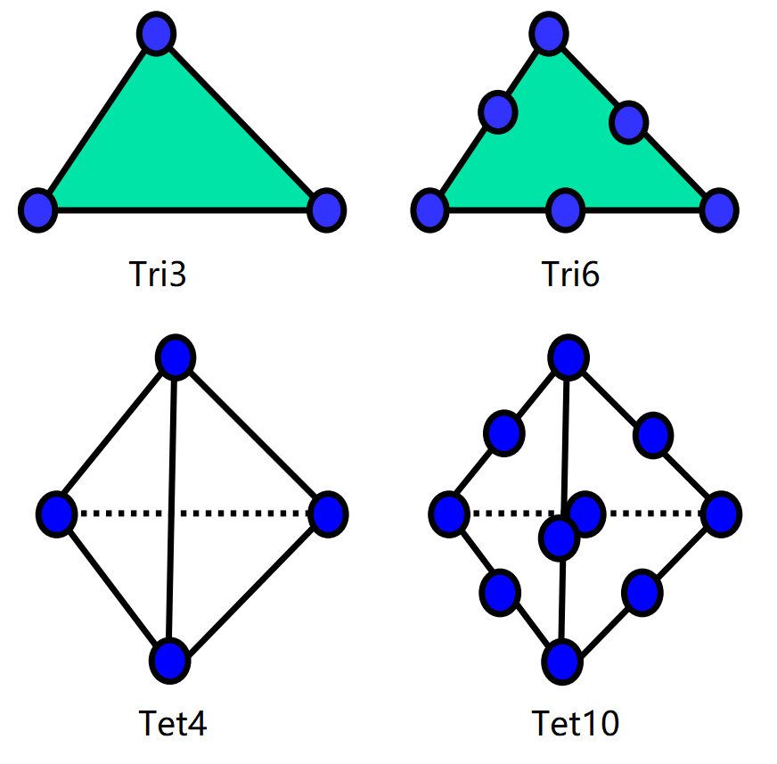
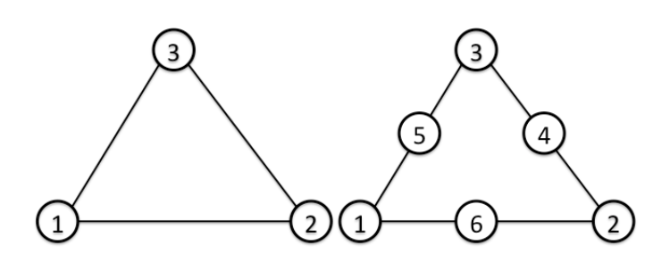
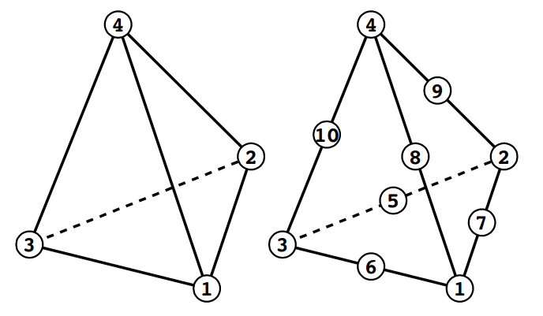

# Element library
The WELSIM application supports several types of finite elements. This section discuss the details of element that is used in the program. 

| Element type | Finite element type | Description |
| ------------ | ------------------- | ----------- |
| Plane element (Shell) | Tri3 | Three node triangular element |
| Plane element (Shell) | Tri6 | Six node triangular element(quadratic) |
| Solid element | Tet4 | Four node tetrahedral element |
| Solid element | Tet10 | Ten node tetrahedral element(quadratic) |

The element groups shown in Table [tab:ch4_theory_elem_types] can be used for engineering analysis. The schematic views and the surface definition of those elements are given in Figures [fig:ch4_theory_elem_views], [fig:ch4_theory_elem_triangles], and [fig:ch4_theory_elem_tet].

| Surface No. | Linear | Quadratic |
| ------------ | ------------------- | ----------- |
| 1 | 1-2-3 [front] | 1-6-2-4-3-5 [front] |
| 2 | 3-2-1 [back] | 3-4-2-6-1-5 [back] |

| Surface No. | Linear | Quadratic |
| ------------ | ------------------- | ----------- |
| 1 | 1-2-3  | 1-7-2-5-3-6  |
| 2 | 1-2-4  | 1-7-2-9-4-8  |
| 3 | 2-3-4  | 2-5-3-10-4-9 |
| 4 | 3-1-4  | 3-6-1-10-4-8 |

