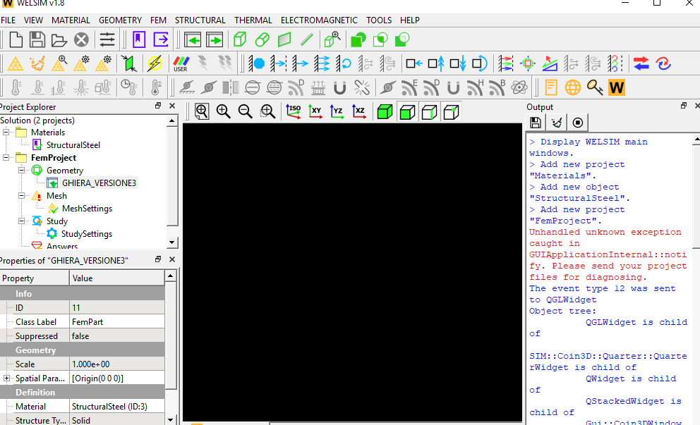

# Troubleshooting
If you encounter an issue that cannot be resolved here, please send the project file (*.wsdb and the associated folder), and the system information to <info@welsim.com>. Your computer information can be acquired by clicking About button on the toolbar.

## Graphical window issue
The graphics window fails to display items, and the context is all black. The screen capture of this issue is shown in Figure below.

* **Cause**: This issue is due to an unsupported graphics card or driver.

* **Solution**: Set the environment variable **QT_OPENGL=desktop** then restart the WelSim application. The graphics window shall display the context correctly.

## Result data matching issue
The result fails to display contours due to the dismatched mesh. The error message of this issue is shown in Figure below.

{#welsim_result_data_point_error1}

* **Cause**: This issue is due to dismatched data between result and mesh.

* **Solution**: This could be a software defect, send the model to the [info@welsim.com](mailto:info@welsim.com) for investigation.

