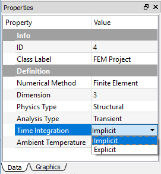
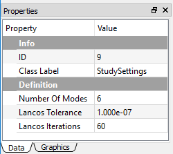
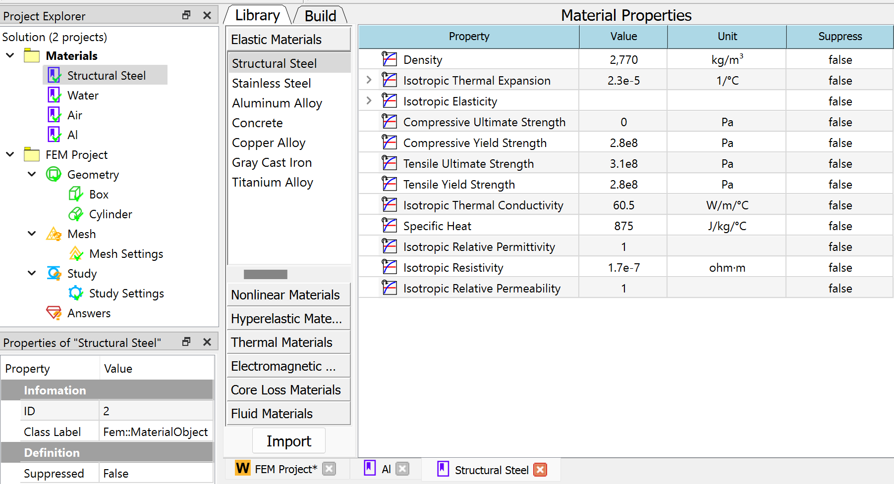
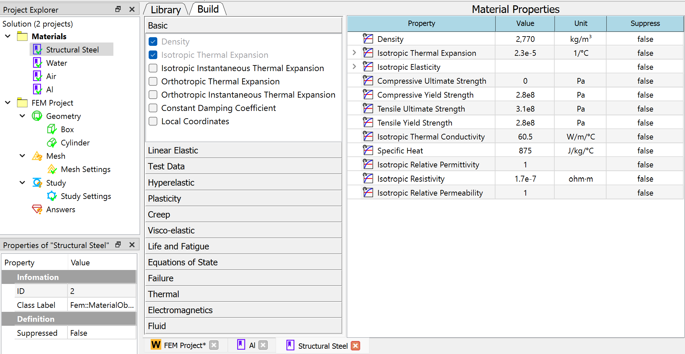

# Physics and analysis types
WELSIM supports several types of finite element analyses. This section describes those analysis types that you can perform in the WELSIM user interface.

## Static structural analysis
As one of the most widely used analysis types, a static structural analysis discloses the structural displacements, stresses, strains, and forces caused by loads or other mechanical effects. In this static analysis, the constant loading and response are assumed. 

The static structural analysis can be either linear or nonlinear. The non-linearity can be introduced by the large deformations, in-elasticity, contact, hyperelasticity, etc. For the nonlinear problem, it is recommended to set multiple substeps in the Study Settings.

### Conducting a static structural analysis
The following lists the general and specifics steps in conducting static structural analysis:

1. **Creating analysis environment**: In the Properties View of the FEM Project object, set the Physics Type to Structural and Analysis Type to Static. Since the static structural analysis is the default analysis type, you do not need to change these properties if the analysis is newly created. See [Creating Analysis Environment](steps.md#creating-analysis-environment) for details.

2. **Defining materials**: The material properties can be either linear or nonlinear. You must define the sufficient properties that are required in the solving process. See [Defining Materials](../../mateditor/mateditor_overview.md) for details.

3. **Specifying geometries**: See [Specifying Geometries](geometry.md) for details.

4. **Defining part behaviors**: The Structure Type property of the Part object determines the successive meshing and solving algorithms, the default setting is Solid. You need to change this property value accordingly if the geometry is Shell or other types. See [Defining Part Behaviors](steps.md#defining-part-behaviors) for details.

5. **Setting bonnections**: Optional. Contacts are supported in a static structural analysis. See [Setting Connections](connections.md) for details.

6. **Applying mesh**: It is recommended to generate Tet10 elements for Solid analysis and the Tri6 element for the Shell analysis. See [Applying Mesh](steps.md#applying-mesh) for details.

7. **Configuring study settings**: You usually do not need to change these settings for simple linear analyses. For the complex analyses such as nonlinear models, the analysis controls you can tune: Step Controls in Study object, Substep Controls and Nonlinear Controls in Study Settings object. See [Configuring Study Settings](study.md) for details.

8. **Setting up boundary conditions**: For a static structural analysis, the applicable boundary conditions are Fixed Supported, Fixed Rotation, Displacement, Force, and Pressure. The following body conditions are supported: Body Force, Acceleration, Earth Gravity, and Rotational Velocity. See [Setting up Boundary Conditions](bcs.md) for details.

9. **Solving**: Output window continuously updates messages from the solvers and provides information on the numerical steps in solving the given problem. The convergence data is also explicitly shown in the Output window. See [Solving](steps.md#solving) for details.

10. **Evaluating results**: For a static structural analysis, the applicable results are Deformations, Stresses, Strains, Rotations, Reaction Forces, and Reaction Moments. The Tabular Data and Chart windows display the maximum and minimum result values along the time/set number. See [Evaluating Results](results.md) for details.

## Transient structural analysis
In the transient structural analysis, the dynamic response is updated and is a function of time. You can impose general time-dependent boundary conditions on the model and obtain the time-varying responded to these transient loads or constraints. The inertia or damping effects play important roles in this analysis type, if the inertia and damping effects are minimal, you could use the static analysis instead.

The transient structural analysis can be either linear or nonlinear. The non-linearity can be introduced by the large deformations, inelasticity, contact, hyperelasticity, etc. For the nonlinear problem, it is recommended to set multiple substeps for each load step in the Study Settings.

### Conducting a transient structural analysis
The following lists the general and specifics steps in conducting transient structural analysis:

1. **Creating analysis environment**: In the Properties View of the FEM Project object, set the Physics Type to Structural and Analysis Type to Transient. You can choose either Implicit or Explicit time integration solver. **The Explicit is recommended due to using the powerful OpenRadioss solver.** See [Creating Analysis Environment](steps.md#creating-analysis-environment) for details.

2. **Defining materials**: The material properties can be either linear or nonlinear. You must define the sufficient properties that are required in the solving process. See [Defining Materials](../../mateditor/mateditor_overview.md) for details.

3. **Specifying geometries**: See [Specifying Geometries](geometry.md) for details.

4. **Defining part behaviors**: The Structure Type property of the Part object determines the successive meshing and solving algorithms, and the default setting is Solid. You need to change this property value accordingly if the geometry is Shell or other types. See [Defining Part Behaviors](steps.md#defining-part-behaviors) for details.

5. **Setting connections**: Optional. Contacts are supported in a transient structural analysis. See [Setting Connections](connections.md) for details.

6. **Applying mesh**: It is recommended to generate Tet10 elements for Solid analysis and the Tri6 element for the Shell analysis. See [Applying Mesh](steps.md#applying-mesh) for details.

7. **Configuring study settings**: You usually do not need to change these settings for simple linear analyses. For the complex analyses such as nonlinear models, the analysis controls you can tune are Step Controls in Study object, Substep Controls and Nonlinear Controls in Study Settings object. See [Configuring Study Settings](study.md) for details.

8. **Defining initial conditions**: Optional. In the transient structural analysis, you can define the initial status of boundary and body conditions. The Initial Status property provides two options: None and Equal to Step 1. The default option None set the initial value to zero, the option Equal to Step 1 set the initial value to that of step 1. See [Defining Initial Conditions](steps.md#defining-initial-conditions) for details.

9. **Setting up boundary conditions**: For the transient structural analysis, the applicable boundary conditions are Fixed Supported, Fixed Rotation, Displacement, Force, Pressure, Velocity, and Acceleration. The following body conditions are supported: Body Force, Acceleration, Earth Gravity, and Rotational Velocity. See [Setting up Boundary Conditions](bcs.md) for details.

10. **Solving**: Output window continuously updates messages from the solvers and provides information on the numerical steps in solving the given problem. The convergence data is also explicitly shown in the Output window. See [Solving](steps.md#solving) for details.

11. **Evaluating results**: For the transient structural analysis, the applicable results are: Deformations, Stresses, Strains, Rotations, Reaction Forces, Reaction Moments, Velocity, and Acceleration. The Tabular Data and Chart windows display the maximum and minimum result values along the time/set number. See [Evaluating Results](results.md) for details.

## Modal analysis
The modal analysis investigates the vibration characteristics of a structure or component. You can obtain the natural frequencies and mode shapes, which serve as a starting pointing for dynamic analysis of the target structure.

### Conducting a modal structural analysis
The following lists the general and specifics steps in conducting modal structural analysis:

1. **Creating analysis environment**: From the properties view of FEM Project object, set the **Physics Type** to **Structural** and **Analysis Type** to **Modal**. See [Creating Analysis Environment](steps.md#creating-analysis-environment) for details.

2. **Defining materials**: The material properties can be either linear or nonlinear. However, the nonlinearity in the modal analysis is ignored due to the characteristics of eigen solver algorithms. You must define the sufficient properties that are required in the solving process. For example, the mass density parameter must be defined. See [Defining Materials](../../mateditor/mateditor_overview.md) for details.

3. **Specifying geometries**: See [Specifying Geometries](geometry.md) for details.

4. **Defining part behaviors**: The **Structure Type** property of the **Part** object determines the successive meshing and solving algorithms, and the default setting is **Solid**. You need to change this property value accordingly if the geometry is **Shell** or other types. See [Defining Part Behaviors](steps.md#defining-part-behaviors) for details.

5. **Setting connections**: Optional. The Bonded Contacts are supported in a modal structural analysis. See [Setting Connections](connections.md) for details.

6. **Applying mesh**: It is recommended to generate the **Tet10** elements for **Solid** analysis and the **Tri6** element for the **Shell** analysis. See [Applying Mesh](steps.md#applying-mesh) for details.

7. **Configuring study settings**: You typically do not need to change these settings for simple modal analyses. The default number of modes is 6, increasing this value yields to calculate more natural frequency modes, while it requires more computational resources. See [Configuring Study Settings](study.md) for details.

8. **Setting up boundary conditions**: For the modal structural analysis, the applicable boundary conditions are **Fixed Supported**, **Fixed Rotation**, zero **Displacement**. The following body conditions are supported: **Body Force**, **Acceleration**, **Earth Gravity**, and **Rotational Velocity**. Note that only constraint-type boundaries are applicable in modal analysis. See [Setting up Boundary Conditions](bcs.md) for details.

9. **Solving**: Output window continuously updates messages from the solvers and provides information on the numerical steps in solving the given problem. The convergence data is also explicitly shown in the Output window. See [Solving](steps.md#solving) for details.

10. **Evaluating results**: For the modal structural analysis, the applicable results are **Deformations**, and Frequencies. Note that deformation results here are just relative quantities intended to show the shape modes. The **Tabular Data** and **Chart** windows display the frequencies and related mode numbers. See [Evaluating Results](results.md) for details.

## Steady-state thermal analysis
In the steady-state thermal analysis, you can determine the temperatures in objects that are impacted by the time-invariant thermal loads. Users are recommended to perform a steady-state analysis before conducting a transient study in a complex model. 

The static thermal analysis can be either linear or nonlinear. The nonlinearity can be introduced by the temperature-depend material properties, or radiation and convection coefficient. For the nonlinear problem, it is recommended to set multiple substeps in the **Study Settings**.

### Conducting a static structural analysis
The following lists the general and specifics steps in conducting static structural analysis:

1. **Creating analysis environment**: In the Properties View of the FEM Project object, set the Physics Type to Thermal and Analysis Type to Static. See [Creating Analysis Environment](steps.md#creating-analysis-environment) for details.

2. **Defining materials**: The material properties can be either linear or nonlinear. You must define the sufficient properties that are required in the solving process. See [Defining Materials](../../mateditor/mateditor_overview.md) for details.

3. **Specifying geometries**: See [Specifying Geometries](geometry.md) for details.

4. **Defining part behaviors**: The Structure Type property of the Part object determines the successive meshing and solving algorithms, and the default setting is Solid. You need to change this property value accordingly if the geometry is Shell or other types. See [Defining Part Behaviors](steps.md#defining-part-behaviors) for details.

5. **Setting connections**: Optional. The steady-state thermal analysis supports the Bonded Contact. See [Setting Connections](connections.md) for details.

6. **Applying mesh**: It is recommended to generate the Tet10 elements for Solid analysis, and the Tri6 element for the Shell analysis. See [Applying Mesh](steps.md#applying-mesh) for details.

7. **Configuring study settings**: You usually do not need to change these settings for simple linear analyses. For the complex analysis such as nonlinear models, the analysis controls you can tune are Step Controls in Study object, Substep Controls and Nonlinear Controls in Study Settings object. See [Configuring Study Settings](study.md) for details.

8. **Setting up boundary conditions**: In the steady-state thermal analysis, the applicable boundary conditions are: Temperature, Heat Flux, Convection, and Radiation. See [Setting up Boundary Conditions](bcs.md) for details.

9. **Solving**: Output window continuously updates messages from the solvers and provides information on the numerical steps in solving the given problem. The convergence data is also explicitly shown in the Output window. See [Solving](steps.md#solving) for details.

10. **Evaluating results**: In steady-state thermal analysis, the applicable results are Temperature. The Tabular Data and Chart windows display the maximum and minimum result values along the time/set number. See [Evaluating Results](results.md) for details.

## Transient thermal analysis
In the transient thermal analysis, you can obtain the temperatures of objects that vary over time. Many heat transfer applications such as coiling or quenching problems, and so on involve transient thermal analysis. The transient thermal analysis can be either linear or nonlinear. The nonlinearity can be introduced by the temperature-dependent material properties or convection and radiation boundary conditions. For the nonlinear problem, it is recommended to define multiple substeps for each load step in the Study Settings.

### Conducting a transient thermal analysis
The following lists the general and specifics steps in conducting transient thermal analysis:

1. **Creating analysis environment**: In the Properties View of the FEM Project object, set the Physics Type to Thermal and Analysis Type to Transient. See [Creating Analysis Environment](steps.md#creating-analysis-environment) for details.

2. **Defining materials**: The material properties can be either linear or nonlinear. You must define the sufficient properties that are required in the solving process. See [Defining Materials](../../mateditor/mateditor_overview.md) for details.

3. **Specifying geometries**: See [Specifying Geometries](geometry.md) for details.

4. **Defining part behaviors**: The Structure Type property of the Part object determines the successive meshing and solving algorithms, and the default setting is Solid. You need to change this property value accordingly if the geometry is Shell or other types. See [Defining Part Behaviors](steps.md#defining-part-behaviors) for details.

5. **Setting connections**: Optional. In the transient thermal analysis, the Bonded Contact is supported. See [Setting Connections](connections.md) for details.

6. **Applying mesh**: It is recommended to generate the Tet10 elements for Solid analysis and the Tri6 element for the Shell analysis. See [Applying Mesh](steps.md#applying-mesh) for details.

7. **Configuring study settings**: You usually do not need to change these settings for simple linear analyses. For the complex analysis such as nonlinear models, the analysis controls you can tune are Step Controls in Study object, Substep Controls and Nonlinear Controls in Study Settings object. See [Configuring Study Settings](study.md) for details.

8. **Setting up boundary conditions**: In the transient thermal analysis, the applicable boundary conditions are: Temperature, Heat Flux, Convection, and Radiation. See [Setting up Boundary Conditions](bcs.md) for details.

9. **Defining initial conditions**: You can define the global initial temperature condition for the analysis. In the transient thermal analysis, you can define the initial status of boundary and body conditions. The Initial Status property provides two options: None and Equal to Step 1. The default option None set the initial value to zero, the option Equal to Step 1 set the initial value to that of step 1. See [Defining Initial Conditions](steps.md#defining-initial-conditions) for details.

10. **Solving**: Output window continuously updates messages from the solvers and provides information on the numerical steps in solving the given problem. The convergence data is also explicitly shown in the Output window. See [Solving](steps.md#solving) for details.

11. **Evaluating results**: In the transient thermal analysis, the applicable results are Temperature. The **Tabular Data** and **Chart** windows display the maximum and minimum result values along the time/set number. See [Evaluating Results](results.md) for details.

## ElectroStatic Analysis
The electrostatic analysis can be applied to determine the distribution of electric potential in a conducting body under voltage or current conditions. You can obtain the solution results such as voltage, electric field, etc. The electrostatic analysis supports the single body analysis. 

An electrostatic analysis could be either linear or nonlinear. The electric field dependent material properties can introduce the nonlinearity. For the nonlinear problem, it is recommended to set multiple substeps in the Study Settings.

### Conducting an electrostatic analysis
The following lists the general and specifics steps in conducting electrostatic analysis:

1. **Creating analysis environment**: In the Properties View of the FEM Project object, set the Physics Type to Electromagnetic and Analysis Type to ElectroStatic. See [Creating Analysis Environment](steps.md#creating-analysis-environment) for details.

2. **Defining materials**: The material properties can be either linear or nonlinear. You must define the sufficient properties that are required in the solving process. See [Defining Materials](../../mateditor/mateditor_overview.md) for details.

3. **Specifying geometries**: See [Specifying Geometries](geometry.md) for details.

4. **Defining part behaviors**: The Structure Type property of the Part object determines the successive meshing and solving algorithms, and the default setting is Solid. An electrostatic analysis only supports the Solid geometry type. See [Defining Part Behaviors](steps.md#defining-part-behaviors) for details.

5. **Applying mesh**: It is recommended to generate Tet10 elements for Solid analysis. See [Applying Mesh](steps.md#applying-mesh) for details.

6. **Configuring study settings**: You usually do not need to change these settings for simple linear analyses. For the complex analysis such as nonlinear models, the analysis controls you can tune are Step Controls in Study object, Substep Controls and Nonlinear Controls in Study Settings object. See [Configuring Study Settings](study.md) for details.

7. **Setting up boundary conditions**: In the electrostatic analysis, the applicable boundary conditions are Ground, Voltage, Symmetry, Zero Charge, Surface Charge Density, and Electric Displacement. See [Setting up Boundary Conditions](bcs.md) for details.

8. **Solving**: Output window continuously updates messages from the solvers and provides information on the numerical steps in solving the given problem. The convergence data is also explicitly shown in the Output window. See [Solving](steps.md#solving) for details.

9. **Evaluating results**: In the electrostatic analysis, the applicable results are Voltage, Electric Field, Electric Displacement, and Energy Density. The Tabular Data and Chart windows display the maximum and minimum result values along the time/set number. See [Evaluating Results](results.md) for details.

## MagnetoStatic analysis
The magnetostatic analysis determines the magnetic field in and around a magnetic body. 

A magnetostatic analysis requires the medium such as air surrounding the geometry be included as part of the entire simulation domain. In many cases, the full model can be reduced to the symmetric model by applying a symmetric boundary condition on the symmetric surface.

### Conducting a magnetostatic analysis
The following lists the general and specifics steps in conducting magnetostatic analysis:

1. **Creating analysis environment**: In the Properties View of the FEM Project object, set the Physics Type to Electromagnetic and Analysis Type to MagnetoStatic. See [Creating Analysis Environment](steps.md#creating-analysis-environment) for details.

2. **Defining materials**: The material properties can be either linear or nonlinear. You must define the sufficient properties that are required in the solving process. See [Defining Materials](../../mateditor/mateditor_overview.md) for details.

3. **Specifying geometries**: See [Specifying Geometries](geometry.md) for details.

4. **Defining part behaviors**: The Structure Type property of the Part object determines the successive meshing and solving algorithms, and the default setting is Solid. A magnetostatic analysis only supports the Solid geometry type. See [Defining Part Behaviors](steps.md#defining-part-behaviors) for details.

5. **Applying mesh**: It is recommended to generate the Tet10 elements for magnetostatic analysis. See [Applying Mesh](steps.md#applying-mesh) for details.

6. **Configuring study settings**: You usually do not need to change these settings for simple linear analyses. For the complex analysis such as nonlinear models, the analysis controls you can tune are Step Controls in Study object, Substep Controls and Nonlinear Controls in Study Settings object. See [Configuring Study Settings](study.md) for details.

7. **Setting up boundary conditions**: In the magnetostatic analysis, the applicable boundary conditions are Insulating, Symmetry, Magnetic Potential, and Magnetic Flux Density. See [Setting up Boundary Conditions](bcs.md) for details.

8. **Solving**: Output window continuously updates messages from the solvers and provides information on the numerical steps in solving the given problem. The convergence data is also explicitly shown in the Output window. See [Solving](steps.md#solving) for details.

9. **Evaluating results**: In the magnetostatic analysis, the applicable results are Magnetic Potential, Magnetic Field, Magnetic Induction Field, and Energy Density. The Tabular Data and Chart windows display the maximum and minimum result values along the time/set number. See [Evaluating Results](results.md) for details.

The following describes the widget components in the material editor interface:

* **Library Outline Tab**: Display the available pre-defined material data for you to select. All materials are classified into several categories including **General Materials**, **Nonlinear Materials**, **Hyperelastic Materials**, **Thermal Materials**, **Electromagnetic Materials**, and **Acoustic Materials**.

* **Build Outline Tab**: Display the available properties for you to add to the material. All properties are classified into several categories including **Baisc**, **Linear Elastic**, **Hyper-elastic**, **Plastic**, **Creep**, **Visco-elastic**, and **Electromagnetic**. The toggled properties are added to the material data and shown in the Property Pane.

* **Material Properties View Pane**: Displays the properties of the selected properties items. You can modify the values of the properties. Click **OK** button to close the spreadsheet and save the material data into the **Material Object**.

### Library outline tab
The Library Outline Tab shows an outline of the contents of the selectable material sources. You can directly load a material data from this pre-defined source by one of the methods below:

* Double click a material entry.
* Select a material entry, and press the Import button.

## CFD Analysis
To be added ...

## Molecular Dynamics Analysis
To be added ...

