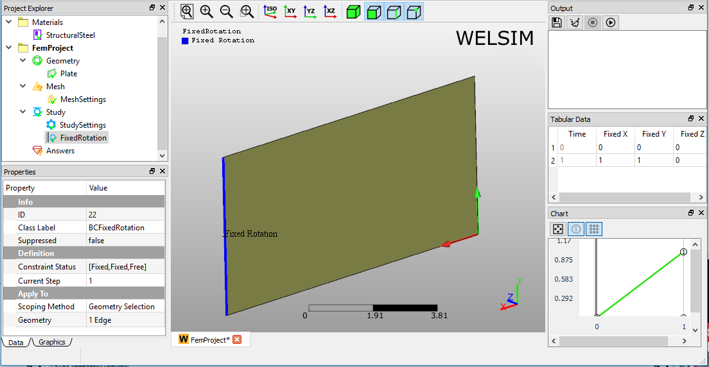

# Setting up boundary conditions
Boundary or Body conditions are essential conditions for the most analyses. A boundary condition is imposed on the boundary of the geometry. For example, a displacement condition imposed on the face of the 3D solid geometry. A body condition is imposed on the entire body. For example, the rotational velocity imposed on the body. 

Each analysis type has its boundary and body conditions. These boundary and body conditions will be described separately regarding structural, thermal, and electromagnetic analyses. 

!!! note
    The **boundary condition** here includes both boundary and body conditions.

## Add boundary condition
Adding boundary and body conditions in WELSIM application is straightforward. The following describes the adding method and its behaviors.

* Adding new conditions from the **Menu**.
* Adding new conditions from the **Toolbar**.
* Right clicking on the **Study** or its children objects and selecting the condition item from the context menu.

## Scoping method 
The scoping method supports the geometry selection, and you can select the target geometry entities and set to the properties. A voltage boundary condition scoping is illustrated in Figure below. You can select multiple geometry entities such as bodies, faces, edges, or vertices to a Geometry property, but all these entities must be the same type. 

### Tips in geometry selection
The following describes the tips in selecting geometries for boundary and body conditions:

* You can first select geometries and then apply to Geometry Selection property, or you can click the Geometry Selection property then select the geometries from the Graphics window.
* You can select multiple entities by pressing the **Ctrl** or **Shift** key.
* For the body conditions, you only select the volumes or bodies. 
* For the boundary conditions, you only can select the faces or edges.

## Types of boundary conditions
This section describes the boundary conditions that are provided in the WELSIM application.

### Displacement
Displacement determines the spatial motion of one or more faces, edges, or vertices for their original location. This boundary condition is available for all structural analysis. 

#### Boundary condition application
To apply **Displacement**: 

1. On the menu or toolbar of the **Structural**, click **Displacement** button. Or, right-click the **Study** object in the tree and select **Impose Conditions** > **Displacement**.
2. Click the property of **Geometry Selection**, and scope the geometric entities from Graphics window.
3. Define the **Displacement** components on X, Y, and Z directions.

#### Properties view
The available settings in the Properties View are described below. 

* **Geometry selection**: Selection field allows you to select the Face, Edge, or Vertex entities. The selected entities must be the same type.
* **Displacement vector**: Component field allows you to input displacement values on X, Y, and Z directions.
* **Suppressed**: Include (**False** - default) or exclude (**True**) the boundary condition.

#### Displacement example
**Displacement** boundary condition is applied as shown in Figure below. 

### Fixed support
Fixed Support is a special case of [Displacement](#displacement) boundary condition. It essentially sets the displacement to zero at the scoped geometries. This boundary condition is available for all structural analysis. 

#### Boundary condition application
To apply the Fixed Support: 

1. On the menu or toolbar of the **Structural**, click **Fixed Support** button. Or, right-click the **Study** object in the tree and select **Impose Conditions** > **Fixed Support**.
2. Click the property of **Geometry Selection**, and scope the geometric entities from Graphics window.
3. Determine the constraint status on X, Y, and Z directions.

#### Properties view
The available settings in the Properties View are described below. 

* **Geometry selection**: Selection field allows you to select the Face, Edge, or Vertex entities. The selected entities must be the same type.
* **Constraint status**: Component field allows you to set the constraints on X, Y, and Z directions.
* **Suppressed**: Include (**False** - default) or exclude (**True**) the boundary condition.

#### Fixed support example
**Fixed support** boundary condition is applied as shown in Figure below. 

### Fixed rotation
Fixed Rotation constrains the rotation of the scoped geometry entities. This boundary condition is only available for Shell structural analysis. 

#### Boundary condition application
To apply Fixed Rotation: 
1. On the menu or toolbar of the **Structural**, click **Fixed Rotation** button. Or, right-click the Study object in the tree and select Impose **Conditions** > **Fixed Rotation**.
2. Click the property of **Geometry Selection**, and scope the geometric entities from **Graphics** window.
3. Determine the constraint status on X, Y, and Z directions.

#### Properties view
The available settings in the Properties View are described below. 

* **Geometry Selection**: Selection field allows you to select the Face, Edge, or Vertex entities. The selected entities must be the same type.
* **Constraint Status**: Component field allows you to set the constraints on X, Y, and Z directions.
* **Suppressed**: Include (False - default) or exclude (True) the boundary condition.

#### Fixed Rotation example
**Fixed Rotation** boundary condition is applied as shown in Figure below.

### Pressure
A pressure boundary condition imposes a constant normal pressure to one or more surfaces. A positive pressure acts into the surface, which compresses the scoped body. Similarly, a negative pressure pulling away from the scoped surface. This boundary condition is available for all structural analysis. 

#### Boundary condition application
To apply **Pressure**: 

1. On the menu or toolbar of the **Structural**, click **Pressure** button. Or, right-click the **Study** object in the tree and select **Impose Conditions** > **Pressure**.
2. Click the property of **Geometry Selection**, and scope the geometric entities from **Graphics** window.
3. Input the magnitude of normal pressure. A positive pressure acts into the surface, and a negative pressure pulls away from the surface.

#### Properties view
The available settings in the Properties View are described below. 

* **Geometry Selection**: Selection field allows you to select the Face, Edge, or Vertex entities. The selected entities must be the same type.
* **Normal Pressure**: Scalar value field allows you to pressure. A positive value indicates a compression pressure, and negative value denotes a tensile pressure.
* **Suppressed**: Include (False - default) or exclude (True) the boundary condition.

#### Pressure example
**Pressure** boundary condition is applied as shown in Figure below.

### Force
A force boundary condition imposes a constant force to one or more entities, such as surfaces, edges, or vertices. This boundary condition is available for all structural analysis. 

#### Boundary condition application
To apply Force: 

1. On the menu or toolbar of the Structural, click Force button. Or, right-click the Study object in the tree and select Impose Conditions>Force.
2. Click the property of Geometry Selection, and scope the geometric entities from Graphics window.
3. Define the Force components on X, Y, and Z directions.

#### Properties view
The available settings in the Properties View are described below. 

* **Geometry Selection**: Selection field allows you to select the Face, Edge, or Vertex entities. The selected entities must be the same type.
* **Force Vector**: Defines the Force component values on X, Y, and Z directions.
* **Suppressed**: Include (False - default) or exclude (True) the boundary condition.

#### Force example
Force boundary condition is applied as shown in Figure below. 

### Velocity
A velocity boundary condition imposes a constant velocity to one or more entities, such as surfaces, edges, or vertices. This boundary condition is available for transient structural analysis. 

#### Boundary condition application
To apply Velocity: 

1. On the menu or toolbar of the **Structural**, click **Velocity** button. Or, right-click the **Study** object in the tree and select **Impose Conditions** > **Velocity**.
2. Click the property of **Geometry Selection**, and scope the geometric entities from **Graphics** window.
3. Define the **Velocity** components on X, Y, and Z directions.

#### Properties view
The available settings in the Properties View are described below. 

* **Geometry Selection**: Selection field allows you to select the Face, Edge, or Vertex entities. The selected entities must be the same type.
* **Velocity Vector**: Defines the Velocity component values on X, Y, and Z directions.
* **Suppressed**: Include (False - default) or exclude (True) the boundary condition.

#### Velocity example
Velocity boundary condition is applied as shown in Figure below.

### Acceleration
An acceleration boundary condition imposes a constant acceleration to one or more entities, such as surfaces, edges, or vertices. This boundary condition is available for transient structural analysis. 

#### Boundary condition application
To apply Acceleration: 

1. On the menu or toolbar of the Structural, click Acceleration button. Or, right-click the Study object in the tree and select Impose Conditions>Acceleration.
2. Click the property of Geometry Selection, and scope the geometric entities from Graphics window.
3. Define the Acceleration components on X, Y, and Z directions.

#### Properties view
The available settings in the Properties View are described below. 

* **Geometry Selection**: Selection field allows you to select the Face, Edge, or Vertex entities. The selected entities must be the same type.
* **Acceleration Vector**: Defines the Acceleration component values on X, Y, and Z directions.
* **Suppressed**: Include (False - default) or exclude (True) the boundary condition.

#### Acceleration example
Acceleration boundary condition is applied as shown in Figure below.

### Temperature
A temperature boundary condition imposes a constant temperature to one or more entities, such as surfaces, edges, or vertices. This boundary condition is available for all thermal analysis. 

#### Boundary condition application
To apply Temperature: 

1. On the menu or toolbar of the Thermal, click Temperature button. Or, right-click the Study object in the tree and select Impose Conditions>Temperature.
2. Click the property of Geometry Selection, and scope the geometric entities from Graphics window.
3. Define the Temperature scalar value.

#### Properties view
The available settings in the Properties View are described below. 

* **Geometry Selection**: Selection field allows you to select the Face, Edge, or Vertex entities. The selected entities must be the same type.
* **Temperature**: Defines the Temperature value.
* **Suppressed**: Include (False - default) or exclude (True) the boundary condition.

#### Temperature example
Temperature boundary condition is applied as shown in Figure below.

### Heat flux
A Heat Flux boundary condition imposes a constant flux to one or more entities, such as surfaces, edges, or vertices. This boundary condition is available for all thermal analysis. 

#### Boundary condition application
To apply Heat Flux: 

1. On the menu or toolbar of the Thermal, click Heat Flux button. Or, right-click the Study object in the tree and select Impose Conditions>Heat Flux.
2. Click the property of Geometry Selection, and scope the geometric entities from Graphics window.
3. Define the Heat Flux scalar value.

#### Properties view
The available settings in the Properties View are described below. 

* **Geometry Selection**: Selection field allows you to select the Face, Edge, or Vertex entities. The selected entities must be the same type.
* **Heat Flux**: Defines the flux value. A positive flux acts into the boundary, and a negative heat flux acts away from the boundary.
* **Suppressed**: Include (False - default) or exclude (True) the boundary condition.

#### Heat flux example
Heat Flux boundary condition is applied as shown in Figure below.

### Heat convection
A heat convection boundary condition imposes a constant convection onto one or more entities, such as surfaces, edges, or vertices. This boundary condition is available for all thermal analysis. 

#### Boundary condition application
To apply Heat Convection: 

1. On the menu or toolbar of the Thermal, click Heat Convection button. Or, right-click the Study object in the tree and select **Impose Conditions** > **Heat Convection**.
2. Click the property of Geometry Selection, and scope the geometric entities from Graphics window.
3. Define the Convection Coefficient and Ambient Temperature scalar values.

#### Properties view
The available settings in the Properties View are described below. 

* Geometry Selection: Selection field allows you to select the Face, Edge, or Vertex entities. The selected entities must be the same type.
* Convection Coefficient: Defines the convection value. A positive convection acts into the boundary, and a negative heat convection acts away from the boundary.
* Ambient Temperature: Defines the ambient temperature value for the convection condition. 
* Suppressed: Include (False - default) or exclude (True) the boundary condition.

#### Heat convection example
Heat Convection boundary condition is applied in Figure below. 

### Heat radiation
A heat radiation boundary condition imposes a constant radiation onto one or more entities, such as surfaces, edges, or vertices. This boundary condition is available for all thermal analysis. 

#### Boundary condition application
To apply Heat Radiation: 

1. On the menu or toolbar of the Thermal, click Heat Radiation button. Or, right-click the Study object in the tree and select Impose Conditions>Heat Radiation.
2. Click the property of Geometry Selection, and scope the geometric entities from Graphics window.
3. Define the Radiation Coefficient and Ambient Temperature scalar values.

#### Properties view
The available settings in the Properties View are described below. 

* **Geometry Selection**: Selection field allows you to select the Face, Edge, or Vertex entities. The selected entities must be the same type.
* **Emissivity**: Defines the radiation coefficient value. 
* **Ambient Temperature**: Defines the ambient temperature value. 
* **Suppressed**: Include (**False** - default) or exclude (**True**) the boundary condition.

#### Heat radiation example
Heat Radiation boundary condition is applied as shown in Figure below.

### Initial temperature
#### Boundary condition application
To apply Initial Temperature: 

1. On the Menu or Toolbar of the Thermal, click Initial Temperature button. Or, right-click the Study object in the tree and select **Impose Conditions** > **Heat Radiation**.
2. Set the Initial Temperature value or use the default value.

#### Properties view
The available settings in the Properties View are described below. 

* **Initial temperature**: Define initial temperature value.
* **Suppressed**: Include (False - default) or exclude (True) the boundary condition.

#### Initial temperature example
Initial Temperature boundary condition is applied as shown in Figure below.

!!! note
    Initial Temperature should be added before any other boundary conditions in all kinds of thermal analyses.

### Heat flow
#### Boundary condition application
To apply Heat Flow: 

1. On the Menu or Toolbar of the Thermal, click Heat Flow button. Or, right-click the Study object in the tree and select **Impose Conditions** > **Heat Flow**.
2. Click the property of Geometry Selection, and scope the geometric entities from Graphics window.
3. Set the Heat Flow value.

#### Properties view
The available settings in the Properties View are described below. 

* **Geometry Selection**: Selection field allows you to select the Face, Edge, or Vertex entities. The selected entities must be the same type.
* **Heat Flow**: Define the heat flow value.
* **Suppressed**: Include (False - default) or exclude (True) the boundary condition.

#### Heat flow example
Heat Flow boundary condition is applied as shown in Figure below.

### Perfectly insulated
#### Boundary condition application
To apply Perfectly Insulated: 

1. On the Menu or Toolbar of the Thermal, click Heat Flow button. Or, right-click the Study object in the tree and select **Impose Conditions** > **Heat Flow**.
2. Click the property of Geometry Selection, and scope the geometric entities from Graphics window.

#### Properties view
The available settings in the Properties View are described below. 

* **Geometry Selection**: Selection field allows you to select the Face, Edge, or Vertex entities. The selected entities must be the same type.
* **Suppressed**: Include (False - default) or exclude (True) the boundary condition.

#### Perfectly insulated example
Perfectly Insulated boundary condition is applied as shown in Figure below.

### Voltage
Voltage determines the electric potential to one or more faces or edges, or vertices. This boundary condition is available for the electrostatic analysis. 

#### Boundary condition application
To apply Voltage: 

1. On the menu or toolbar of the Electromagnetic, click Voltage button. Or, right-click the Study object in the tree and select Impose Conditions>Voltage.
2. Click the property of Geometry Selection, and scope the geometric entities from Graphics window.
3. Define the Voltage value.

#### Properties view
The available settings in the Properties View are described below. 

* **Geometry Selection**: Selection field allows you to select the Face, Edge, or Vertex entities. The selected entities must be the same type.
* **Voltage**: Scalar field allows you to input voltage value.
* **Suppressed**: Include (**False** - default) or exclude (**True**) the boundary condition.

#### Voltage example
Voltage boundary condition is applied as shown in Figure below.

### Ground
A Ground boundary condition is a special case of [Voltage](#voltage) boundary condition. It essentially sets the voltage to zero at the scoped geometries. This boundary condition is available for the electrostatic analysis. 

#### Boundary condition application
To apply Ground: 

1. On the menu or toolbar of the Electromagnetic, click Ground command. Or, right-click the Study object in the tree and select Impose Conditions>Ground.
2. Click the property of Geometry Selection, and scope the geometric entities from Graphics window.

#### Properties view
The available settings in the Properties View are described below. 

* **Geometry Selection**: Selection field allows you to select the Face, Edge, or Vertex entities. The selected entities must be the same type.
* **Suppressed**: Include (**False** - default) or exclude (**True**) the boundary condition.

#### Ground example
Ground boundary condition is applied as shown in Figure below.

#### Symmetry
A Symmetry boundary condition defines the symmetric boundary for the scoped geometry. This boundary condition is available for electromagnetic analyses. 

#### Boundary condition application
To apply Symmetry: 

1. On the menu or toolbar of the Electromagnetic, click Symmetry button. Or, right-click the Study object in the tree and select Impose Conditions>Symmetry.
2. Click the property of Geometry Selection, and scope the geometric entities from Graphics window.

#### Properties view
The available settings in the Properties View are described below. 

* **Geometry Selection**: Selection field allows you to select the Face, Edge, or Vertex entities. The selected entities must be the same type.
* **Suppressed**: Include (False - default) or exclude (True) the boundary condition.

#### Symmetry example
Symmetry boundary condition is applied as shown in Figure below.

### Zero charge 
A Zero Charge boundary condition defines the zero surface charge for the scoped geometry. This boundary condition is available for electrostatic analysis. 

#### Boundary condition application
To apply Zero Charge: 

1. On the menu or toolbar of the Electromagnetic, click Zero Charge button. Or, right-click the Study object in the tree and select Impose Conditions>Zero Charge.
2. Click the property of Geometry Selection, and scope the geometric entities from Graphics window.

#### Properties view
The available settings in the Properties View are described below. 

* **Geometry Selection**: Selection field allows you to select the Face, Edge, or Vertex entities. The selected entities must be the same type.
* **Suppressed**: Include (False - default) or exclude (True) the boundary condition.

#### Zero charge example
Zero Charge boundary condition is applied as shown in Figure below.

### Surface charge density
A Surface Change Density boundary condition defines the surface charge density for the scoped geometry. This boundary condition is available for electrostatic analysis. 

#### Boundary condition application
To apply Surface Charge Density: 

1. On the menu or toolbar of the Electromagnetic, click Surface Charge Density button. Or, right-click the Study object in the tree and select Impose Conditions>Surface Charge Density.
2. Click the property of Geometry Selection, and scope the geometric entities from Graphics window.

#### Properties view
The available settings in the Properties View are described below. 

* **Geometry Selection**: Selection field allows you to select the Face, Edge, or Vertex entities. The selected entities must be the same type.
* **Charge Density**: A scalar value field determines the surface charge density on the scoped geometry. 
* **Suppressed**: Include (False - default) or exclude (True) the boundary condition.

#### Surface charge density example
Surface Charge Density boundary condition is applied as shown in Figure below.

### Electric displacement
An Electric Displacement boundary condition defines the electric displacement vector for the scoped geometry. This boundary condition is available for electrostatic analysis. 

#### Boundary condition application
To apply Electric Displacement: 

1. On the menu or toolbar of the Electromagnetic, click Electric Displacement button. Or, right-click the Study object in the tree and select Impose Conditions>Electric Displacement.
2. Click the property of Geometry Selection, and scope the geometric entities from Graphics window.
3. Determine the values of Electric Displacement.

#### Properties view
The available settings in the Properties View are described below. 

* **Geometry Selection**: Selection field allows you to select the Face, Edge, or Vertex entities. The selected entities must be the same type.
* **Electric Displacement**: Component fields determine the electric displacement on the X, Y, and Z directions.
* **Suppressed**: Include (False - default) or exclude (True) the boundary condition.

#### Electric displacement example
Electric Displacement boundary condition is applied as shown in Figure below.

#### Insulating 
An Insulating boundary condition defines the zero magnetic field for the scoped geometry. This boundary condition is available for the magnetic analysis. 

#### Boundary condition application
To apply Insulating: 

1. On the menu or toolbar of the Electromagnetic, click Insulating command. Or, right-click the Study object in the tree and select Impose Conditions>Insulating.
2. Click the property of Geometry Selection, and scope the geometric entities from Graphics window.

#### Properties view
The available settings in the Properties View are described below. 

* **Geometry Selection**: Selection field allows you to select the Face, Edge, or Vertex entities. The selected entities must be the same type.
* **Suppressed**: Include (False - default) or exclude (True) the boundary condition.

#### Insulating example
Insulating boundary condition is applied as shown in Figure below.

### Vector magnetic potential
A Vector Magnetic Potential boundary condition defines the magnetic potential vector for the scoped geometry. This boundary condition is available for magnetic analysis. 

#### Boundary condition application
To apply Vector Magnetic Potential: 

1. On the menu or toolbar of the Electromagnetic, click Magnetic Potential button. Or, right-click the Study object in the tree and select Impose Conditions>Magnetic Potential.
2. Click the property of Geometry Selection, and scope the geometric entities from Graphics window.
3. Determine the value of Vector Magnetic Potential.

#### Properties view
The available settings in the Properties View are described below. 

* **Geometry Selection**: Selection field allows you to select the Face, Edge, or Vertex entities. The selected entities must be the same type.
* **Magnetic Potential**: A component field determines the magnetic potential on the X, Y, and Z directions.
* **Suppressed**: Include (False - default) or exclude (True) the boundary condition.

#### Magnetic potential example
Magnetic Potential boundary condition is applied as shown in Figure below. 

### Magnetic flux density
A Magnetic Flux Density boundary condition defines the magnetic flux density for the scoped geometry. This boundary condition is available for magnetic analysis. 

#### Boundary condition application
To apply Magnetic Flux Density: 

1. On the menu or toolbar of the Electromagnetic, click Magnetic Flux Density button. Or, right-click the Study object in the tree and select Impose Conditions>Magnetic Flux Density.
2. Click the property of Geometry Selection, and scope the geometric entities from Graphics window.

#### Properties view
The available settings in the Properties View are described below. 

* **Geometry Selection**: Selection field allows you to select the Face, Edge, or Vertex entities. The selected entities must be the same type.
* **Magnetic Flux Density**: A component field determines the magnetic flux density on the X, Y, and Z directions.
* **Suppressed**: Include (False - default) or exclude (True) the boundary condition.

#### Magnetic flux density example
Magnetic Flux Density boundary condition is applied as shown in Figure below.

## Types of body conditions
This section describes the Body Conditions that are provided in the WELSIM application. 

### Acceleration
The Acceleration body condition defines a linear acceleration of a structure in a particular direction. This body condition is available for all structural analysis. 

If desired, acceleration body condition can be used to mimic the [Earth Gravity](#earth-gravity). For example, the standard earth gravity is 9.80665 m/s$^{2}$ toward the ground, you can add an acceleration body condition object and apply to all or the target bodies to represent the earth gravity. 

#### Body condition application
To apply Acceleration: 

1. On the menu or toolbar of the **Structural**, click **Acceleration** button. Or, right-click the Study object in the tree and select Impose Conditions>Acceleration.
2. Keep the All bodies Scoping Method, or choose the Geometry Selection and scope the geometric entities from Graphics window.
3. Define the Acceleration magnitude on X, Y, and Z directions.

#### Properties view
The available settings in the Properties View are described below. 

* **Scoping Method**: Drop-down field has options All Bodies and Geometry Selection. 
* **Geometry Selection**: Selection field allows you to select the body entities. This property is shown if the Scoping Method property is set to Geometry Selection.
* **Acceleration**: Component field allows you to input acceleration values on X, Y, and Z directions.
* **Suppressed**: Include (False - default) or exclude (True) the body condition.

#### Acceleration example
Acceleration is applied as shown in Figure below.

### Earth gravity
The earth gravity condition defines gravitational effects on structure bodies. This body condition is available for all structural analysis. This condition is equivalent to the [Acceleration](#acceleration_1) body condition.

#### Body condition application
To apply Acceleration: 

1. On the menu or toolbar of the Structural, click Earth Gravity button. Or, right-click the Study object in the tree and select Impose Conditions>Earth Gravity.
2. Keep the All bodies Scoping Method, or choose the Geometry Selection and scope the geometric entities from Graphics window.
3. Define the Earth Gravity magnitude on X, Y, and Z directions.

#### Properties view
The available settings in the Properties View are described below. 

* **Scoping Method**: Drop-down field has options All Bodies and Geometry Selection. 
* **Geometry Selection**: Selection field allows you to select the body entities. This property is shown if the Scoping Method property is set to Geometry Selection.
* **Gravity**: Component field allows you to input gravity values on X, Y, and Z directions.
* **Suppressed**: Include (False - default) or exclude (True) the body condition.

#### Earth gravity example
The Earth Gravity body condition is applied as shown in Figure below.

### Body force
The body force condition defines a linear force acting structure bodies. This body condition is available for all structural analysis. The contribution of body force to the governing equation can be seen at [Infinitesimal deformation linear elasticity static analysis](../theory/structures.md#infinitesimal-deformation-linear-elasticity-static-analysis).

#### Body condition application
To apply Body Force: 

1. On the menu or toolbar of the Structural, click Body Force button. Or, right-click the Study object in the tree and select Impose Conditions>Body Force.
2. Click the property of Geometry Selection, and scope the geometric entities from Graphics window.
3. Define the Body Force magnitude on X, Y, and Z directions.

#### Properties view
The available settings in the Properties View are described below. 

* **Geometry Selection**: Selection field allows you to select the body entities.
* **Force Vector**: Component field allows you to input body force values on X, Y, and Z directions.
* **Suppressed**: Include (False - default) or exclude (True) the body condition.

#### Body force example
The Body Force is applied as shown in Figure below. 

### Rotational velocity
The Rotational Velocity condition determines the centrifugal force generated from a part spinning at a constant rate. This body condition is available for all structural analysis. 

#### Body condition application
To apply Rotational Velocity: 

1. On the menu or toolbar of the Structural, click Rotational Velocity button. Or, right-click the Study object in the tree and select Impose Conditions>Rotational Velocity.
2. Keep the All bodies Scoping Method, or choose the Geometry Selection and scope the geometric entities from Graphics window.
3. Define the coefficients of Angular Velocity, Rotating Axis.

#### Properties view
The available settings in the Properties View are described below. 

* **Geometry Selection**: Selection field allows you to select the body entities. This property is shown if the Scoping Method property is set to Geometry Selection.
* **Angular Velocity**: Defines the magnitude of the angular velocity.
* **Rotating Origin**: Defines the origin location of the rotation axis.
* **Rotating Axis**: Defines the direction vector of the rotation axis.
* **Suppressed**: Include (False - default) or exclude (True) the boundary condition.

#### Rotational velocity example
The Rotational Velocity is applied as shown in Figure below. 

### Internal heat generation
The Internal Heat Generation condition determines the heat flow generated from the body. This body condition is available for all thermal analysis. 

#### Internal heat generation application
To apply Internal Heat Generation: 

1. On the menu or toolbar of the Thermal, click Internal Heat Generation button. Or, right-click the Study object in the tree and select **Impose Conditions** > **Internal Heat Generation**.
2. Keep the All bodies Scoping Method, or choose the Geometry Selection and scope the geometric entities from Graphics window.
3. Define the coefficients of Heat Flow value.

#### Properties view
The available settings in the Properties View are described below. 

* **Geometry Selection**: Selection field allows you to select the body entities. This property is shown if the Scoping Method property is set to Geometry Selection.
* **Heat Flow**: Defines the magnitude of the volume heat generation.
* **Suppressed**: Include (**False** - default) or exclude (**True**) the boundary condition.

#### Internal heat generation example
The Internal Heat Generation is applied as shown in Figure below. 

<!--  -->

