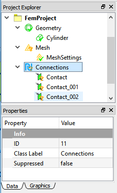
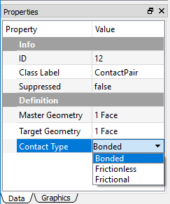
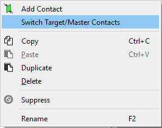

# Setting connections
The Connections object acts as a group folder includes all connecting related settings, such as Contact Pair. 

## Connections group
The Connections group is a unique container in WELSIM application for all types of connection objects. As illustrated in Figure below, the **Connections** object includes multiple **Contact Pair** objects. 

## Contact pairs
Contact Pairs are applied when two separate parts (solid, surface, and line bodies) in an assembly touch one another (they are mutually tangent). The contact bodies/surfaces:

* Transmit normal forces and tangential frictional forces.
* Can be bonded contact (Linear).
* Can separate or collide (Nonlinear).
* Do not penetrate one another in the structures.

As shown in Figure below, the Contact for structure analysis support three types of contact: **Bonded**, **Frictionless**, and **Frictional**. For the Frictionless and Frictional types, the contact pairs (surfaces, edges) are free to separate and move away from one another, which is called to have status-changing nonlinearity. The stiffness matrice in the solving change dramatically as the parts are touching or separated. 

## Formulation of contact
Since the contact algorithms are complicated, it is recommended to use the default formulation method for your contact analysis. This section describes the theory of contact formulations: Lagrange and Augmented Lagrange methods. Those methods only exist in the structural analysis. 

### Bonded
For the Non-Separated Bonded contact, the MPC algorithm is applied internally to add constraint equations to the tied nodes on the contact entities (surfaces, edges). The bonded contact has no penetration, no separation behaviors during the motion.

### Lagrange method
This formulation adds an extra contact pressure term to satisfy the contact compatibility. Thus the contact force is solved explicitly as an unknown degree of freedom. 

### Augmented lagrange method

Augmented Lagrange method is a penalty-based contact formulation. The finite contact force is 

$$
F_{Normal}=k_{Normal}x_{Penetration}+\lambda
$$

where $k_{Normal}$ is the contact stiffness, $x_{Penetration}$ is the penetration depth along the normal direction. The smaller the penetration depth, the more accurate numerical solutions. The exist of term $\lambda$ is the difference between the traditional penalty method and the augmented Lagrange method.

## Contact settings
When you select a Contact Pair object in the tree, the contact settings become available in the Properties view. The Target Geometry and Master Geometry properties allow you to scope the contact pairs from the Graphics window. Note that the valid Target and Master Geometries show in different colors. You can change the highlight color in the Display tab of the contact Properties View. 

When you choose the Frictionless or Frictional option in the Contact Type property, the following properties shows:

* **Formulation**: Provides two options: Lagrange and Augmented Lagrange methods. The default is the Lagrange method. The Formation property is described in [Formulation of Contact](connections.md#formulation-of-contact).
* **Finite Sliding**: Supports the finite sliding as the contact occurs. The default is **false**.
* **Normal Direction Tolerance**: Determines the distance tolerance on the normal direction. The default value is **1e-5**.
* **Tangential Direction Tolerance**: Determines the distance tolerance on the tangential direction. The default value is **1e-3**.
* **Normal Direction Penalty**: Determines the penalty tolerance on the normal direction. The Default value is **1e3**.
* **Tangential Direction Penalty**: Determines the penalty tolerance on the tangential direction. The default value is **1e3**.

## Supported contact types
The Table below identifies the supported formulations for the various contact geometries.

| Contact Geometry | Face (Master) | Edge (Master) | Vertex (Master) | 
| ---------------- | ------------- | ------------- | --------------- |
| Face (Target) | Yes | Yes | Not Supported for solving |
| Edge (Target) | Yes | Yes | Not Supported for solving |
| Vertex (Target) | Not Supported for solving | Not Supported for solving | Not Supported for solving |

## Ease of use contact
### Flipping master and target scoping geometries
This feature provides you a command to quickly swap master and target geometries that are already scoped in the Properties View. You can achieve this by right clicking on the specific Contact Pair, and choosing **Switch Target/Master Contacts** from the context menu as shown in Figure below. 

!!! note
    This feature is not applicable to Face to Edge contact where faces and edges are always designated as targets and masters, respectively.

