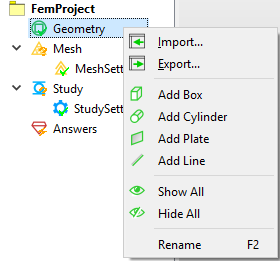
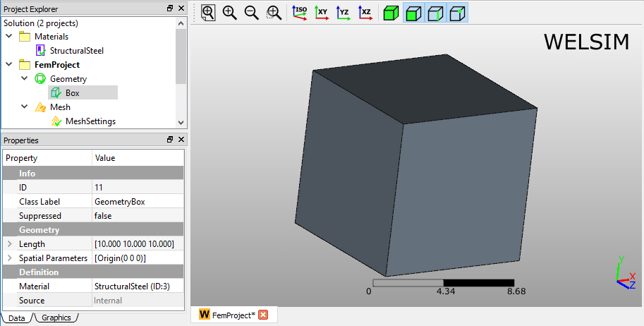
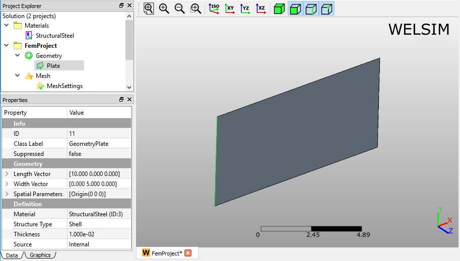
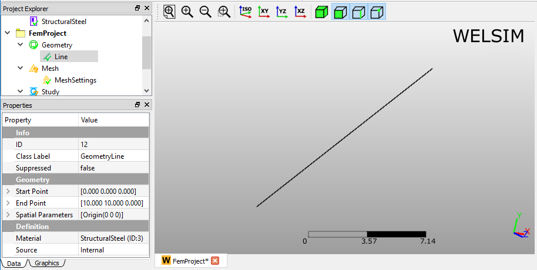
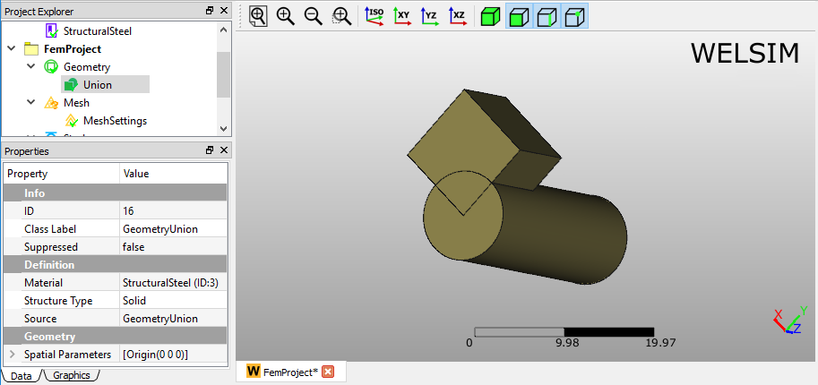
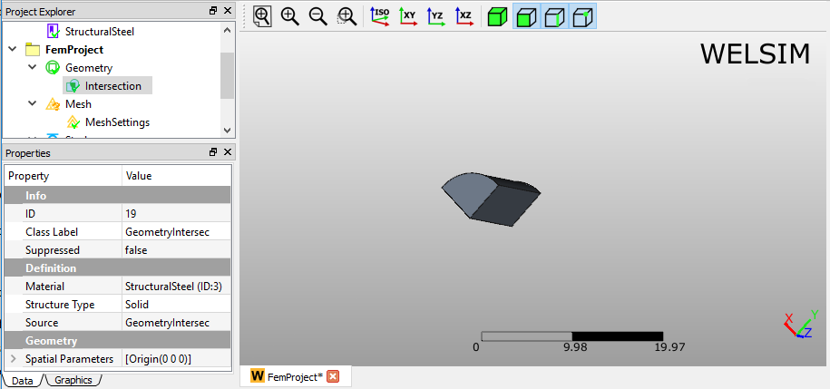
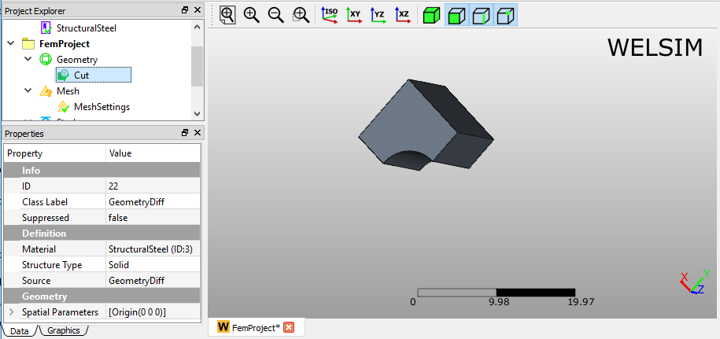
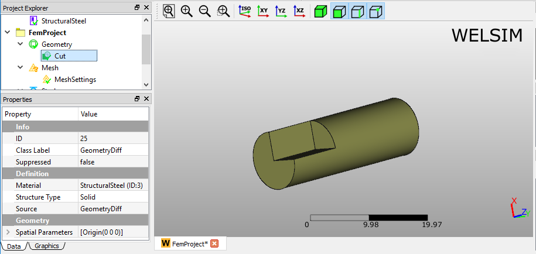
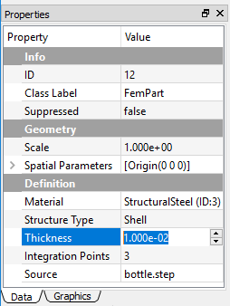

# Specifying geometry

## Geometry fundamentals
Part is the fundamental object carries the geometry data. An assembly model may contain one or multiple parts. There is no limit of parts in WELSIM application, and large assemblie require more hardware resources to process the geometric operations. All parts object are grouped in the Geometry Group object. 

### Working with parts
The part has these attributes:

* Each part object has a Material property, which determines the assigned material on the part.
* Parts can be hidden/shown in the Graphics window.
* Parts can be **Suppressed/Unsuppressed** for the successive analysis.
* The imported part can adjust the size of geometry by tuning the Scale property value.

### Color scheme of parts
The geometry is assigned with predefined random color. However, you can define the color of part to visually identify different components in an assembly. Click the Display tab from the Properties view of the Part Object, and click the Color By property to determine the color scheme. The following lists the available color schemes:

* Part Color
* Material

You can reset the colors back to the default color scheme by right click on the Geometry object in the tree and selecting **Reset Body Colors**.

## Overview
The WELSIM geometry module's interface is similar to that most other features. 
The graphical user interface of geometry commands is consist of three regions:

1. **Toolbars**: Located at the top of the interface, there is a toolbar.
2. **Geometry Menu**: Located at the Menu, the Geometry Menu provides all geometry related commands.
3. **Context Menu**: Popped up at Geometry tree objects, the context menu provides geometry related commands as shown in Figure below.

## Creating primitive geometry
The system provides built-in commands to allow you to create primitive geometries. The following describes the supported geometries: **Box**, **Cylinder**, **Plate**, and **Line**.

### Box
An example of a created box shape is shown in Figure [fig:ch3_guide_geom_box].

### Cylinder
An example of a created cylinder shape is shown in Figure [fig:ch3_guide_geom_cylinder].

### Plate
An example of a created plate shape is shown in Figure [fig:ch3_guide_geom_plate].

### Line
An example of a created Line shape is shown in Figure [fig:ch3_guide_geom_line].

## Importing and exporting geometry
### Importing
The geometry importing feature supports the STEP and IGES format files, and the STEP file is recommended. The following lists the behaviors of importing geometry:

* An imported STEP file may lead to creating multiple Part objects in the tree if the file contains an assembly.
* IGES file contains the surface information only, you need to implement **Make Solid** command to the imported geometry to obtain the solid geometry.
* Using the **Scale** property to tune the size of the imported geometry.

### Exporting
The geometries in the tree can be exported to an external STEP file. The following methods show you how to export: 

* Click the **Export**... button from the Toolbar.
* Click the **Export**... item from the **Geometry** Menu.
* Right click on the target geometries and select the **Export**... from the context menu.

## Boolean operations
The WELSIM geometry module supports fundamental Boolean operations, which allow users to manipulate the shape of geometries. The available operations are **Union**, **Intersection**, and **Difference**. You can select multiple geometry objects from the tree list and press the Boolean commands to implement the operations. You can hold **Ctrl** or **Shift** keys to select multiple geometry objects from the project tree.

### Union
The union operation consolidates two or more geometry into one geometry. An example of Union geometry of a box and cylinder shape is shown in Figure below.

### Intersection
The intersection operation keeps the commonly shared portions of two or more geometries. An example of Intersection geometry of a box and cylinder shape is shown in Figure below.

### Difference
The Difference operation subtracts the secondly selected geometry from the first selected geometry. Thus the selection order plays an important role in the final generated geometry. You can see the results of two different selection orders in Figures below.

## Geometry commands
In addition to the fundamental geometry commands, the following lists the commands that may be applied in the geometry modeling:

### Generate solid
In the most of analysis, the model needs to be solid to generate the 3D solid finite element. If the imported geometry only contains the surface data, the mesher cannot generate solid elements. In this scenario, you need to convert a surface geometry to solid geometry. The Generate Solid command provides you with a tool to complete this conversion. 

To convert a surface to solid geometry, you can follow the steps below:

1. Select the surface geometry objects from the tree. 
2. Click the Generate Solid command from the Geometry Menu, or right click on the selected geometry objects, and select the Generate Solid command from the context menu. 

## Part structure types
### Solid bodies
The solid bodies including parts and assembly support all simulation features of WELSIM application.

### Surface bodies
The surface bodies are treated as Shell structure in the structural and thermal analyses. In the Properties View of the Shell part, you need to specify the thickness of the shell, as shown in Figure below.

