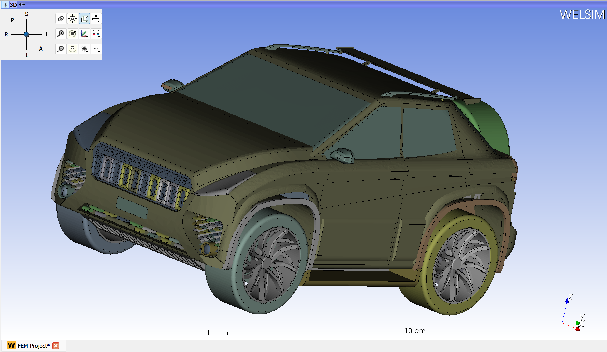

# Application user interface
This section describes the fundamental components of the WELSIM application interface, their usage, and behaviors.


## WELSIM application window
The functional components of the graphical user interface include the following as listed in Table below.

| Window Component | Description |
| ---------------- | ----------- | 
| Main Menus | This menu includes all application level actions such as **File** and **About** |
| Standard Toolbar | This toolbar contains commonly used actions such as **Mesh** and **Solve** |
| Graphics Toolbar | This toolbar contains graphics related actions such as **Zoom** and **Selection** |
| Project Explorer (Tree) Window | This window contains a list of simulation objects that represents the modeling settings. Since it contains the branches and trunk, this windows is also called tree outline. The context menu for each object could vary. The object can be renamed, deleted, duplicated, copied and pasted |
| Properties Window | This window displays the properties of each object in the tree list. The user can view or edit the property values |
| Graphics View | This window shows and manipulates the visual content of the simulation entities. This window can display: 3D geometry, mesh, annotation, coordinate system symbol, spreadsheet, etc |
| Output Window | This window display the messages from the system or solvers | 
| Tabular Data Window | This window lists the data that is input from user or output from the solvers. The listed data is always consistent with the curves in the Chart window |
| Chart Window | This window plots the graphics that is input from user or output from the solvers. The curves are always consistent with the table data in the Tabular Data window |
| Context Menu | This menu shows up as user right mouse button click on objects, graphics, toolbars, etc. Different entities may show different context |
| Status Bar | This widget shows the message and status on the bottom area of the application interface | 


## Windows management
The WELSIM window owns panes that can carry project objects, properties, graphics, output, tabular data, and chart views.Window management functionalities enable you to dock, hide, show, move, and resize the windows. 

### Hiding and showing
The windows can be hidden or shown by setting the view controller. As shown in Figures below, there are two ways to control the window views:

1. Browse the **View Menu** > **Windows**, toggle the windows that you would show or hide.
2. Right mouse button clicks on the **Toolbar**, you can toggle the windows.

You also can click the cross button on the title bar to hide the window. 


### Docking and undocking
You can drag a window's title bar to move a window pane. Once you start to drag the window, the activated window is moving with your mouse. You can release the button on the target area to settle the new docking area. You can double-click a window's title bar to move it around the screen. The size of the window can be adjusted easily by dragging the borders or corners. You also can click the undocking button on the title bar to undock the window. 

### Moving and resizing
You can drag a window's title bar to move and undock a window pane. Once you start to drag the window, the potential dock target area appears in the allowed space. At this moment, you can release the button to dock the window on the target area. 


## Main windows
Besides the menu and toolbar widgets of the user interface, some other widgets are available. Those windows appear by default or when specific options are activated. The availability of those windows is controlled by the **VIEW** > **Windows** menu. This section discusses the following windows:

* Project Explorer (Tree list)
* Properties View
* Graphics Window
* Output Window
* Tabular Data Window
* Chart Window
* Spreadsheet Window

As the user selects a tree object in the Project Explorer window, all attributes for the selected object in Properties View, Tabular Data, and Chart Window are displayed or updated. The Properties window contains two tabs, and the Data tab shows the attributes about the object data, the Display tab lists the specifications about the graphics. The Graphics window shows the three-dimensional geometry model, depending on the tree object selection, shows information about the object details, highlighted areas, and annotations. The Output window displays the messages from the system or solvers. The Spreadsheet window shows the worksheet data for specific tree objects. 

Those user interface components are described in the following sections:

### Project explorer
The object Tree list represents the logical steps of the conducted simulation study. All branches relate to the parenting object. For instance, a key object called Study contains Study Settings and boundary condition objects. The user can right click on an object to activate a context menu that relates to the clicked object. The objects can be copied, pasted, duplicated, and renamed. 

An example of the Project Explorer window is shown in Figure below.


!!! note
    The tree outline contains all elements that applied in the simulation study. The root object displays the number of projects in the solution. The Material project node includes all material specification. The FEM project contains the analysis settings, multiple FEM projects are allowed in the solution.

#### Knowing the tree objects
The tree objects in the Project Explorer window have the following conventions:

* Object Icon appears to the left of the object in the tree list. The icon is intended for users to identify the type of object. For example, icons for computational results always consist of three colors (red, green, and blue), which can help distinguish other objects.
* A right-head arrow symbol to the left of the object indicates that this object contains child sub-objects. Clicking the arrow to expand the object and display the children.
* A down-head arrow symbol to the left of the object indicates that the object expends all child objects. Clicking the arrow to collapse the sub-objects.
* To delete an object from the tree list, you can right click on the target object and select **Delete**.

#### Object status symbols
The status icons are smaller than the tree object icon and located to the right bottom corner of the object icon. These symbols are intend to provide a quick visual reference to the status of the object. The details of the status symbols are described in Table below.

| Status Name | Symbol Icon | Description |
| ----------- | ----------- | ----------- |
| Underdefined | {:width="100%"} | A study object or its child objects requires user input values |
| Error | {:width="100%"} | A fixed supported object may stop the simulation due to the confliction with other settings, user needs to resolve the confliction to continue the modeling |
| OK | {:width="100%"} | A mesh settings object is well defined or any action about this object is succeed |
| Suppressed | {:width="100%"} | An object is suppressed, such object becomes deactivated and won't participate the simulation. User can unsuppress the object |
| Needs to be Updated | {:width="100%"} | An answers object or its child objects are not evaluated. Waiting for user to update |


#### Suppressing/Unsuppressing objects
Most of the objects in the Project Explorer window can be suppressed or unsuppressed by users. A suppressed object means that it is excluded from the further analysis. For example, suppressing a boundary condition excludes the boundary condition from the study and the further solutions. You also can unsuppress the object with the restored object attributes. 

There are two ways to suppress/unsuppress an object:

* Right-click the object, and then select Suppress from the context menu. Or
* In the property view of the object, set the Suppressed option to True. Conversely, you can unsuppress objects by setting the Suppressed option to False.


### Properties view
The Properties View is located in the bottom left corner of the main user interface by default, and the user can change the location by dragging the window pane. This view window provides the user with details and information that relate to the selected object in the [Project Explorer](#project-explorer). Some properties are read-only that cannot be changed by the users, and some properties allow users to input values. An example of Properties View of the object is shown in Figures below.


#### Features
The features of the Properties View include:

* Resizable and movable.
*  Drop-down cells for Boolean or Enumeration list.
*  Buttons to display a dialog box (such as color picker).
*  OK/Cancel buttons for geometry selection.
*  Property cell can change background color according to the content. 

#### Group property
The **Group Property** is a read-only and occupy the entire row of the Properties pane, as shown in Figure below.


The group provides you better user experience by organizing the properties into distinct categories. 


#### Undefined or invalid properties
In the Properties View, the undefined or invalid fields are highlighted in yellow as shown in Figure below.


Once the property is well defined and becomes valid, highlight yellow color disappears.


#### Drop-down list
The combo property shows the drop-down list as user clicks the attribute as shown in Figure below. 


!!! note 
    You can adjust the width of the columns by dragging the separator between the columns.


#### Text entry
In the text entry field, you can input strings, numbers, or integers, depending on the type of the cell as shown in Figure below.


The invalid value for the specific cell will be discarded, or the cell shows red background.


#### Geometry selection
Geometry Selection allows users to scope topological entities from the graphics window. An example of Geometry Selection property is shown in Figure below. 


After selecting appropriate geometry entities, you can click the OK button to set the current selection into the field. Clicking the Cancel button does not change the pre-existing selection.


### 3D Graphics window
The 3D Graphics window displays the geometry, annotation, mesh, result, etc. The components in the graphics window could be: 

* 3D Graphics
* A scale rule
* A legend and a coutour controller (for result display)
* 2D Annotations (for boundary conditions, result display)
* 3D Annotations (for boundary conditions)
* Global coordinate system symbol
* Graphical toolbar
* Multi-purpose tabs
* WELSIM logo and version number

An example view of the Grpahics window is shown in Figure below.



#### 3D View Controls
The blue bar across any 3D View shows a pushpin icon on its left. When the mouse rolls over this icon, a panel for configuring the 3D View is displayed. The panel is hidden when the mouse moves away. For persistent display of this panel, just click the pushpin icon.


* **Center 3D view** (small square) centers the slice on the currently visible 3D view content and all loaded volumes (even if volumes that are not visible). The field of view (zoom factor) is not adjusted, therefore it may be necessary to zoom in/out to see all objects. To reset the center and field of view at the same time, click in the 3D view and hit r key.

* **Viewpoint direction** switches orientation of the view between standard directions. Clicking on Left, Right, Anterior, Posterior, Superior, Inferior button will make the 3D content viewed from that direction.

* **View link** button synchronizes properties across 3D views (viewpoint position, direction, ruler, orientation marker, etc. settings).

* **Orthographic/perspective rendering** mode toggle. Orthographic mode (parallel projection) is useful for assessing size, because displayed object size does not depend on distance from the viewpoint. Perspective mode provides better depth perception, because objects that are closer appear larger.

* **Ruler** controls display of ruler. Only available in orthographic rendering mode.

* **Stereo viewing** enables stereoscopic display. Red/blue and anaglyph modes just require inexpensive red/blue colored glasses. Other modes require special 3D display hardware. Note that SlicerVirtualReality extension offers superior stereo viewing and interaction experience, with fully immersive 3D visualization by a single click of a button, and rich interaction with objects in the scene using 3D controllers.

* More options (…)
    * Use depth peeling must be enabled for correct rendering of semi-transparent surfaces (in models, markups, etc). It may make rendering updates slightly slower and artifacts when volume rendering is used in the view.
    * Show/Hide frames per second (FPS) displays rendering speed in the corner of the view.
    * Show/Hide the logo of WELSIM
    * Show/Hide the version

* **Orientation Marker** controls display of human, cube, etc in lower right corner.

* **Visibility options** controls visibility of view background color and displayed components.

* **Spin** continuously spins the view around.

* **Rock** continuously rocks the view left-to-right.

* **Zoom in/out** slightly zooms in/out the view. Convenient buttons for touchscreens.


#### Context menu from RMB
Right mouse clicking shows you a context menu, which contains operations such as Zoom To Fit, Isometric View, Image to Clipboard, different camera views.


### Tabular data window
**Tabular Data** window is designed in better reviewing the input and output data. When you select the following objects in the tree window, both Tabular Data and Chart windows display data on the interface. 

* Material properties
* Boundary conditions
* Body conditions
* Results
* Probe results

The listed data in Tabular Data window is consistent with the curves in the [Chart window](#chart-window). As an example shown in Figure below, you can see the maximum and minimum values at all time steps are consistent between those two windows. 


### Chart window
The Chart window displays the curves for the selected tree object. The curves are consistent with the data in the [Tabular Data window](#tabular-data-window). An example of Chart window drawing the maximum and minimum values along time is shown in Figure below.


!!!note
    The Table and Chart share the same data, and both update synchronously. 

### Spreadsheet window
The spreadsheet window provides object data in the form of tables, charts, or text to you. This widget usually contains the summarized data for a collection of properties. Note that not all objects contain a spreadsheet window, only the object that has large data may own a spreadsheet window. The behaviors of the spreadsheet window are:

1. A spreadsheet designed to show large data on one field does not automatically display the data. You can open the spreadsheet window by double-clicking specific objects, such as Material and Study Setting objects. 
2. A new tab shows up as the spreadsheet window is open. You can close the window by clicking the cross button on the tab, or by pressing the OK button on the spreadsheet.

An example of the spreadsheet window is shown in Figure below.


### Output window
The output window prompts you with feedback concerning the results of your actions in using WELSIM. In the current version, the output window mainly displays the message from the solvers. An example of output window displaying the solver messages is shown in Figure below.


The Output window pane contains several buttons, there are:

* Save Output Text: saves the output text into an external file.
* Clear Text: clears the text field.
* Stop Interprocess: discontinues the solver process.


## Main menus
The main menus contain the following items as shown in Figure below.


### File menu
The FILE menu includes the following actions:

* **New**: Creates a new finite element analysis project.
* **Open**: Resumes the WELSIM solution from an external “*.wsdb” file.
* **Save**: stores the WELSIM solution to an external “.wsdb” file.
* **Save As**: stores the WELSIM solution to another external “.wsdb” file.
* **Close Project**: deletes the current finite element project.
* **Close All**: deletes all projects in the solution.
* **Quit**: Exit the application.

The items of the File menu is shown in Figure below.


### View menu
The VIEW menu includes the following actions:

* **Zooms**: adjusts display scale of the graphics field, contains sub-items: Zoom Extents, Zoom In, Zoom Out, Box Zoom. 
* **Views**: changes the viewpoint to the graphics display field. Includes sub-items: Isometric, Top, Right, Front.
* **Graphics Window**: changes the mode of the graphics window. Includes sub-items: Docked, Undocked, and Full Screen.
* **Toolbars**: determines to show the toolbars on the uesr interface. The available toolbars include File, Material, Geometry, FEM, Structural, Thermal, Electromagnetic, Tools, and Help. 
* **Windows**: controls the display of the windows. The options that can be toggled are Project Explorer, Properties, Output, Tabular Data, and Chart windows.
* **Status Bar**: toggles the display of the status bar to the bottom of the main window.

The items of the View menu is shown in Figure below.


### Material menu
The **MATERIAL** menu includes the following actions:

* **New Material Project**: adds a new material project if the tree has no material project.
* **Add Material**: defines a new material object.
* **Export Materials**: outputs material data into an external file with JSON format.

The items of the **Material Menu** is shown in Figure below.


### Geometry menu
The **GEOMETRY** menu includes the following actions:

* **Import**: creates new geometries from the external files with STEP or IGES format.
* **Export**: saves geometries into external STEP file.
* **Add Box**: creates a new 3D box shape.
* **Add Cylinder**: creates a new 3D cylinder shape.
* **Add Plate**: creates a new 3D plate shape.
* **Add Line**: creates a new 3D line shape.
* **Generate Solid**: create a 3D solid shape according to the enclosed surface shape.
* **Union**: consolidates multiple geometries into one geometry.
* **Intersection**: creates a geometry that is the common area of multiple geometries.
* **Difference**: creates a geometry that is differentiated between the selected geometries.
* **Show**: displays the selected geometry objects.
* **Hide**: hides the selected geometry objects.
* **Show All**: displays all geometries.
* **Hide All**: hides all geometries.

The items of the Geometry Menu is shown in Figure below.


### FEM menu
The **FEM Menu** includes the following actions:

* **Mesh All**: generates the mesh for the entire domain.
* **Clear Generated Mesh**: removes all generated mesh.
* **Check Mesh**: examines the quality of the generated mesh.
* **Add Mesh Settings**: adds a global mesh settings object to the tree. 
* **Add Mesh Method**: adds a local mesh method object to the tree.
* **Mesh Method**: generates the mesh for the geometries that are scoped in the mesh method object.
* **Connections**: adds a Connections object if no connection object is presented. 
* **Add Contact**: adds a Contact Pair object to the tree.
* **Add Study Settings**: adds a Study Settings object to the tree if no study settings object is presented.
* **Compute**: solves the finite element model.
* **Clear Calculated Solution**: remove the solved data in the current project.
* **User Defined Result**: adds a user-defined result object to the tree.
* **Evaluate Result**: evaluates the selected result objects.
* **Evaluate All**: evaluate all result objects in current project.
* **Clear Result**: remove the generated result data.
* **Export Result**: export the result data into an external file in ASCII format.

The items of the FEM Menu is shown in Figure below.


### Structural menu
The **STRUCTURAL** menu includes the following actions:

* **Constraint**: adds a fixed support boundary condition object. It essentially sets displacement to zero.
* **Displacement**: adds a displacement boundary condition object.
* **Force**: adds a force boundary condition object.
* **Pressure**: adds a pressure boundary condition object.
* **Fixed Rotation**: adds a fixed rotation boundary condition object, specifically for the shell model.
* **Velocity**: adds a velocity boundary condition object, specifically for the transient structural analysis.
* **Acceleration**: adds a velocity boundary condition object, specifically for the transient structural analysis.
* **Body Force**: adds a body force condition object.
* **Acceleration**: adds a body acceleration condition object.
* **Earth Gravity**: adds a standard earth gravity condition object.
* **Rotational Velocity**: adds a rotational velocity object.
* **Displacement Result**: adds a displacement result object.
* **Stress Result**: adds a stress result object.
* **Strain Result**: adds a strain result object.
* **Velocity Result**: adds a velocity result object. It is available for the transient structural analysis.
* **Acceleration Result**: adds an acceleration result object. It is available for the transient structural analysis.
* **Rotation Result**: adds a ratation result object. It is available for the shell structure.
* **Reaction Force Probe**: adds a force reaction probe result.
* **Reaction Moment Probe**: adds a moment reaction probe result. It is available for the shell structure.

The items of the Structural menu is shown in Figure below.


### Thermal menu
The THERMAL menu includes the following actions:

* **Temperature**: adds a temperature boundary condition object.
* **Heat Flux**: adds a heat flux boundary condition object.
* **Convection**: adds a heat convection boundary condition object.
* **Radiation**: adds a heat radiation boundary condition object.
* **Initial Temperature**: adds a initial temperature condition object. It is available for transient thermal analysis.
* **Temperature Result**: adds a temperature result object. 

The items on the Thermal menu is shown in Figure below.


### Electromagnetic menu
The ELECTROMAGNETIC menu includes the following actions:

* **Ground**: adds a ground boundary condition object. It essentially sets the voltage to zero.
* **Voltage**: adds a voltage boundary condition object.
* **Symmetry**: adds a symmetry boundary condition object.
* **Zero Charge**: adds a zero charge boundary condition object.
* **Surface Charge Density**: adds a surface charge density boundary condition object.
* **Electric Displacement**: adds an electric displacement boundary condition object.
* **Insulating**: adds an insulating boundary condition object. It essentially sets zero magnetic potential.
* **Magnetic Potential**: adds a magnetic potential boundary condition object.
* **Magnetic Flux Density**: adds a magnetic flux density boundary condition object.
* **Voltage Result**: adds a voltage result object.
* **Electric Field Result**: adds an electric field result object. 
* **Electric Displacement Result**: adds an electric displacement result object.
* **Magnetic Potential Result**: adds a magnetic potential result object.
* **Magnetic Field Result**: adds a magnetic field result object.
* **Magnetic Induction Field Result**: adds a magnetic induction field result object.
* **Energy Density Result**: adds an energy density result object.

The items of the Electromagnetic menu is shown in Figure below.


### Tools menu
The TOOLS menu includes the following actions:

* Export Input Script: generates solver input scripts to the designated directory.
* Reveal Files in Explorer: opens the local directory that contains project files.

The items of the Tools menu is shown in Figure below.


### Help menu
The HELP menu includes the following actions:

* Documentation: opens the default internet web browser, and visits [online documentation](http://docs.welsim.com).
* Website:  opens the default internet web browser, and visits [official website](https://welsim.com).
* License Manager: opens WELSIM license manager interface. You can activate the application with the license key or update the license here. 
* About: provides copyright and application version information.

The items of the Help menu is shown in Figure below.


## Toolbars
Toolbars are displayed across the top of the main user interface. Toolbars are dockable, and you can drag the toolbar to your preferred field. 

### File toolbar
The File toolbar contains application-level commands as shown in Figure below. Each icon button and its description follows:

* : creates a new finite element analysis project.
* : saves solution into an external “*.wsdb” file.
* : resumes solution from an external “*.wsdb” file.
* : closes the current analysis project.


### Material toolbar
The Material toolbar contains material-related simulation commands as shown in Figure below. Each icon button and its description follows:

* : creates a new material object. 
* : exports all material data into an external JSON file.


### Geometry toolbar
The Geometry toolbar contains geometry-related commands as shown in Figure below. Each icon button and its description follows:

* : imports the geometries from an external STEP or IGES file.
* : exports the geometries into an external STEP file.
* : creates a box shape.
* : creates a cylinder shape.
* : creates a plate shape.
* : creates a line shape.
* : consolidates the selected geometries into one part.
* : creates geometry from the commonly shared field of multiple geometries.
* : creates geometry from the difference among multiple geometries.


### FEM toolbar
The FEM toolbar contains finite element analysis commands as shown in Figure below. Each icon button and its description follows:

* : generates the mesh for the entire domain.
* : clear the generated mesh.
* : examines the mesh quality.
* : creates a mesh method object, which is used for the local mesh settings.
* : generates the mesh for the scoped geometries in mesh method object.
* : creates a new contact pair object.
* : solves the finite element model.
* : creates a new user-defined result object.
* : evaluates the selected result objects.
* : evaluates all result objects in current project.


### Structural toolbar
The Structural toolbar contains structural analysis commands as shown in Figure below. Each icon button and its description follows:

* : creates a fixed support boundary condition object.
* : creates a displacement boundary condition object.
* : creates a force boundary condition object.
* : creates a pressure boundary condition object.
* : creates a fixed rotation boundary condition object.
* : creates a velocity boundary condition object. It is available for the transient structural analysis.
* : creates a acceleration boundary condition object. It is available for the transient structural analysis.
* : creates a body force domain condition object.
* : creates an acceleration domain condition object.
* : creates a standard earth gravity domain condition object.
* : creates a rotational velocity domain condition object.
* : creates a displacement result object.
* : creates a stress result object.
* : creates a strain result object.
* : creates a velocity result object. It is available for the transient structural analysis.
* : creates a velocity result object. It is available for the transient structural analysis.
* : creates a rotation result object. It is available for the shell model.
* : creates a force reaction probe object. 
* : creates a moment reaction probe object. It is available for the shell model.


### Thermal toolbar
The Thermal toolbar contains thermal analysis commands as shown in Figure below. Each icon button and its description follows:

* : creates a temperature boundary condition object.
* : creates a heat flux boundary condition object.
* : creates a heat convection boundary condition object.
* : creates a heat radiation boundary condition object.
* : creates an initial temperature boundary condition object. It is available for the transient thermal analysis.
* : creates a temperature result object.


### Electromagnetic toolbar
The Electromagnetic toolbar contains electric and magnetic analyses commands as shown in Figure below. Each icon button and its description follows:

* : creates a ground boundary condition object.
* : creates a velocity boundary condition object.
* : creates a symmetry boundary condition object.
* : creates a zero charge boundary condition object.
* : creates a surface charge density boundary condition object.
* : creates an electric displacement boundary condition object.
* : creates an insulating boundary condition object.
* : creates a magnetic potential boundary condition object.
* : creates a magnetic flux density boundary condition object.
* : creates a voltage result object.
* : creates an electric field result object.
* : creates an electric displacement result object.
* : creates a vector magnetic potential result object.
* : creates a magnetic field result object.
* : creates a magnetic induction field result object.
* : creates an electromagnetic energy density result object.


### Tool toolbar
The Tool toolbar contains assistance commands as shown in Figure below. Each icon button and its description follows:

```
To be added ...
```


### Help toolbar
The Help toolbar contains assistance commands as shown in Figure below. Each icon button and its description follows:

* : opens the default internet web browser, and visits [online documentation](http://docs.welsim.com).
* : opens the default internet web browser, and visits [official website](https://welsim.com).
* : opens WELSIM license manager interface. You can activate the application with the license key or update the license here. 
* : displays the copyrights and version information of WELSIM application.


### Graphics toolbar
The Graphics toolbar contains graphical operation commands as shown in Figure below. Each icon button and its description follows:

* : fits the entire model in the graphics window.
* : displays a closer view of the geometries.
* : displays a more distant view of the geometries.
* : displays the selected area of a model in a box that you define.
* : displays the 3D model in an isometric view.
* : displays the 3D model in an XY-plane view.
* : displays the 3D model in a YZ-plane view.
* : displays the 3D model in an XZ-plane view.
* : set the volume selectable. 
* : set the face selectable.
* : set the edge selectable.
* : set the vertex selectable.


## Working with graphics
The following lists the tips for working with WELSIM graphics:

* You can use the ruler, presented at the bottom of the graphics window, to estimate the scale of the geometry size. 
* You can rotate the view of geometries by holding and dragging the left mouse button.
* You can select or deselect multiple topological entities by pressing CTRL or SHIFT key.
* You can pan the view by dragging your right mouse button or arrow keys.
* You can zoom in/out the view by scrolling the mouse wheel or using +/- and CTRL keys.
* You can rotate the view by using the left mouse button.
* You can open a context menu of views by right-clicking on the graphics field.

### PreSelecting geometry
This section discusses the pre-selection features in the Graphics window. 

#### Highlighting
As you hover the cursor over a geometry entity, the graphics highlights the selection and shows the location of the pointer. The pre-selection is controlled by the selection filter, and only the allowed entity types can be pre-selected and highlighted.

As shown in Figure below, the face are highlighted in green color at pre-selection mode.

.")

### Selecting geometry
This section discusses how to select and pick geometry in the Graphics window. 

#### Picking
You can pick visible geometries by left clicking on the entities. A valid picking sets the geometry selection property for specific objects, such as boundary conditions. 

You can hold the Ctrl or Shift key down to add or remove multiple selections from the current selections. A pick in the free space clears the current selection.

#### Selection filters
The selection filters control the user selection mode and provide an easy interface for users to pick or select the geometry entities. A pressed button in the selection filter toolbar denotes a selectable geometry type. The following describes the filters. 

* Volumes: Allows selection of the entire body. Highlighted by body surfaces in green. Depressing this filter releases the Faces, Edges, and Vertices filters.
* Faces: Allows selection of faces. Highlighted by surfaces in green. Depressing this filter releases the Volumes filters.
* Edges: Allows selection of edges. Highlighted by lines in green. Depressing this filter releases the Volumes filters.
* Vertices: Allows selection of vertices. Highlighted by points in green. Depressing this filter releases the Volumes filters.


### Controlling graphical view
The section describes the controlling and manipulating the graphical view with mouse and keys.

* **Zoom**: Middle scrolling.
* **Pan**: Right clicking, or arrow keys.
* **Rotate**: Left clicking and dragging.

#### View annotations
Graphics window may contain these types of annotations:

* **2D annotation**: statically locates at the left top of the graphics windows. This annotation shows texts about the object type and name and color indicator for specific objects such as boundary conditions. 

* **3D annotation**: dynamically locates on the geometry area, the position can be changed as the user rotates, zooms or pans the view. 

