# Objects reference
This reference provides a specification for the objects in the tree. 

## Answers
The Answers object customizes the solution properties and contains all result-level objects. The Properties View of the Answers object is shown in Figure below.

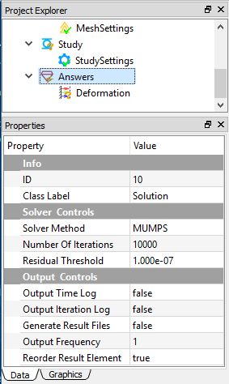

### Tree dependencies

* Valid Parent Tree Object: [FEM Project](#fem-project).
* Valid Child Tree Objects: [Results](#results).

### Insertion options
Appears by default when you create a new FEM project.

### Object properties
The Properties View for this object include the following:

| Property Name | Description |
| ------------- | ----------- |
| ID | A read-only field denotes the ID of this object |
| Class Label | A read-only field denotes the class name |
| Solver Method | A drop-down field allows you to select a solver from the options: **CG**(Conjugate Gradient), **BiCGStab**, **GMRES**, **GPBiCG**, **MUMPS**, **Direct**, **DIRECTmkl**, where **MUMPS**, **Direct**, and **DIRECTmkl** are direct solvers, and the rest are iterative solvers. The default solver is **MUMPS** |
| Number of Iterations | A number field defines the maximum number of the linear algebra solver iterations. The default is **10000** |
| Residual Threshold | A number field defines the residual threshold for the linear algebra solver. The default is **1e-7** |
| Output Time Log | A Boolean field outputs the log for each time step. The default is **False** |
| Output Iteration Log | A Boolean field outputs the log each iteration step. The default is **False** |
| Generate Result Files | A Boolean field generates ASCII format result file. The default is **False** |
| Output Frequency | A number field determines the frequency of the result data output. The default value is **1**, which outputs result data every step. |

## Body conditions
Body condition type objects enable you to impose the body condition onto the geometry bodies. 

### Application objects
[Body Force](bcs.md#body-force), [Acceleration](bcs.md#acceleration_1), [Earth Gravity](bcs.md#earth-gravity), [Rotational Velocity](bcs.md#rotational-velocity)

### Tree dependencies

* Valid Parent Tree Object: [Study](#study).
* Valid Child Tree Objects: None.

### Insertion options
You can use any of the following methods to insert body conditions:

* Click the item from the standard Toolbar.
* Click the item from the Menu.
* Right click on the Study level objects, and choose the target object from the pop-up context menu.

### Object properties
The properties may vary for different body conditions. See the [Setting Up Boundary Conditions](bcs.md) section for more information about body conditions.

## Boundary conditions
Boundary condition type objects enable you to impose the boundary condition onto the geometry entities, such as faces, edges, and vertices. 

### Application objects
[Displacement](bcs.md#displacement),
[Fixed Support](bcs.md#fixed-support),
[Fixed Rotation](bcs.md#fixed-rotation),
[Pressure](bcs.md#pressure),
[Force](bcs.md#force),
[Velocity](bcs.md#velocity),
[Acceleration](bcs.md#acceleration),
[Temperature](bcs.md#temperature),
[Heat Flux](bcs.md#heat-flux),
[Convection](bcs.md#convection),
[Radiation](bcs.md#radiation),
[Voltage](bcs.md#voltage),
[Ground](bcs.md#ground),
[Symmetry](bcs.md#symmetry),
[Zero Charge](bcs.md#zero-charge),
[Surface Charge Density](bcs.md#Surface-charge-density),
[Electric Displacement](bcs.md#electric-displacement),
[Insulating](bcs.md#insulating),
[Magnetic Potential](bcs.md#magnetic-potential),
[Magnetic Flux Density](bcs.md#magnetic-flux-density)

### Tree dependencies

* Valid Parent Tree Object: [Study](#study).
* Valid Child Tree Objects: None.

### Insertion options
You can use any of the following methods to insert boundary condition:

* Click the item from the standard Toolbar.
* Click the item from the Menu.
* Right click on the Study level objects, and choose the target object from the pop-up context menu.

### Object properties
The properties may vary for different body conditions. See the [Setting up Boundary Conditions](bcs.md) section for more information about Boundary Conditions.

## Box
The Box object defines a shape that is generated by the built-in modeler. An example of Box object and properties are illustrated in Figure below.

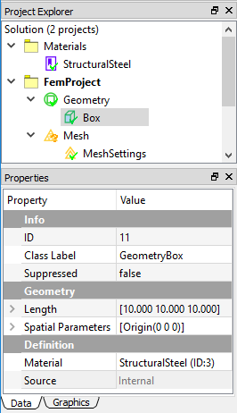

### Tree dependencies

* Valid Parent Tree Object: [Geometry Group](#geometry-group).
* Valid Child Tree Objects: None.

### Insertion options
Appears when you create a box shape. You can use any of the following methods to insert a Box:

* Click the **Add Box** item from the standard Toolbar.
* Click the **Add Box** item from the Geometry Menu.
* Right click on the Geometry level objects, and choose the **Add Box** from the pop-up context menu.

### Object properties
The Properties View for this object include the following:

| Property Name | Description |
| ------------- | ----------- |
| ID | A read-only field denotes the ID of this object |
| Class Label | A read-only field denotes the class name |
| Suppressed | Include (**False** - default) or exclude (**True**) the geometry from the analysis |
| Length | A vector component field to determine the length, width, and height of the box. The default value is **10** |
| Origin | A vector component field to determine the location of origin. The default vector is **0** |
| Material | A drop-down field to assign the material for the selected part. The available material candidates are defined in the [Material Project](#material-project) |
| Source | A read-only field indicates the shape is generated internally |

## Connections
The Connections object is a group-type object that may contain the connection objects between two or more parts. The currently supported children object types are [Contact Pair](#contact-pair).

### Tree dependencies

* Valid Parent Tree Object: [FEM Project](#fem-project).
* Valid Child Tree Objects: [Contact Pair](#contact-pair).

### Insertion options
Connections object is automatically inserted as you add a contact pair object to the tree.

### Object properties
The Properties View for this object include the following:

| Property Name | Description |
| ------------- | ----------- |
| ID | A read-only field denotes the ID of this object |
| Class Label | A read-only field denotes the class name |
| Suppressed | A Boolean field to include (**False** - Default) or exclude (**True**) the object in the analysis |

## Contact pair
This object defines a contact pair between parts. 

### Tree dependencies

* Valid Parent Tree Object: [Connections](#connections).
* Valid Child Tree Objects: None.

### Insertion options
You can use any of the following methods to insert contact pairs:

* Click the item from the standard Toolbar.
* Click the item from the FEM Menu.
* Right click on the Connections level objects, and select Add Contact command from the pop-up context menu.

### Object properties
The Properties View for this object include the following:

| Property Name | Description |
| ------------- | ----------- |
| ID | A read-only field denotes the ID of this object | 
| Class Label | A read-only field denotes the class name |
| Suppressed | A Boolean field to include (**False** - Default) or exclude (**True**) the object in the analysis | 
| Master Geometry | A Geometry Selection field to scope geometry entities, such as faces, edges |
| Target Geometry | A Geometry Selection field to scope geometry entities, such as faces, edges |
| Contact Type | A drop-down enumeration field to select a type from three options: **Bonded**, **Frictionless**, and **Frictional** |
| Formulation | A drop-down enumeration field to selection contact formulation from two options: **Lagrange** and **Augmented Lagrange**. This property is only available for **Frictionless** or **Frictional** contact type |
| Finite Sliding | A Boolean field to turn on (**True**) or off (**False** - default) the finite sliding algorithm. This property is only available for **Frictionless** or **Frictional** contact type |
| Normal Direction Tolerance | A number field to determine the distance tolerance in the normal direction. The default value is **1e-5** |
| Tangential Direction Tolerance | A number field to determine the distance tolerance in the tangential direction. The default value is **1e-5** |
| Normal Direction Penalty | A number field to determine the penalty value in the normal direction. The default value is **1e3** |
| Tangential Direction Penalty | A number field to determine the penalty value in the tangential direction. The default value is **1e3** |

## Cylinder
The Cylinder object defines a shape that is generated by the built-in modeler. An example of Cylinder object and properties are illustrated in Figure below.

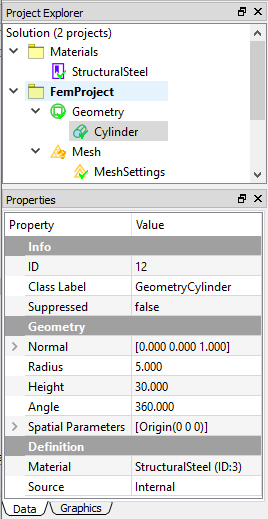

### Tree dependencies

* Valid Parent Tree Object: [Geometry Group](#geometry-group).
* Valid Child Tree Objects: None.

### Insertion options
Appears when you create a Cylinder shape. You can use any of the following methods to insert a Cylinder:

* Click the **Add Cylinder** item from the standard **Toolbar**.
* Click the **Add Cylinder** item from the Geometry **Menu**.
* Right click on the Geometry level objects, and choose the **Add Cylinder** from the pop-up context menu. 

### Object properties
The Properties View for this object include the following:

| Property Name | Description |
| ------------- | ----------- |
| ID | A read-only field denotes the ID of this object |
| Class Label | A read-only field denotes the class name |
| Suppressed | Include (**False** - default) or exclude (**True**) the geometry from the analysis |
| Normal | A vector component field to determine the direction of the cylinder. The default value is **(0,0,1)** |
| Radius | A number component field to determine the radius of the cylinder base. The default value is **10** |
| Height | A number component field to determine the height of the cylinder. The default value is **30** |
| Angle | A number component field to determine the sweeping angle of the cylinder circle. The default value **360** gives a full cylinder |
| Origin | A vector component field to determine the location of origin. The default vector is **0** |
| Material | A drop-down field to assign the material for the selected part. The available material candidates are defined in the [Material Project](#material-project) |
| Source | A read-only field indicates the shape is generated internally |

## FEM project
The FEM Project object represents an independent analysis, which contains **Geometry**, **Mesh**, **Study**, and **Answers** objects. The **Connections** object is not created until you add a contact pair object. An example of FEM Project and properties are illustrated in Figure [fig:ch3_guide_obj_fem_proj].

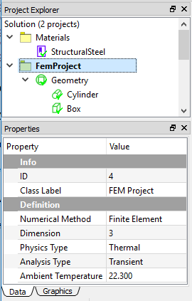

### Tree dependencies

* Valid Parent Tree Object: [Solution](#solution).
* Valid Child Tree Objects: [Geometry Group](#geometry-group), [Mesh Group](#mesh-group), [Connections](#connections), [Study](#study), [Answers](#answers).

### Insertion options
Appears by default when you create a new FEM project.

### Object properties
The Properties View for this object include the following:

| Property Name | Description |
| ------------- | ----------- |
| ID | A read-only field denotes the ID of this object |
| Class Label | A read-only field denotes the class name |
| Numerical Method | A read-only field to indicate the Finite Element Method applied in this project |
| Dimension | A read-only field to indicate a 3D analysis of this project |
| Physics Type | A drop-down enumeration field for you to select the physics type. The available options are **Structural**, **Thermal**, and **Electromagnetic**. The default is **Structural**. Note that change this property may change the validation of existing objects and display of object's properties | 
| Analysis Type | A drop-down enumeration field for you to select the analysis type. Depending on the **Physics Type**, the available options vary. For the Structural analysis, the options are **Static**, **Transient**, and **Modal**. For the Thermal analysis, the options are **Steady-State** and **Transient**. For the Electromagnetic analysis, the options are **ElectroStatic** and **MagnetoStatic** |
| Ambient Temperature | A number field to determine the environment temperature for the analysis, the default value is **22.3** |

## Geometry group
Geometry Group object contains the geometries in the form of a part or assembly. All imported and created geometries are included in this group-level object as shown in Figure below.

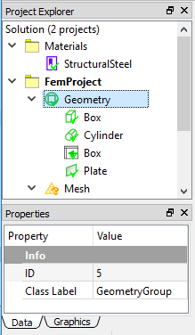

### Tree dependencies

* Valid Parent Tree Object: [FEM Project](#fem-project).
* Valid Child Tree Objects: Part, Box, Cylinder, Plane, Line.

### Insertion options
Appears by default when you create a new FEM project.

### Object properties
The Properties View for this object include the following:

| Property Name | Description |
| ------------- | ----------- |
| ID | A read-only field denotes the ID of this object |
| Class Label | A read-only field denotes the class name |

## Initial temperature
Initial Temperature defines the temperature status at the beginning of the simulation for transient thermal analysis. An example of Initial Temperature and its properties are shown in Figure below.

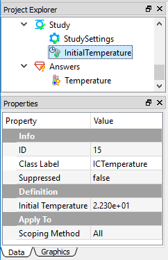

### Tree dependencies

* Valid Parent Tree Object: [Study](#study).
* Valid Child Tree Objects: None.

### Insertion options
You can use any of the following methods to insert initial temperature:

* Click the item from the standard Toolbar.
* Click the item from the FEM Menu.
* Right click on the Study level objects, and choose **Insert Conditions...** > **Initial Temperature** command from the pop-up context menu. 

!!! note
    Inserting initial condition command is only applicable when the Physics Type and Analysis Type properties of FEM Project object are Thermal and Transient, respectively.

### Object properties
The Properties View for this object include the following:

| Property Name | Description |
| ------------- | ----------- |
| ID | A read-only field denotes the ID of this object |
| Class Label | A read-only field denotes the class name |
| Suppressed | A Boolean field to include (**False** - Default) or exclude (**True**) the object in the analysis |
| Scoping Method | A read-only field shows All |
| Initial Temperature | A number field to define the temperature value. The default is **22.3** |

## Line
The Line object defines a shape that is generated by the built-in modeler. An example of Line object and properties are illustrated in Figure below.

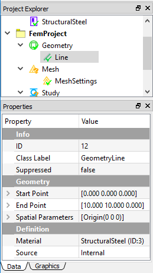

### Tree dependencies

* Valid Parent Tree Object: [Geometry Group](#geometry-group).
* Valid Child Tree Objects: None.

### Insertion options
Appears when you create a line shape. You can use any of the following methods to insert a Line:

* Click the **Add Line** item from the standard **Toolbar**.
* Click the **Add Line** item from the Geometry **Menu**.
* Right click on the Geometry level objects, and choose the **Add Line** from the pop-up context menu.

### Object properties
The Properties View for this object include the following:

| Property Name | Description |
| ------------- | ----------- |
| ID | A read-only field denotes the ID of this object |
| Class Label | A read-only field denotes the class name |
| Suppressed | Include (False - default) or exclude (True) the geometry from the analysis |
| Start Point | A vector component field to determine one point of a line. The default value is **0** |
| End Point | A vector component field to determine another point of a line. The default value is **(10, 10, 0)** |
| Material | A drop-down field to assign the material for the selected part. The available material candidates are defined in the [Material Project](#material-project) |
| Source | A read-only field indicates the shape is generated internally |

## Material
A Material object defines a material data using the associated properties and spreadsheet data. You can define multiple material objects in the WELSIM application. An example of a Material object and its properties and spreadsheet are shown in Figure below.

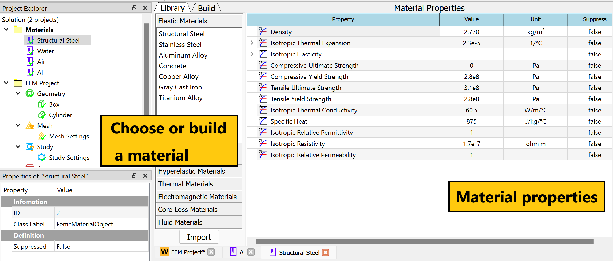

### Tree dependencies

* Valid Parent Tree Object: [Material Project](#material-project).
* Valid Child Tree Objects: None.

### Insertion options
You can use any of the following methods to insert material:

* Click the Add Material item from the standard Toolbar.
* Click the Add Material item from the Material Menu.
* Right click on the Material level objects, and choose Add Material command from the pop-up context menu.

### Object properties
The Properties View for this object include the following:

| Property Name | Description |
| ------------- | ----------- |
| ID | A read-only field denotes the ID of this object |
| Class Label | A read-only field denotes the class name |
| Suppressed | A Boolean field to include (**False** - Default) or exclude (**True**) the object in the analysis |

### Spreadsheet 
The Material object is able to display the Spreadsheet window, which provides a friendly user interface for defining all material properties as shown in Figure below. You can double click or right click on the Material object and select the **Edit** command to display the spreadsheet window.

## Material project
The Material Project object holds all material definition objects. 

### Tree dependencies

* Valid Parent Tree Object: [Solution](#solution).
* Valid Child Tree Objects: [Material](#material).

### Insertion options
Appears by default when you create a new FEM project.

### Object properties
The Properties View for this object include the following:

| Property Name | Description |
| ------------- | ----------- |
| ID |  A read-only field denotes the ID of this object |
| Class Label |A read-only field denotes the class name |

## Mesh group 
Mesh Group manages all meshing features and tools for the project. An example of mesh object and properties is shown in Figure below.

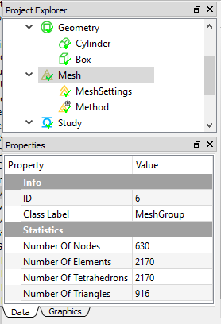

### Tree dependencies
* Valid Parent Tree Object: [FEM Project](#fem-project).
* Valid Child Tree Objects: [Mesh Settings](#mesh-settings), [Mesh Method](#mesh-method).

### Insertion options
Appears by default when you create a new FEM project.

### Object properties
The Properties View for this object include the following:

| Property Name | Description |
| ------------- | ----------- |
| ID | A read-only field denotes the ID of this object |
| Class Label | A read-only field denotes the class name |
| Number of Nodes | A read-only output field to show the number of generated nodes. The value is automatically updated as the mesh is completed |
| Number of Elements | A read-only output field to show the number of generated elements. The value is automatically updated as the mesh is completed |
| Number of Tetrahedrons | A read-only output field to show the number of generated tetrahedrons. The value is automatically updated as the mesh is completed |
| Number of Triangles | A read-only output field to show the number of generated triangles. The value is automatically updated as the mesh is completed |

## Mesh method
In the multi-body analysis, different parts may need different mesh density due to the various sizes of geometries. Mesh Method object helps you fine tuning the mesh for the specifically scoped geometries. An example of Mesh Method object is shown in Figure below. 

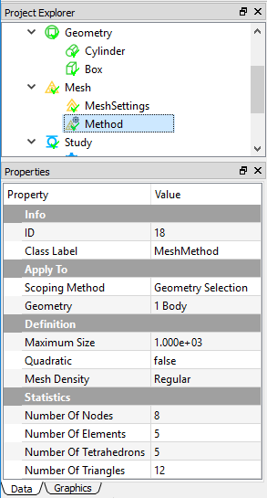

### Tree dependencies

* Valid Parent Tree Object: [Mesh Group](#mesh-group).
* Valid Child Tree Objects: None.

### Insertion options
You can use any of the following methods to insert Mesh Method:

* Click the item from the standard **Toolbar**.
* Click the item from the **FEM Menu**.
* Right click on the Mesh level objects, and choose **Add Mesh Method** command from the pop-up context menu. 

### Object properties
The Properties View for this object include the following:

| Property Name | Description |
| ------------- | ----------- |
| ID | A read-only field denotes the ID of this object |
| Class Label | A read-only field denotes the class name |
| Scoping Method | A read-only field indicates the scoping method |
| Geometry | A geometry selection field to scope the geometry entities (volume/body only) |
| Maximum Size | A number field determines the maximum size of the generated finite element |
| Quadratic | A read-only field to show the order of the generated element. This property is determined by the Quadratic property in the global Mesh Settings object |
| Mesh Density | A drop-down enumeration field to determine the mesh density for the scoped geometries. The options are Very Coarse, Coarse, Regular, Fine, Very Fine, and User Defined. The default is Regular. If you select User Defined, additional properties Growth Rate, Segments per Edge, and Segments per Radius are shown |
| Growth Rate | A number field determines the change of mesh density in spatial. The default value is **0.3** |
| Segments per Edge | A number field determines the number of element segments per edge. The default value is **1**. The higher value, the more dense mesh |
| Segments per Radius | A number field determines the number of element segments per radius. The default value is **2**. The higher value, the more dense mesh |
| Number of Nodes | A read-only output field to show the number of generated nodes. The value is updated as the mesh is completed |
| Number of Elements | A read-only output field to show the number of generated elements. The value is updated as the mesh is completed |
| Number of Tetrahedrons | A read-only output field to show the number of generated tetrahedrons. The value is updated as the mesh is completed |
| Number of Triangles | A read-only output field to show the number of generated triangles. The value is updated as the mesh is completed |

## Mesh settings
The Mesh Settings object is a global setting for the meshing operations. You change the global mesh settings by tuning the properties of this object. An example of Mesh Settings object is shown in Figure [fig:ch3_guide_obj_mesh_settings]. 

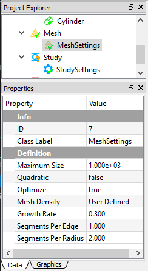

### Tree dependencies

* Valid Parent Tree Object: [Mesh Group](#mesh-group).
* Valid Child Tree Objects: None.

### Insertion options
Appears by default when you create a new FEM project. 

### Object properties
The Properties View for this object include the following:

| Property Name | Description |
| ------------- | ----------- |
| ID | A read-only field denotes the ID of this object |
| Class Label | A read-only field denotes the class name |
| Maximum Size | A number field to determine the maximum size of the generated finite element |
| Quadratic | A Boolean field to determine the linear element (**False**) or bilinear element (**True**) |
| Mesh Density | A drop-down enumeration field to determine the mesh density for the scoped geometries. The options are **Very Coarse**, **Coarse**, **Regular**, **Fine**, **Very Fine**, and **User Defined**. The default is Regular. If you select **User Defined**, additional properties **Growth Rate**, **Segments per Edge**, and **Segments per Radius** are shown |
| Growth Rate | A number field indicate the change of mesh density in spatial. The default value is **0.3** |
| Segments per Edge | A number field indicate the element segment per edge. The default value is **1**. The higher value, the more dense mesh |
| Segments per Radius | A number field indicate the element segment per radius. The default value is **2**. The higher value, the more dense mesh |

## Part
The Part object defines a component of the geometry that is imported from an external CAD file. An example of Part object and properties are illustrated in Figure [fig:ch3_guide_obj_part].

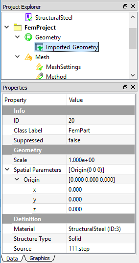

### Tree dependencies

* Valid Parent Tree Object: [Geometry Group](#geometry-group).
* Valid Child Tree Objects: None.

### Insertion options
Appears when you import geometry from external files. You can use any of the following methods to insert Part:

* Click the item from the standard Toolbar.
* Click the Import item from the Menu.
* Right click on the Geometry level objects, and choose the Insert... from the pop-up context menu.

### Object properties
The Properties View for this object include the following:

| Property Name | Description |
| ------------- | ----------- |
| ID | A read-only field denotes the ID of this object |
| Class Label | A read-only field denotes the class name |
| Suppressed | Include (**False** - default) or exclude (**True**) the part from the analysis |
| Scale | A number field to manipulate the size of the imported geometry. The default value is **1** |
| Origin | A vector component field to determine the location of origin. The default vector is **0** |
| Material | A drop-down field to assign the material for the selected part. The available material candidates are defined in the [Material Project](#material-project) |
| Structure Type | A drop-down field to define the structure type. The available options are **Solid**, **Shell**, **Beam**, and **Truss**. The default is **Solid** |
| Source | A read-only field indicates the name of the imported geometry file |

## Plate
The Plate object defines a shape that is generated by the built-in modeler. An example of Plate object and properties are illustrated in Figure [fig:ch3_guide_obj_part].

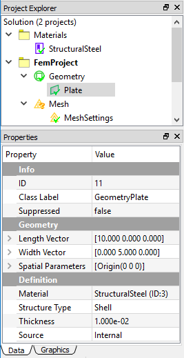

### Tree dependencies

* Valid Parent Tree Object: [Geometry Group](#geometry-group).
* Valid Child Tree Objects: None.

### Insertion options
Appears when you create a plate shape. You can use any of the following methods to insert a Plate:

* Click the **Add Plate** item from the standard Toolbar.
* Click the **Add Plate** item from the Geometry Menu.
* Right click on on the Geometry level objects, and choose the **Add Plate** from the pop-up context menu.

### Object properties
The Properties View for this object include the following:

| Property Name | Description |
| ------------- | ----------- |
| ID | A read-only field denotes the ID of this object |
| Class Label | A read-only field denotes the class name |
| Suppressed | Include (**False** - default) or exclude (**True**) the geometry from the analysis |
| Length | A vector component field to determine the length vector of the plate. The default value is **(10, 0, 0)** |
| Width | A vector component field to determine the width vector from the origin. The default vector is **(0, 5, 0)** |
| Material | A drop-down field to assign the material for the selected part. The available material candidates are defined in the [Material Project](#material-project) |
| Thickness | A number field to determine the thickness of the plate. The default value is **0.01** |
| Source | A read-only field indicates the shape is generated internally |

## Results
The Result objects define the simulation output for displaying and analyzing the results from a solution.

### Application objects
[Deformation](results.md/#deformation),
[Stress](results.md/#stress),
[Strain](results.md/#strain),
[Acceleration](results.md/#acceleration),
[Velocity](results.md/#velocity),
[Rotation](results.md/#rotation),
[Reaction Force](results.md/#reaction-force),
[Reaction Moment](results.md/#reaction-moment),
[Temperature](results.md/#temperature),
[Voltage](results.md/#voltage),
[Electric Field](results.md/#electric-field),
[Electric Displacement](results.md/#electric-displacement),
[Electromagnetic Energy Density](results.md/#electromagnetic-energy-density),
[Magnetic Potential](results.md/#magnetic-potential),
[Magnetic Flux Density](results.md/#magnetic-flux-density),
[Magnetic Field](results.md/#magnetic-field),
[User-Defined Result](results.md/#user-defined-result).

### Tree dependencies

* Valid Parent Tree Object: [Answers](#answers).
* Valid Child Tree Objects: None.

### Insertion options
Appears by default when you start the WELSIM application.

### Object properties
The properties may vary for different result types. The following lists the properties that may be shown for the most of Result objects. See the [Using results](results.md) section for more information.

| Property Name | Description |
| ------------- | ----------- |
| ID | A read-only field denotes the ID of this object |
| Class Label | A read-only field denotes the class name |
| Suppressed | Include (**False** - default) or exclude (**True**) the result object from the analysis |
| Result By | Determines the result loading type |
| Set Number | Determines the set number to retrieve the result data |
| Maximum Value | The maximum result value at the current step |
| Minimum Value | The minimum result value at the current step |

## Solution
The Solution object acts as a root object in the WELSIM application. Only one Solution can exist per simulation session, and one solution can contain multiple FEM projects. 

### Tree dependencies
* Valid Parent Tree Object: None - highest level in the tree.
* Valid Child Tree Objects: [FEM Project](#fem-project).

### Insertion options
Appears by default when you create a new FEM project.

## Study
The Study object holds all analysis related objects such as Study Settings, Boundary Conditions, Body Conditions, and Initial Conditions. An example of Study object is shown in Figure [fig:ch3_guide_obj_study]. 

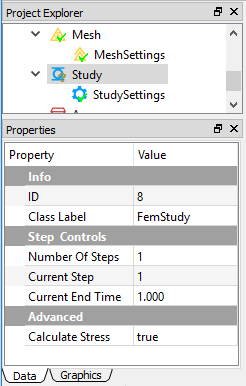

### Tree dependencies

* Valid Parent Tree Object: [FEM Project](#fem-project).
* Valid Child Tree Objects: 
[Boundary Conditions](bcs.md#boundary-conditions),
[Body Conditions](bcs.md#body-conditions),
[Initial Temperature](bcs.md#initial-temperature).

### Insertion options
Appears by default when you create a new FEM project. 

### Object properties
The Properties View for this object include the following:

| Property Name | Description |
| ------------- | ----------- |
| ID | A read-only field denotes the ID of this object |
| Class Label | A read-only field denotes the class name |
| Number of Steps | A number field to determine the total number of steps. The default value is 1. The input value must be positive |
| Current Step | A number field to determine the current step for the successive settings. The default value is 1. The input value must be less than or equal to the Number of Steps. Note that Current Step property of Study object is adjustable, and determines the Current Step properties in other objects such as Study Settings, and Boundary Conditions |
| Current End Time | a number field to determine the end time of the current step. The value must be larger than that of the last step |

## Study Settings
The Study Settings object allows you to define analysis and solving settings to customize a specific simulation model. An example of Study Settings object is shown in Figure [fig:ch3_guide_obj_study_settings].

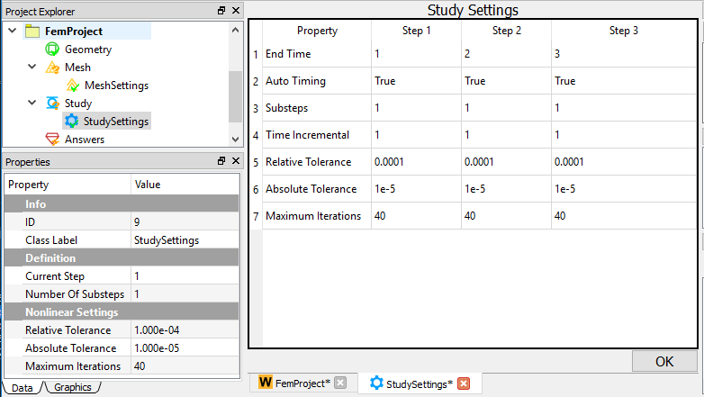

### Tree dependencies

* Valid Parent Tree Object: Study.
* Valid Child Tree Objects: None.

### Insertion options
Appears by default when you create a new FEM project.

### Object properties
The properties of Study Settings vary for different Physics and Analysis types. The following lists the available properties according to Analysis Type:

* Static Structural and Thermal: Current Step (Read-Only), Number of SubSteps, Relative Tolerance, Absolute Tolerance, Maximum Iterations. 
* Transient Structural and Thermal: Current Step (Read-Only), Auto-Timing, Number of SubSteps, Time Incremental (Shown as Auto Timing is False), Relative Tolerance, Absolute Tolerance, Maximum Iterations. 
* Modal Structural: Number of Modes, Lancos Tolerance, Lancos Iterations.
* ElectroStatic and MagnetoStatic: Current Step (Read-Only), Relative Tolerance, Absolute Tolerance, Maximum Iterations. 

### Spreadsheet 
The Study Settings object can display the Spreadsheet window, which provides a friendly user interface to review properties at all steps as shown in Figure [fig:ch3_guide_obj_study_settings]. You can double click or right click on the Study Settings object and select the Edit command to display the Spreadsheet window.

