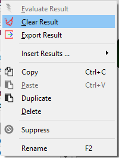
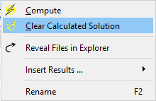
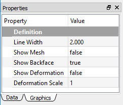
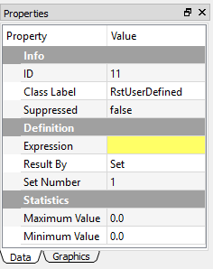
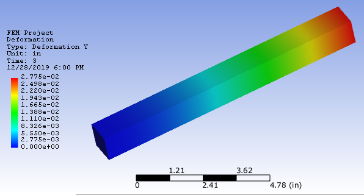
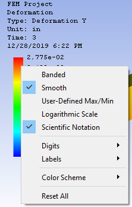
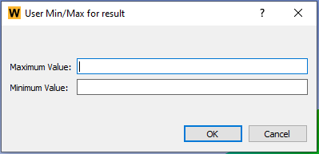

# Using results
This section describes the details of a result. The help for Results is classified by the physics and analysis types.

## Introduction to the results
You can generate results to understand the behaviors of the analyzed model. The advantages of using results in WELSIM application are:

* Illustrates result contour over the simulation domain for various solution quantities, such as stress, deformation, temperature, voltage, etc. 
* Probe results to calculate the abstract engineering quantities, such as reaction forces.
* Displays the minimum and maximum values over time in Chart and Tabular Data windows.
* Allows customized results using User-Defined Results.
* Export result data to external files. 

### Result application
Applying results can be achieved by

* Right-click on the Answer object or its children objects in the tree, select **Insert Results** from the pop-up context menu and then choose from the result options.
* Click the result object from the **Menu** or **Toolbar**.

## Result definitions
This section describes the fundamental features in result definitions. 

### Result controller
In the multi-step or transient analysis, the solution contains result data at various steps. **Result By** property provides a controller to select the desired step data to display. You can determine to show the result by **Set Number** or **Time/Frequency**. The default is by **Set Number**. Additional properties such as **Set Number**, **Time**, or **Frequency** shows up as you define the **Result By** property.

### Clear generated data
You can clear results data from the database using the **Clear Result** command from the **Toolbar**, **Menu**, or the right-click context menu on a result object. 

You also can clear entire solution data from the database using the **Clear Calculated Data** command from the **Toolbar**, **Menu**, or the right-click context menu on an **Answers** object. These two commands from the context menu are shown in Figure [fig:ch3_guide_rst_clear_data].

### Display controller
You can select the **Graphics** tab on the result **Properties** View pane. As shown in Figure [fig:ch3_guide_rst_display_prop], the following properties are available to adjust the contour display:

* **Line Width**: determines the line width of the mesh frame.
* **Show Mesh**: Show (**True**) or hide (**False** - default) the mesh frames on the result contour.
* **Show Backface**: Show (**True** - default) result contour on the back face.
* **Show Deformation**: Show (**True**) or ignore (**False** - default) the structural deformation on the result contour. This option is only valid for the structural analysis.
* **Deformation Scale**: Determines the scale of the deformation, the default value 1 denotes the true deformation. This option is only valid as **Show Deformation** is True.

## Structural results
The following structural results are described in this section.

### Deformation

Physical deformation of the modeling geometries can be calculated and plotted in the form of contour. This result is available for all structural analysis. The following gives the properties of result object:

* **Type**: The available options are **Deformation X**, **Deformation Y**, **Deformation Z**, and **Total Deformation**. The default is **Total Deformation**, which essentially shows the magnitude of the deformation vector. 
* **Result By**: Determines the result loading type.
* **Set Number**: Determines the set number to retrieve the result data.
* **Maximum Value**: The maximum result value at the current step.
* **Minimum Value**: The minimum result value at the current step.
* **Suppressed**: Include (**False** - default) or exclude (**True**) the result object.

### Stress
The stress quantities provide mechanical insights to the given model and material of a part or an assembly under a specific structural loading environment. A general 3D stress state contains three normal and three shear stresses. The stress quantities in WELSIM application are the nodal values and available for all structural analysis. The equivalent stress (also called von-Mises stress) is related to the principal stresses by the equation:

$$
\sigma_{VM}=\left[\dfrac{(\sigma_{11}-\sigma_{22})^{2}+(\sigma_{22}-\sigma_{33})^{2}+(\sigma_{33}-\sigma_{11})^{2}+6(\sigma_{12}^{2}+\sigma_{23}^{2}+\sigma_{31}^{2})}{2}\right]^{1/2}
$$

The following gives the properties of result object:

* **Type**: The available options are **Normal Stress X**, **Normal Stress Y**, **Normal Stress Z**, **Shear Stress XY**, **Shear Stress YZ**, **Shear Stress XZ**, and **von-Mises Stress**. The default is **von-Mises Stress**. 
* **Result By**: Determines the result loading type.
* **Set Number**: Determines the set number to retrieve the result data.
* **Maximum Value**: The maximum result value at the current step.
* **Minimum Value**: The minimum result value at the current step.
* **Suppressed**: Include (**False** - default) or exclude (**True**) the result object.

### Strain
The strain quantities provide deformation insights to the given model and material of a part or an assembly under a specific structural loading environment. This result is available for all structural analysis.

The available properties for strain result are:

* **Type**: The available options are **Normal Strain X**, **Normal Strain Y**, **Normal Strain Z**, **Shear Strain XY**, **Shear Strain YZ**, and **Shear Strain XZ**. The default is **Normal Strain X**. 
* **Result By**: Determines the result loading type.
* **Set Number**: Determines the set number to retrieve the result data.
* **Maximum Value**: The maximum result value at the current step.
* **Minimum Value**: The minimum result value at the current step.
* **Suppressed**: Include (**False** - default) or exclude (**True**) the result object.

### Acceleration
The acceleration quantities demonstrate the acceleration of the given model and material of a part or an assembly under a specific structural loading environment. This result is available for transient structural analysis.

The available properties for acceleration result are:

* **Type**: The available options are **Acceleration X**, **Acceleration Y**, **Acceleration Z**, and **Total Acceleration**. The default is **Total Acceleration**. 
* **Result By**: Determines the result loading type.
* **Set Number**: Determines the set number to retrieve the result data.
* **Maximum Value**: The maximum result value at the current step.
* **Minimum Value**: The minimum result value at the current step.
* **Suppressed**: Include (**False** - default) or exclude (**True**) the result object.

!!! note 
    Acceleration result is only available for the transient structural analysis.

### Velocity
The velocity quantities demonstrate the velocity of the given model and material of a part or an assembly under a specific structural loading environment. This result is available for transient structural analysis.

The available properties for velocity result are:

* **Type**: The available options are **Velocity X**, **Velocity Y**, **Velocity Z**, and **Total Velocity**. The default is **Total Velocity**. 
* **Result By**: Determines the result loading type.
* **Set Number**: Determines the set number to retrieve the result data.
* **Maximum Value**: The maximum result value at the current step.
* **Minimum Value**: The minimum result value at the current step.
* **Suppressed**: Include (**False** - default) or exclude (**True**) the result object.

!!! note 
    Velocity result is only available for the transient structural analysis.

### Rotation
The rotation quantities demonstrate the rotation of the given model and material of a part or an assembly under a specific structural loading environment. This result is available for only shell structure.

The available properties for rotation result are:

* **Type**: The available options are **Rotation XY**, **Rotation YZ**, **Rotation XZ**, and **Total Rotation**. The default is **Total Rotation**. 
* **Result By**: Determines the result loading type.
* **Set Number**: Determines the set number to retrieve the result data.
* **Maximum Value**: The maximum result value at the current step.
* **Minimum Value**: The minimum result value at the current step.
* **Suppressed**: Include (**False** - default) or exclude (**True**) the result object.

!!! note 
    Rotation result is only available for the shell structural analysis.

### Reaction Force Probe
The reaction force provides an insight to abstract reaction force of the given model and material of a part or an assembly under a specific structural loading environment. This result is available for structural analysis.

The available properties for a reaction force probe are:

* Type: The available options are Reaction Force X, Reaction Force Y, Reaction Force Z, and Total Reaction Force. The default is Total Reaction Force. 
* Result By: Determines the result loading type.
* Set Number: Determines the set number to retrieve the result data.
* Maximum Value: The maximum result value at the current step.
* Minimum Value: The minimum result value at the current step.
* Suppressed: Include (False - default) or exclude (True) the result object.

!!! note 
    This probe result does not show contour on the geometry. The primary output data is the **Maximum Value** and **Minimum Value** displayed in the Properties View window.

### Reaction Moment Probe
The reaction moment provides an insight to abstract quantities of the given model and material of a part or an assembly under a specific structural loading environment. This result is available for only shell structure.

The available properties for reaction moment probe are:

* **Type**: The available options are Reaction Moment X, Reaction Moment Y, Reaction Moment Z, and Total Reaction Moment. The default is Total Reaction Moment. 
* **Result By**: Determines the result loading type.
* **Set Number**: Determines the set number to retrieve the result data.
* **Maximum Value**: The maximum result value at the current step.
* **Minimum Value**: The minimum result value at the current step.
* **Suppressed**: Include (False - default) or exclude (True) the result object.

!!! note
    Reaction moment probe result is only available for the shell structural analysis.
    
    Reaction moment probe result does not show contour on the geometry. The primary output data is the **Maximum Value** and **Minimum Value** displayed in the Properties View window.

## Thermal results
The following thermal results are described in this section:

### Temperature
The temperature, a scalar quantity, provides an insight to the temperature distribution throughout the structure. Temperature results can be displayed as a contour plot. 

The available properties for temperature are:

* **Type**: The sole available option is Temperature. This field is read-only.
* **Result By**: Determines the result loading type.
* **Set Number**: Determines the set number to retrieve the result data.
* **Maximum Value**: The maximum result value at the current step.
* **Minimum Value**: The minimum result value at the current step.
* **Suppressed**: Include (**False** - default) or exclude (**True**) the result object.

## Electric results
### Voltage
The voltage, a scalar quantity, provides an insight to the electric potential distribution throughout the conductor bodies.

The available properties for voltage are:

* **Type**: The sole available option is Voltage. This is a read-only field.
* **Result By**: Determines the result loading type.
* **Set Number**: Determines the set number to retrieve the result data.
* **Maximum Value**: The maximum result value at the current step.
* **Minimum Value**: The minimum result value at the current step.
* **Suppressed**: Include (**False** - default) or exclude (**True**) the result object.

### Electric Field
The electric field, a vector component quantity, provides an insight to the electric field intensity distribution throughout the bodies. 

The available properties for Electric Field are:

* **Type**: The available options are Electric Field X, Electric Field Y, Electric Field Z, Total Electric Field. The default Total Electric Field option displays the total magnitude of the vectors as a contour.
* **Result By**: Determines the result loading type.
* **Set Number**: Determines the set number to retrieve the result data.
* **Maximum Value**: The maximum result value at the current step.
* **Minimum Value**: The minimum result value at the current step.
* **Suppressed**: Include (**False** - default) or exclude (**True**) the result object.

### Current Density

### Electric Displacement
The electric displacement, a vector component quantity, provides an insight to the electric displacement intensity distribution throughout the bodies. This quantity has the constitutive relation with [Electric Field](#electric-field) as shown in equation below:

$$
D=\epsilon E
$$

where D is the electric displacement, E is the electric field, and $\epsilon$ is the electric permittivity. The available properties for Electric Displacement are:

* **Type**: The available options are **Electric Displacement X**, **Electric Displacement Y**, **Electric Displacement Z**, **Total Electric Displacement**. The default **Total Electric Displacement** option displays the total magnitude of the vectors as a contour.
* **Result By**: Determines the result loading type.
* **Set Number**: Determines the set number to retrieve the result data.
* **Maximum Value**: The maximum result value at the current step.
* **Minimum Value**: The minimum result value at the current step.
* **Suppressed**: Include (**False** - default) or exclude (**True**) the result object.

### Energy Density 
The energy density, a scalar quantity, provides an insight to the electromagnetic energy throughout the simulation bodies.

The available properties for energy density are:

* **Type**: The sole available option is Energy Density. This is a read-only field.
* **Result By**: Determines the result loading type.
* **Set Number**: Determines the set number to retrieve the result data.
* **Maximum Value**: The maximum result value at the current step.
* **Minimum Value**: The minimum result value at the current step.
* **Suppressed**: Include (False - default) or exclude (True) the result object.

## Magnetic results
The magnetostatic analysis provides fundamental result quantities for you to investigate the field. 

### Electric Potential

### Magnetic Potential 
Magnetic Potential vector components are computed throughout the simulation domain. The available properties for Magnetic Potential are:

* **Type**: The available options are **Magnetic Potential X**, **Magnetic Potential Y**, **Magnetic Potential Z**, **Total Magnetic Potential**. The default **Total Magnetic Potential** option displays the total magnitude of the vectors as a contour.
* **Result By**: Determines the result loading type.
* **Set Number**: Determines the set number to retrieve the result data.
* **Maximum Value**: The maximum result value at the current step.
* **Minimum Value**: The minimum result value at the current step.
* **Suppressed**: Include (False - default) or exclude (True) the result object.

### Magnetic Flux Density
Magnetic Flux Density vector components are computed throughout the simulation domain. The available properties for Magnetic Flux Density are:

* **Type**: The available options are **Magnetic Flux Density X**, **Magnetic Flux Density Y**, **Magnetic Flux Density Z**, **Total Magnetic Flux Density**. The default **Total Magnetic Flux Density** option displays the total magnitude of the vectors as a contour.
* **Result By**: Determines the result loading type.
* **Set Number**: Determines the set number to retrieve the result data.
* **Maximum Value**: The maximum result value at the current step.
* **Minimum Value**: The minimum result value at the current step.
* **Suppressed**: Include (**False** - default) or exclude (**True**) the result object.

### Magnetic Field 
Magnetic Field vector components are computed throughout the simulation domain. The available properties for Magnetic Field are:

* **Type**: The available options are **Magnetic Field X**, **Magnetic Field Y**, **Magnetic Field Z**, **Total Magnetic Field**. The default **Total Magnetic Field** option displays the total magnitude of the vectors as a contour.
* **Result By**: Determines the result loading type.
* **Set Number**: Determines the set number to retrieve the result data.
* **Maximum Value**: The maximum result value at the current step.
* **Minimum Value**: The minimum result value at the current step.
* **Suppressed**: Include (**False** - default) or exclude (**True**) the result object.

## User-Defined Results
This section describes the use of the User-Defined Result feature in WELSIM application. The user-defined result provides you with more flexible result evaluation methods. In addition to the system-provided result types, the User-Defined Result allows you to plot more broad kinds of results with the given expression. 

Like other result types that display contours, chart, and data, the User-Defined results:

* Need you to input a supported Expression to retrieve the result data.
* Need you to specify a set, time, or frequency in the Properties View window.
* Display Maximum and Minimum values in the Properties View window.
* Display Maximum and Minimum data over time in Tabular Data and Chart windows.

Applying a User-Defined Result can be done using one of the following methods:

* Select the User-Defined Result item from the **Menu** of FEM.
* Select the User-Defined Result button from the standard **Toolbar**.
* Right-click the Solution or Result object, and select the User-Defined Result item.

An example of User Defined Result properties view is shown in Figure [fig:ch3_guide_user_defined_rst_prop].

### User Defined Result expressions
The property Expression accepts the capital string values, and the lower case letters are converted automatically to the capital letters. The following lists the supported Expressions used in the WELSIM application:

| Expression | Result description |
| ----------------- | ----------- |
| UVW | Total deformation for structural analysis |
| U | Directional deformation X for structural analysis | 
| V | Directional deformation Y for structural analysis | 
| W | Directional deformation Z for structural analysis | 
| SIGVM | von-Mises stress for the structural analysis |
| SIG00 | Normal stress X for the structural analysis |
| SIG11 | Normal stress Y for the structural analysis |
| SIG22 | Normal stress Z for the structural analysis |
| SIG01 | Shear stress XY for the structural analysis |
| SIG12 | Shear stress YZ for the structural analysis |
| SIG02 | Shear stress XZ for the structural analysis |
| EPS00 | Normal strain X for the structural analysis |
| EPS11 | Normal strain Y for the structural analysis |
| EPS22 | Normal strain Z for the structural analysis |
| EPS01 | Shear strain XY for the structural analysis |
| EPS12 | Shear strain YZ for the structural analysis |
| EPS02 | Shear strain XZ for the structural analysis |
| RFT | Total reaction force for the structural analysis |
| RFX | Directional reaction force X for the structural analysis |
| RFY | Directional reaction force Y for the structural analysis |
| RFZ | Directional reaction force Z for the structural analysis |
| RMT | Total reaction moment for the shell structural analysis |
| RMX | Directional reaction moment X for the shell structural analysis |
| RMY | Directional reaction moment Y for the shell structural analysis |
| RMZ | Directional reaction moment Z for the shell structural analysis |
| ENEEL | Total energy for the structural analysis |
| V123 | Total velocity for the transient structural analysis |
| V1 | Directional velocity X for the transient structural analysis |
| V2 | Directional velocity Y for the transient structural analysis |
| V3 | Directional velocity Z for the transient structural analysis |
| A123 | Total acceleration for the transient structural analysis |
| A1 | Directional acceleration X for the transient structural analysis |
| A2 | Directional acceleration Y for the transient structural analysis |
| A3 | Directional acceleration Z for the transient structural analysis |
| ROTT | Total rotation for shell structural analysis | 
| ROTX | Directional rotation X for shell structural analysis | 
| ROTY | Directional rotation Y for shell structural analysis |
| ROTZ | Directional rotation Z for shell structural analysis |
| TEMP | Temperature for thermal analysis | 
| EM_U | Voltage for electromagnetic analysis | 
| EM_ET | Total electric field intensity for electromagnetic analysis | 
| EM_EX | Directional electric field intensity X for electromagnetic analysis | 
| EM_EY | Directional electric field intensity Y for electromagnetic analysis |
| EM_EZ | Directional electric field intensity Z for electromagnetic analysis | 
| EM_DT | Total electric displacement for electromagnetic analysis | 
| EM_DX | Directional electric displacement X for electromagnetic analysis | 
| EM_DY | Directional electric displacement Y for electromagnetic analysis | 
| EM_DZ | Directional electric displacement Z for electromagnetic analysis | 
| EM_EN | Energy density for electromagnetic analysis | 
| EM_HT | Total magnetic field intensity for electromagnetic analysis | 
| EM_HX | Directional magnetic field intensity X for electromagnetic analysis |
| EM_HY | Directional magnetic field intensity Y for electromagnetic analysis |
| EM_HZ | Directional magnetic field intensity Z for electromagnetic analysis |
| EM_BT | Total magnetic flux density for electromagnetic analysis |
| EM_BX | Directional magnetic flux density X for electromagnetic analysis |
| EM_BY | Directional magnetic flux density Y for electromagnetic analysis |
| EM_BZ | Directional magnetic flux density Z for electromagnetic analysis |
| EM_AT | Magnitude of a magnetic potential vector for electromagnetic analysis |
| EM_A_x | Magnetic potential vector component X for electromagnetic analysis |
| EM_A_y | Magnetic potential vector component Y for electromagnetic analysis |
| EM_A_z | Magnetic potential vector component Z for electromagnetic analysis |

<!-- ## Result output
This section discusses result display and output.
### Tabular Data and Chart 
### Result contour
### Probe results -->

## Result tools
### Result legend
The result legend feature helps you display the result range and contour colors in a specific design. The legend component is shown in the left of the Graphics window. As shown in Figure below, the legend displays the following information:

* Project Name
* Result Object Name
* Result Type
* Unit
* Time
* Current Date and Time

The Legend style can be adjusted by right-clicking on the Legend field. As shown in Figure below, the Context Menu contains items:

* **Banded**: Displays the contour in banded colors. It is mutually exclusive to the Smooth option. The default is toggled **Off**.
* **Smooth**: Displays the contour in smooth colors. It is mutually exclusive to the Banded option. The default is toggled **On**.
* **User-Defined Max/Min**: Allows you to manually set the Minimum and Maximum values on the result legend, the contour on the bodies can be updated accordingly. Once this option is toggled, a popped-up dialog lets you input the specific minimum and maximum values. You can revert the manual minimum and maximum values by toggling off this option. The min/max input dialog is shown below.
* **Logarithmic Scale**: Set legend markers in a logarithmic scale order. The default is toggled **Off**.
* **Scientific Notation**: Use the scientific notation. The default is **On**.
* **Digits**: Determines the number of digits after the decimal symbol, the range is between **1** and **7**. The default value is **3**.
* **Labels**: Determines the number of legend markers, the range is between **6** and **14**. The default value is **11**.
* **Color Scheme**: Provides you four color options: Rainbow, Reverse Rainbow, Grayscale, Reverse Grayscale. The default is **Rainbow**.
* **Reset All**: Resets all settings to the default.

!!! note
    For the option of user-defined max/min settings, the input maximum value must be **greater** than the minimum value.

### Exporting results
The data associated with result objects can be exported in ASCII (.txt or .dat) file format by right-clicking on the desired result object and selecting the **Export Result** option. Once executed, you are asked to define a filename and select the directory to save the file. 

!!! note
    The desired result object must have been successfully evaluated before exporting the result data.

