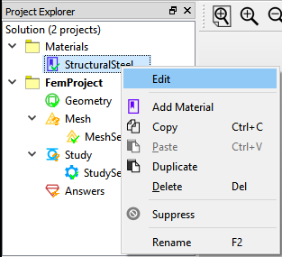
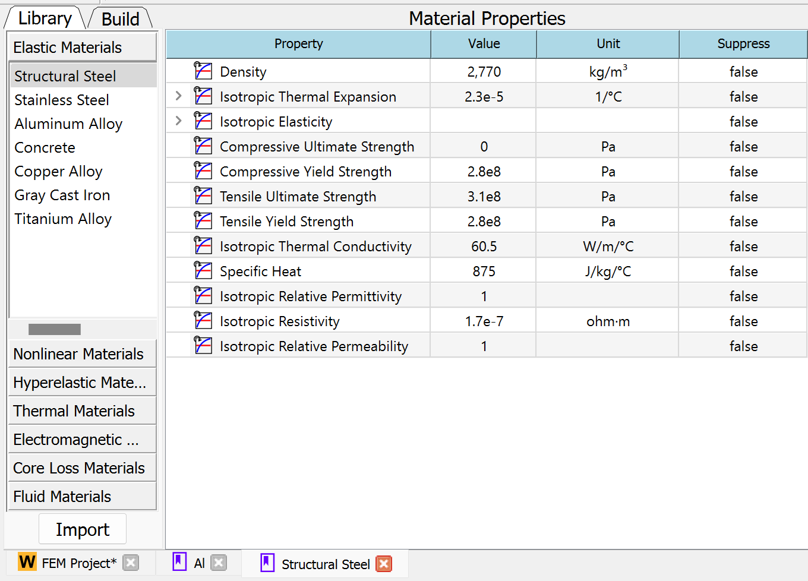
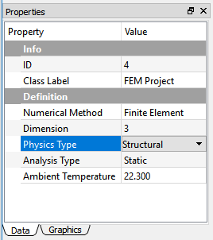
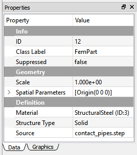
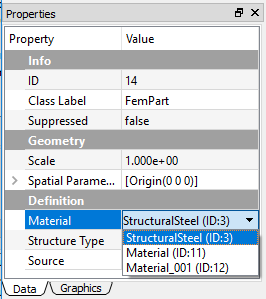
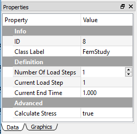
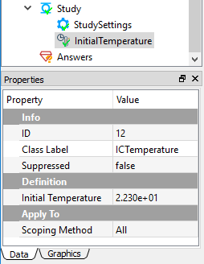
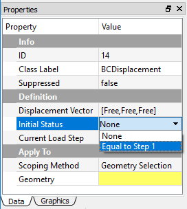

# Steps for using the application
This section discusses the workflow in performing simulation analysis in the WELSIM application. 

## Creating analysis environment
All analyses in WELSIM are represented by one independent analysis environment. After creating a new project environment, you can choose the analysis type and define the parameters to conduct the simulation study. 

### Unit system behavior
The WELSIM provides eight types of unit systems for you to chose. You can select the preferred unit system from **File** > **Preferences** > **General** > **Units**. Once the unit system is chosen, quantity units of FEM objects are fixed. However, user still can select different unit for the quantity defined in material module. The material quantity will be converted to the system units at solve. 

## Defining materials
In simulation analysis, a geometry's attribute is influenced by the material properties that are assigned to the body. When you create a new FEM project, a material project and a structural steel material object are created automatically. This material project can include multiple material objects, which contains the material properties for the successive analysis. The system-generated structural steel can be used directly. 

You can add new materials by either one of the methods below:

* Click the **Add Material** button from **Toolbar**.
* Click the **Add Material** item from the **Material Menu**.
* Right click on the **Material Project** tree object, and choose **Add Material** item from the pop-up context menu.

### Editing material properties
To manage material properties, you can 

* double click on the material object in the tree, or 
* right click on the material object and select **Edit** item from the pop-up context menu as shown in Figure below.




### Defining material properties
In the material definition panel, two tabs display on the left sub-window as shown in Figure below. The **Library** tab gives you a quick method to add a bundle of properties for the specific type of material. The **Build** allows you to add each preferred property one by one. 




## Defining analysis type
There are several analysis types are supported in WELSIM. You can define the analysis type while performing an analysis. For example, if the temperature is to be calculated, you would choose a thermal analysis. In the FEM project object, you can set the **Physics Type** and **Analysis Type** from the **Properties View** window as shown in Figure below. The currently available physics and analysis types are:

* Structural: Static, Transient, Modal
* Thermal: Steady-State, Transient
* Electromagnetics: Electostatic, Magnetostatic




## Generating geometries
There are two ways of generating geometries in the WELSIM application. You can either create primitive shapes using built-in tools or import an existing STEP/IGES file. Since the built-in tool only can create primitive shapes such as box and cylinder, it is recommended to create your complex geometry in an external application and import the CAD file into WELSIM.

### Create primitive shapes
The following lists the primitive shapes that WELSIM build-in tool can create:

* 3D box
* 3D cylinder
* 3D plate
* 3D line

### Import geometry files
For the complex geometry or practical designs, you can create your geometry in an external CAD application, and import to WELSIM application via STEP or IGES file. The properties view of the imported geometry allows you to define the geometry attributes, as shown in Figure below.




## Defining part behaviors
The primitive and imported parts have slightly different behaviors, but the primary attributes are the same. This section describes the behaviors of the imported part.

### Geometry scale
The Scale determines the size change of the imported geometry, and the current geometry size is the original size multiplied by the scale value. The default value is 1. Increasing the scale value enlarges the geometry, reducing this value causes the geometry smaller. The scale ruler on the bottom of the Graphics Window provides a reference for users to recognize the current size of the geometry. 

### Spatial parameters
For the imported geometry, the Spatial Parameters allows the user to adjust the origin of geometries. The default value is the origin of global coordinates (0, 0, 0). 

### Material assignment
Once you have defined the material objects and created the geometry, you can assign the specific material to the selected geometry object. Click Material property, and the cell displays all candidate materials in the drop-down list as shown in Figure below. Each entry includes the material object name and ID.



### Structure type
The Structure Type provides a topological reference for you to differentiate the solid, shell, and beam geometries. The default structural type is Solid. 

### Source file name
The read-only Source property shows the information of the imported geometry file name. It provides a reference for you to identify the specific imported CAD file.


## Applying mesh
Meshing is the process that your geometry is spatially discretized into finite elements and nodes. The quality of the mesh directly influences the final solutions. You can automatically mesh the geometry domains, and generate 3D tetrahedral elements (Tet10 and Tet4), or 3D triangle elements (Tri6 and Tri3). 

If your model does not mesh, the system applies the default settings and automatically meshes the domains at solve time. However, it is recommended to mesh the domain before solving since the system provides a reference for you to examine the mesh. Mesh Settings controls are available to assist you in adjusting the mesh density and quality.

In the multi-body analysis, you can apply local Mesh Method object and scope the target bodies to achieve a finer or coarser mesh comparing to other bodies. 


## Defining connections
In some analyses, you may need to set up the connections such as contact. The available connection features are:

* [Contact Pair](connections.md#contact-pairs): defines two parts are bonded or may contact during the motion. It is supported for both structural and thermal analyses. 


## Defining study settings
The **Study** and **Study Settings** objects are inserted automatically when you started a new FEM project in the step of [Creating Analysis Environment](#creating-analysis-environment). These two objects define the necessary conditions for the solving, such as steps, substeps, end time, convergence tolerance, etc. 

You can create multiple steps in the properties of the **Study** object. As shown in Figure below, the property **Number of Steps** determines the total steps in the analysis. The **Current Step** property of determines the current step that other properties are defining on. 

The spreadsheet for the **Study Settings** object displays the related properties for all steps.




## Defining initial conditions
Based on the chosen analysis type, you can define the initial conditions to the analysis. The following initial conditions are supported:

* **Initial Temperature**: For a transient thermal analysis, you can specify an initial temperature object. The properties view of initial temperature is shown in Figure below. 




## Applying boundary conditions 
You can impose various boundary conditions based on the types of analysis. For instance, the structural analysis allows you to impose pressure, force, displacement, and other boundary conditions. The thermal analysis enable you to impose thermal flux and temperature boundary conditions. 

The body conditions are imposed on the volumes instead of surfaces or edges. For example, the standard earth gravity, acceleration, and rotational velocity act on the bodies.

The boundary and body conditions act according to the steps. For the multi-step analysis, the magnitude of those conditions can vary. The Tabular Data and Chart windows show related data and curves to represent the input values along time/steps. 

For the transient analysis, the Initial Status property provides options for the user to define the boundary value at the beginning of the simulation. As shown in Figure below, you can choose the initial value to be **None** or **Equal to Step 1**.




## Solving
The WELSIM application contains the integrated solvers. These solvers are essentially executable applications and can be instantiated by the front-end using inter-processing scheme. During the solving process, the front-end program generates the input scripts, mesh data file and feeds these files to the solvers. After calculation, the front-end interface can consume the generated result files and displays the resulting contour on the GUI.

Depended on the analysis type, the following solvers are available in WELSIM:

* WelSimFemSolver1: solves the structural and thermal problems.
* WelSimFemSolver2: solves the electromagnetic problems.

### Solution progress
The overall solution progress can be indicated by the **Output** window, where you can view the output information from the solvers. If an calculation is completed successfully, you can see the similar message below in the **Output** window:
```
WelSimFemSolver2 Completed !!
```


## Evaluating results
The WELSIM application provides fully integrated result review module, and you can evaluate simulation results with no need of other software tools. Depends on the analysis type, various results are available for you to examine solutions. The [Using Results](results.md) section lists all available results that may be used in the post-processing.

The following lists the methods to add result objects:

* Right click a Answers or Result object in the tree, and choose the target result item from the context menu.
* Click the result button from the Menu or Toolbar.

The following steps are to evaluate results:

* Select the target result object in the tree.
* If the solution is calculated, you can review the result by clicking the Evaluate button from the toolbar, menu, or the right-clicking context menu.

The following result types are available:

* Contour results: Displays a contour plot of result over geometry surface.
* Probe results: Displays an annotation of the target area, and shows results in the Properties view. 

See the [Using Results](results.md) section for more details on results.


## Saving analysis project
You can save the solution with all settings into an external file, and open this file later or on a different computer that has WELSIM installed. The persisted data include two parts:

* WELSIM database file (*.wsdb).
* Associated data folder, the folder name is consistent with the database file.

!!! note
    The saved database file (*.wsdb) contains the information of objects and their properties. The geometry data is saved as external STEP files. The mesh and result object settings are saved. However, the mesh and result data are not included yet. You need to perform meshing and solving to obtain those data in a resumed project.

