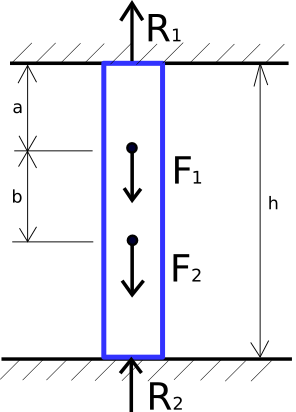
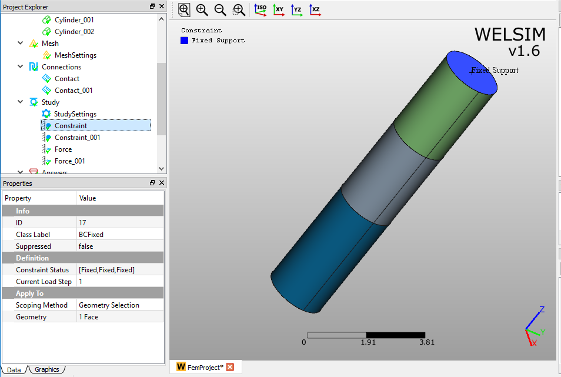
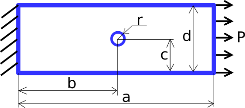
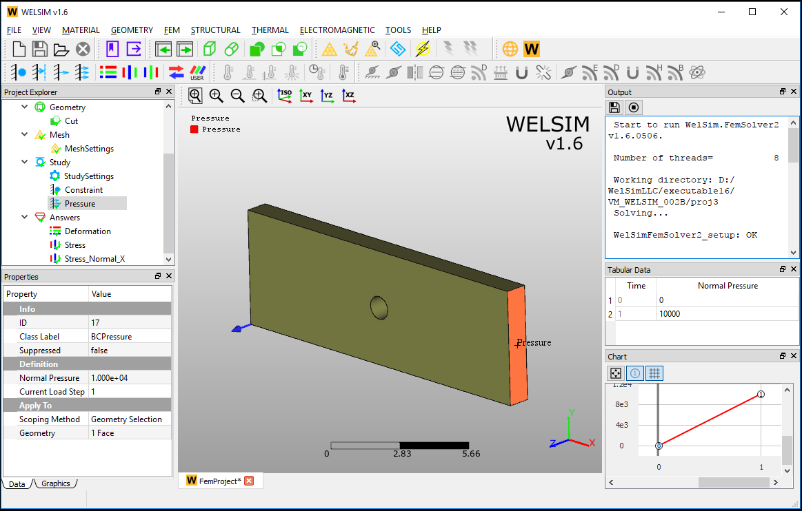

# Structural

## Statically inteterminate reaction force analysis <small>VM001</small>
An assembly of three cylinder bars is supported at both end surfaces. Forces $F_{1}$ and $F_{2}$ is applied on the middle of the assembly as shown in Figure [fig:ch5_vm_001_schematic].

The input data about material, geometry, and loads are given in Table [tab:ch5_vm_001_parameters].

| Material Properties | Geometric Properties | Boundary Conditions |
| ------------------- | -------------------- | ------------------- |
| Young's Modulus E=2e11 | h=10 | $F_{1}$=2000 |
| Mass Density $\rho$=7850 | a=3 | $F_{2}$=1000 |
| Poission's Ratio v=0.3 | b=3 |

The geometries and imposed boundary conditions are shown in Figure [fig:ch5_vm_001_bc].

The result comparison is given in Table [tab:ch5_vm_001_result].

| Results | Theory | WELSIM | Error (%) |
| ------- | ------ | ------ | --------- |
| Z Reaction Force at Top Fixed Support | 1800| 1810 | 0.556 |
| Z Reaction Force at Bottom Fixed Support | 1200 | 1202 | 0.167 |

This test case project file is located at [vm/VM_WELSIM_001.wsdb].

## Rectangular plate with circular hole subjected to tensile pressure <small>VM002</small>
A rectangular plate with a circular hole is fixed along one of the end faces. A tensile pressure load is imposed on another end face as shown in Figure [fig:ch5_vm_002_schematic].

The input data about material, geometry, and loads are given in Table [tab:ch5_vm_002_parameters].

| Material Properties | Geometric Properties | Boundary Conditions |
| ------------------- | -------------------- | ------------------- |
| Young's Modulus E=2e11 | a=15 | Pressure P=1e4 |
| Poission's Ratio v=0.3 | b=7.5 | |
| |  c=2.5 | |
| | d=5 | |
| | thickness=1 | |

The geometries and imposed boundary conditions are shown in Figure [fig:ch5_vm_002_bc].

The result comparison is given in Table [tab:ch5_vm_002_result].

| Results | Theory | WELSIM | Error (%) |
| ------- | ------ | ------ | --------- |
| Maximum Normal X Stress| 3.125e4 | 3.156e4 | 0.992 |

This test case project file is located at %Installation Directory%/vm/VM_WELSIM_002.wsdb.

