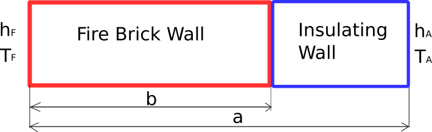
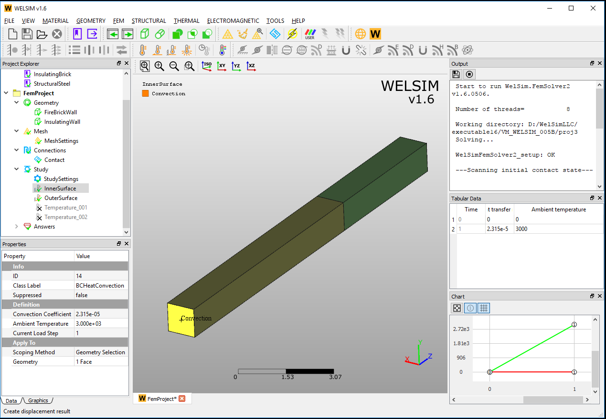

# Thermal

## Heat transfer in a composite wall <small>VM003</small>
An assembly wall consists of fire brick and insulating brick. The temperature and surface convection coefficient are given for both end surfaces. The simulation tries to find the temperature distribution of the assembly. The schematic view of the model is shown in Figure [fig:ch5_vm_003_schematic].

The input data about material, geometry, and loads are given in Table [tab:ch5_vm_003_parameters].

| Material Properties | Geometric Properties | Boundary Conditions |
| ------------------- | -------------------- | ------------------- |
| Thermal conductivity of fire brick wall: $k_{F}$ = 1.852e-5 | a=14 | Convection coefficient $h_{F}$=2.315e-5 |
| Thermal conductivity of insulating wall: $k_{A}$=2.315e-6 | b=9 | Ambient temperature $T_{F}$=3000 |
| |  cross-section=1x1 | Convection coefficient $h_{A}$=3.858e-6 |
| | | Ambient temperature $T_{A}$=80 |

The geometries and imposed boundary conditions are shown in Figure [fig:ch5_vm_003_bc].

The result comparison is given in Table [tab:ch5_vm_003_result].

| Results | Theory | WELSIM | Error (%) |
| ------- | ------ | ------ | --------- |
| Minimum Temperature | 336 | 336.724 | 0.215 |
| Maximum Temperature | 2957 | 2957.216 | 0.007 |

!!! info
    This test case file is located at vm/VM_WELSIM_003.wsdb.

